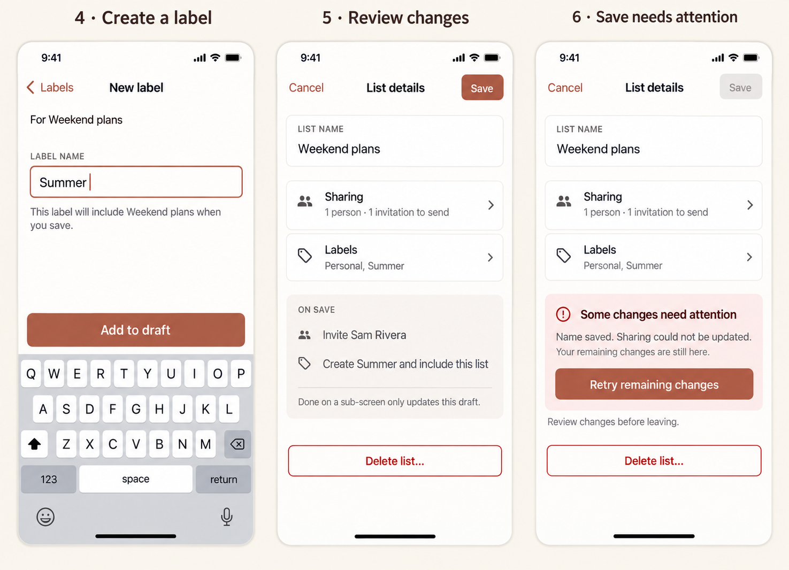

# List details: a phone-first redesign

**Status: design proposal for review · September 16, 2026.** Documentation and freshly generated phone concepts only; no application changes. This follows the [task details design](TODO_DETAILS_UX.md) and its implemented editor conventions.

Replace the crowded Edit List dialog with a full-height phone editor. Put the name and readable Sharing/Labels summaries on the first screen, with dedicated screens for longer choices. Keep one explicit Save boundary. Give deletion a named action and confirmation.

## Review mock-ups

These are AI-generated concepts, not screenshots of implemented behavior. The written specification governs exact copy, states, and sizing. Sample people are fictional.

1. **List details:** an editable name, two large navigation rows, and a separated Delete list action. Opening the editor does not summon the keyboard.
2. **Sharing:** searchable people, readable email addresses, explicit shared/pending states, and checkboxes that reflect the draft. Done returns to details without sending requests.
3. **Labels:** searchable membership choices and a clear Create label entry. A label includes the list; it does not move its tasks.

4. **New label:** a small focused task with Add to draft above the keyboard. Nothing is created remotely yet.
5. **Review:** show consequential pending changes before Save, particularly invitations, removals, and new labels.
6. **Recovery:** retain remaining edits and report which changes succeeded. Retry only what is outstanding.

The boards illustrate separate states, not a single continuous dataset: the first board includes Alex's existing pending invitation; the second illustrates a new invitation to Sam. Active Save in the concepts represents a changed, valid draft. On first open it is disabled. The keyboard and geometry are illustrative; real viewport and accessibility checks remain implementation work.

## Evidence and current problems

Reviewed the [dialog and handlers](<src/routes/(app)/+layout.svelte>), [ShareList](<src/routes/(app)/ShareList.svelte>), [sharing state helpers](src/lib/components/users.ts), [request transport](src/lib/firebase.ts), [list reducers](src/lib/components/lists.ts), and existing [sharing](tests/e2e/006-share-list/README.md), [labels](tests/e2e/005-labels/README.md), and [hidden-label](tests/e2e/010-hidden-label-visibility/README.md) stories.

This is an existing desktop test artifact, not a new phone capture. Current source reveals the following:

- Name, a nested scrolling people list, and label creation compete inside one modal. Larger directories make the small sharing area especially awkward on phones.
- Sharing has no search and represents pending work with an unexplained icon. The helper named `email(user)` returns the user's name; accepted/pending checks therefore receive the wrong identity. Checkbox rendering also reads accepted state rather than the selected draft.
- Labels already support cancellation and draft creation, but the UI does not clearly communicate the commit boundary.
- The trash icon dispatches deletion immediately, without naming the target or explaining its effect.
- Save coordinates several independent writes and sharing requests. Some helpers log and swallow failures; a closed dialog does not establish that every change succeeded.
- The same dialog handles labels but always says Edit List. Its title and available actions should reflect the document type.

## Details screen

Use the same phone shell as Task details: full height, safe-area-aware top navigation, scrollable body, warm neutrals, white groups, and restrained terracotta accents. On desktop/tablet use the same content in a bounded centered panel.

- Top bar: Cancel, **List details**, Save. Save is disabled for unchanged or invalid drafts and while a submission is outstanding. Explain validation beside the field; announce saving status.
- Persistent **List name** label. Allow wrapping and growth for long existing names. Trim boundary whitespace on Save and reject a whitespace-only value with “Enter a list name.” Do not impose a new uniqueness requirement.
- **Sharing** row: “Not shared,” “1 person,” or “2 people · 1 pending,” excluding the current user. Distinguish invitations to send from invitations already pending. Counts come from confirmed/request state plus explicit draft changes, not all known users.
- **Labels** row: “No labels,” or two names followed by “+N more.” Open the screen to read every name; never truncate the only accessible description.
- **On Save** summary appears for invitations, removals, and new labels. Name affected people/labels; for many changes, provide an expandable list. Ordinary rename or membership-only edits can remain visible in their fields.
- Put **Delete list…** after the normal content, visually separated. It scrolls with content on short screens rather than occupying a permanent danger footer.

## Sharing screen

Back to Details abandons this screen's edits; Done applies them to the parent draft. Header, context name, search, and a single scrolling results body replace the nested scrollbox. Search matches known users' names and email addresses; it never sends an invitation or searches an external directory. Clear search without losing selections. Use stable user IDs internally and the actual email for compatibility with current helpers.

| State | Presentation and behavior |
| --- | --- |
| Confirmed shared person | Name, actual email, “Shared,” checked checkbox. Unchecking stages a removal request. |
| Newly selected person | Checked checkbox and “Invite on Save.” Unchecking cancels this unsent draft choice. |
| Existing invitation pending | “Invitation pending,” read-only. No duplicate invitation, cancellation, or resend control in this scope. |
| Existing removal pending | “Removal pending,” read-only until its outcome is known. Do not show “Access removed.” |
| Removal staged | Unchecked selection and “Remove on Save.” Rechecking restores the original state. |
| Available person | Name/email and unchecked checkbox. Exclude the current user. |

Group current shared/pending people before available people. Keep rows stable while toggling, and expose full-row targets with semantic checkboxes. Search filters both groups and announces the result count. Use “No matching people” for a search miss and “No other people available yet” for an empty directory; keep Done available. Fall back to email when a name is missing and initials when a photo is missing. If identity cannot be resolved, show an unavailable row and explain why it cannot be selected.

Accepted/rejected and pending invitation/removal states must come from request type and outcome, not one generic boolean. Refresh confirmed status without erasing local selections; resolve conflicting changes before Save. This screen describes relationships observable to the current account through existing request history. Do not present it as an authoritative global access roster or invent owner/editor/viewer roles.

Sharing remains the existing app-to-app invitation flow. No arbitrary email invitation, share link, notification preference, role administration, immediate revocation guarantee, or cancellation of already-sent requests is introduced.

## Labels and new label

Show the same eligible labels as today: exclude fully hidden labels, preserve existing hidden-but-browsable eligibility, and keep membership in excluded labels untouched. Selection means the current list is explicitly included in that label's query. Preserve unrelated predicates, ordering, and visibility; removing this explicit inclusion must not promise that other query predicates cannot still match the list.

Search labels by name, keep selection stable across filtering, and show “No matching labels” when appropriate. Empty state: “No labels yet” with Create label. Each row is a full-width checkbox. Done accepts this membership subdraft; Back discards it, including labels created during that visit.

Create label opens a child screen with Back to Labels, Label name, and **Add to draft**. Require a non-whitespace name, preserve input on error, and use “Enter a label name.” Trim on submission. Existing duplicate names are allowed by the model: show a matching existing label with “Use existing” as an option, but do not silently merge identities or block intentional duplicates.

Add to draft returns to Labels with the new label selected and marked “New.” This does not write data. Unselecting a new label means it will not be created on Save. Reopening the child screens retains accepted parent-draft choices. Cancelling Details creates no labels and changes no query predicates.

When editing a label itself, title the root **Label details**, use **Label name** and **Delete label…**, and omit the Labels membership row as today. Retain existing sharing capabilities, with copy identifying a label; do not imply sharing a label automatically grants access to all underlying lists. Renaming must preserve label type and visibility. Pinning, visibility settings, and query editing stay in their existing locations.

## Save, cancel, synchronization, and failure

Capture the target document ID/type and initial values when opening. One parent draft owns name, sharing changes, memberships, and new labels. Child screens own reversible subdrafts. No persistence occurs before Save, except a separately confirmed deletion.

Cancel/system Back/Escape at Details closes an unchanged editor. A dirty draft asks **Discard changes?** with Keep editing and Discard changes. Child Back abandons only that child subdraft. Background taps and swipe gestures must not bypass these rules. Restore focus to the invoking edit control after close.

Save validates against current permissions/availability and computes changes from the latest confirmed baseline. Disable duplicate submission. Reuse existing action types and request semantics, but make completion/failure observable: the current fire-and-forget sharing transport and swallowed errors need explicit results before this UI can meet its promise.

Do not assume all writes are one transaction: list actions, label creation/membership, and outgoing requests span separate records and processing stages. Track stable operation identities and confirmed outcomes. On partial failure show exactly what saved, retain the unfinished draft, and offer **Retry remaining changes** without duplicate invitations, duplicate labels, or repeated successful actions. After partial success, Cancel cannot undo confirmed writes; say “Saved changes will remain” when offering to discard the remainder.

Close only once intended writes have reached the implementation's documented durable success boundary. Invitation acceptance is separate: “Invitation sent” does not mean “Shared.” While offline, show “Waiting for connection” and retain the draft unless durable local queue status is actually known. Never report server success based on a timeout. An outstanding submission must not be dismissible as though nothing was written; offer a clear status and prevent conflicting resubmission.

Remote changes must not overwrite active fields. Refresh untouched state, show a conflict for locally edited fields with Reload latest / Keep my changes, and require explicit resolution before writing. If the list or editing access disappears, disable Save, retain readable draft contents, and explain that editing is unavailable. Incoming share acceptance should update status without creating another invitation.

## Deletion is a separate confirmed action

Delete list… opens a confirmation screen within the editor, with the full saved target name, Keep list, and a clearly destructive Delete list button. Opening it does not save or discard the draft. Back/Keep list returns unchanged. The confirmation explains that unsaved edits will be discarded only after successful deletion; a failure keeps the editor and draft available.

Current deletion appends `delete_list` to the list action stream and removes the list from replayed list metadata; the reducer does not itself erase task documents. This is not evidence of permanent erasure, a private “leave list” operation, or a recoverable archive. Do not promise any of those outcomes.

Before shipping, verify deletion replay for both participants in a shared list, related label navigation, and reopening/reload. Proposed confirmation copy: **Delete “Weekend plans”?** / “This removes the list from navigation for people who receive this list's updates. Unsaved changes will be discarded.” Confirm that scope with the two-user story before finalizing the wording. Do not add “all tasks are permanently deleted” or an Undo action without corresponding behavior. If that scope cannot be established, deletion remains an implementation release blocker rather than shipping misleading copy.

For a label use “Delete label,” and verify that source lists/tasks remain intact. On success close and navigate to an available list or Profile as appropriate; do not leave a dangling active route. Failure stays actionable and never displays success prematurely.

## Phone and accessibility requirements

- Baseline 390 × 844 CSS pixels; review 320 × 568, 360 × 800, landscape, and 200% text. Keep 16px side padding where space permits, about 17px body text, and at least 48px touch targets.
- Header stays reachable; body scrolls. Done/Add to draft stays above the visible software keyboard, with the focused field and inline errors scrollable into view. Never shrink text or hide controls to match the board.
- No automatic keyboard on root, Sharing, or Labels. Focus an announced heading on entry; the dedicated New label flow can focus its sole input. Return focus to the invoking row/button after child navigation.
- Long names/emails wrap without horizontal page scrolling. Counts, pending states, errors, and checkbox selection are conveyed by text/semantics as well as color.
- Trap modal focus, keep background inert, support keyboard and system Back, announce result/status changes politely, and honor reduced motion. Avoid nesting dialogs for child flows or confirmations.
- Match light/dark app themes and verify contrast. Real iOS/Android keyboard and assistive-technology review supplements browser viewport coverage.

## Implementation review stories after design approval

Use the project's [E2E guide](E2E_GUIDE.md): deterministic emulator data, assertions at every step, committed screenshots and generated story READMEs. These are future acceptance criteria, not tests claimed by this design PR.

| Story | Required evidence |
| --- | --- |
| Rename and reopen | Long name on a small phone; invalid blank input; valid Save survives reload and changes the sidebar/title. |
| Draft navigation | Sharing/Labels Done affects only the parent draft; child Back rolls back; root Discard leaves every persisted record unchanged, including new labels. |
| Share between two users | Search, stage invitation, review, Save, pending status, recipient accept, both see edits; actual email identity and selected checkboxes stay correct. |
| Sharing outcomes | Rejected invitation, pending invitation, pending removal, staged removal undo, and completed removal; no duplicate request on reopen/retry. Verify actual recipient behavior. |
| Label membership | Add/remove explicit membership, create new label, unselect new label, duplicate-name choice; unrelated query predicates and source tasks survive. |
| Labels and visibility | Hidden/fully hidden eligibility; rename label preserves type/visibility; no recursive membership editor or accidental source-list access grant. |
| Scale and empty states | Empty directories, no search matches, many users/labels, missing names/photos, long email and label names; selections survive search. |
| Recovery | Inject failure after one successful operation; exact progress shown; retry completes only remaining operations; reload proves no duplicated labels or invites. |
| Concurrent edits/offline | Remote rename/removal/access loss and incoming acceptance while dirty; explicit conflict handling; offline status does not claim server success. |
| Deletion | Keep list preserves draft; failed delete retains it; successful delete navigates safely; two-user replay establishes scope; deleting label leaves source tasks intact. |
| Phone navigation | Small portrait, landscape, enlarged text, keyboard focus, system Back, focus restoration, dark theme; manual real-device keyboard/screen-reader checklist. |

## Decisions for this review

Approve the full-height editor with dedicated Sharing/Labels screens; one Save boundary with reversible child drafts; readable request states without unsupported invitation controls; deferred label creation; and confirmed deletion with verified scope. Implementation should reuse the task editor's proven navigation/focus patterns while keeping list-specific multi-operation persistence explicit.

Fresh concepts were generated using the built-in image generation tool. [Exact generation and correction prompts](docs/list-details-ux/generation-prompts.md) are committed alongside both PNG boards. Review validation covers source findings, image inspection, local links, and a documentation-only diff. No app behavior or E2E implementation is changed in this PR.
