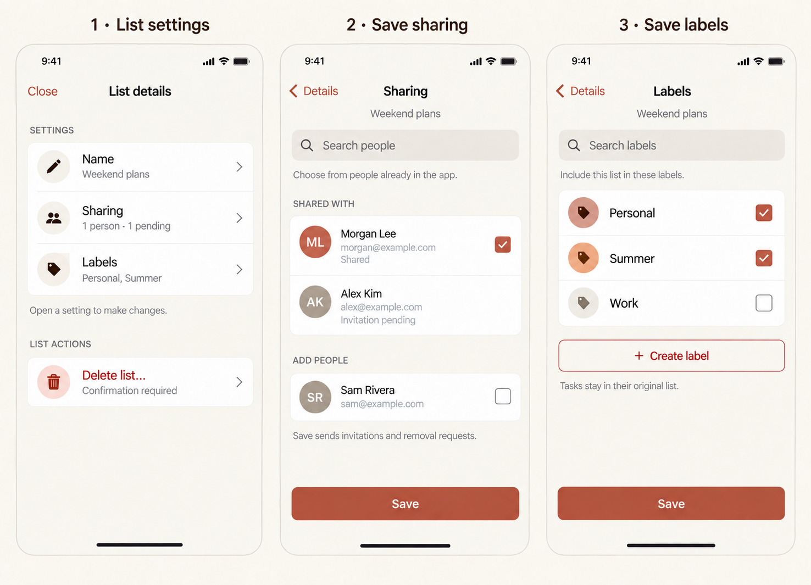
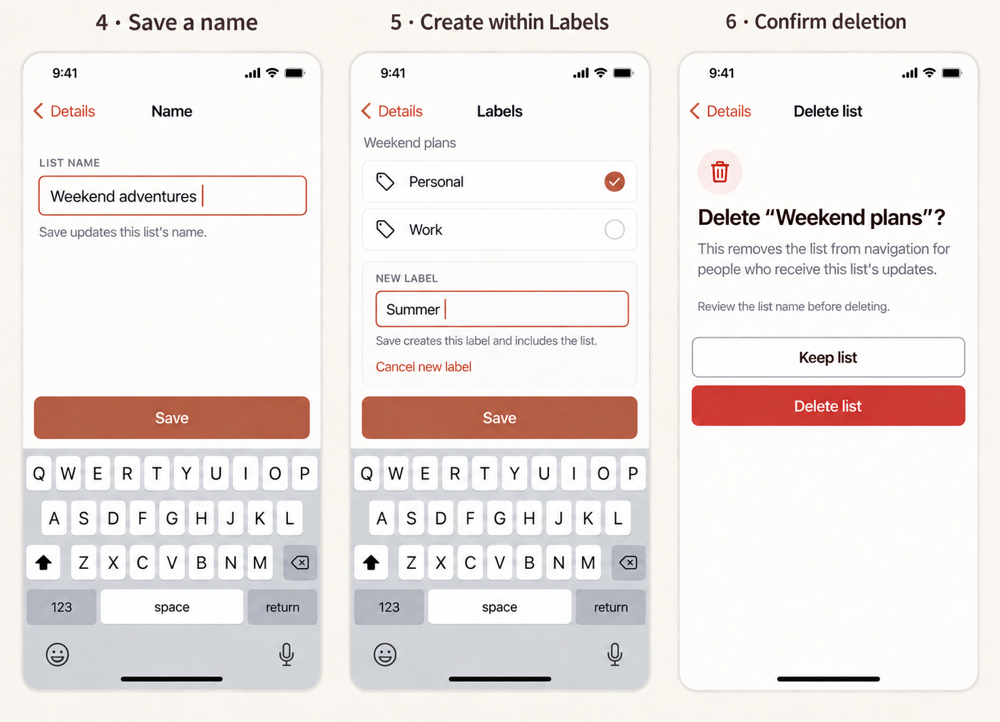
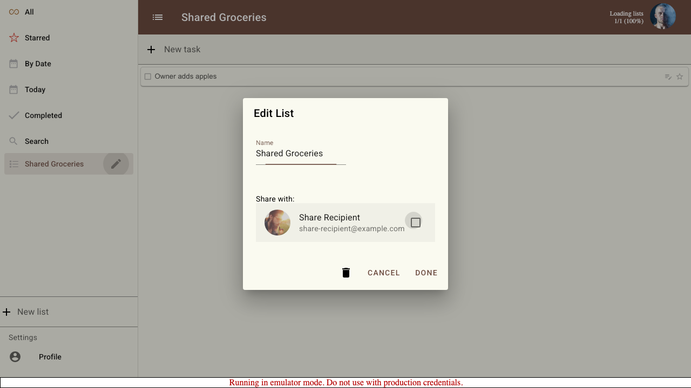

# List details: a phone-first redesign

**Status: design proposal for review · September 16, 2026.** Documentation and freshly generated phone concepts only; no application changes. This follows the [task details design](TODO_DETAILS_UX.md) and its implemented editor conventions.

Replace the crowded Edit List dialog with a full-height phone editor. Put the name and readable Sharing/Labels summaries on the first screen, with dedicated screens for longer choices. Save each setting on its own screen. The top level is a settings overview with Close and no Save action. Put deletion in a regular settings row that opens a separate confirmation screen.

## Review mock-ups

These are AI-generated concepts, not screenshots of implemented behavior. The written specification governs exact copy, states, and sizing. Sample people are fictional.

1. **List details:** Name, Sharing, and Labels are navigation rows showing saved values. Close exits; there is no root draft or Save. Delete list is a settings row under List actions, with “Confirmation required.”
2. **Sharing:** searchable people, explicit shared/pending states, and draft checkboxes. Save sends this screen's changes and returns to details after successful submission.
3. **Labels:** searchable membership choices. Save persists this screen's changes, independently of Name and Sharing.

4. **Name:** dedicated editor with Save above the keyboard. Saving changes the actual list name.
5. **New label inside Labels:** an inline name field shares the Labels screen's Save. No nested “Done” or deferred root save.
6. **Deletion confirmation:** show the saved list name, consequence, and Keep list before a destructive Delete list action. These buttons appear only on this dedicated confirmation screen.

Active Save in the concepts represents a changed, valid setting. On first open it is disabled. The Labels keyboard state illustrates creating Summer before it exists; other states show a previously saved Summer label. Geometry and keyboard appearance are illustrative; real viewport and accessibility checks remain implementation work.

## Evidence and current problems

Reviewed the [dialog and handlers](<src/routes/(app)/+layout.svelte>), [ShareList](<src/routes/(app)/ShareList.svelte>), [sharing state helpers](src/lib/components/users.ts), [request transport](src/lib/firebase.ts), [list reducers](src/lib/components/lists.ts), and existing [sharing](tests/e2e/006-share-list/README.md), [labels](tests/e2e/005-labels/README.md), and [hidden-label](tests/e2e/010-hidden-label-visibility/README.md) stories.

This is an existing desktop test artifact, not a new phone capture. Current source reveals the following:

- Name, a nested scrolling people list, and label creation compete inside one modal. Larger directories make the small sharing area especially awkward on phones.
- Sharing has no search and represents pending work with an unexplained icon. The helper named `email(user)` returns the user's name; accepted/pending checks therefore receive the wrong identity. Checkbox rendering also reads accepted state rather than the selected draft.
- Labels already support cancellation and draft creation, but the UI does not clearly communicate the commit boundary.
- The trash icon dispatches deletion immediately, without naming the target or explaining its effect.
- Save coordinates several independent writes and sharing requests. Some helpers log and swallow failures; a closed dialog does not establish that every change succeeded.
- The same dialog handles labels but always says Edit List. Its title and available actions should reflect the document type.

## Details screen

Use the same phone shell and visual language as Task details: full height, safe-area-aware navigation, scrollable body, warm neutrals, white groups, and restrained terracotta accents. Unlike the task editor, this is a settings overview, not a combined form. On desktop/tablet use a bounded centered panel.

- Top bar: **Close**, **List details**, no right-hand action. Closing never saves, cancels, or reverts changes previously saved in a setting.
- **Name** row shows the saved list name and opens a dedicated Name editor. Long names wrap.
- **Sharing** row shows “Not shared,” “1 person,” or “2 people · 1 pending,” excluding the current user. Counts reflect confirmed/request state, never edits waiting in another screen.
- **Labels** row shows “No labels,” or two names followed by “+N more.” Open the screen to read every name; never truncate the only accessible description.
- No root “On Save” summary, editable fields, unsaved badge, or bottom completion button. After a successful child Save, refresh the relevant summary and announce success.
- Below the settings group, use a modest section gap and **List actions** heading. **Delete list…** is an ordinary white navigation row with a red trash icon/text, “Confirmation required” secondary text, and a chevron. Match other rows' height and padding. Do not style it as an outlined/filled full-width button, push it to the bottom with a spacer, or pin it to a footer. Leave natural empty space below it.

## Name screen

Back to Details, title **Name**, persistent **List name** label, growing input, and one **Save** button above the keyboard. Trim boundary whitespace on Save and reject whitespace-only input with “Enter a list name.” Do not introduce a uniqueness requirement. Save persists only the name, returns to Details, and updates the summary/sidebar/title. Back with unsaved edits offers Keep editing / Discard changes; neither choice reverses an earlier saved setting. No autosave on blur or navigation.

## Sharing screen

Save persists only sharing changes and returns to Details after submission succeeds. Back with unsaved edits offers Keep editing / Discard changes. Header, context name, search, and a single scrolling results body replace the nested scrollbox. Search matches known users' names and email addresses; it never sends an invitation or searches an external directory. Clear search without losing selections. Use stable user IDs internally and the actual email for compatibility with current helpers.

| State | Presentation and behavior |
| --- | --- |
| Confirmed shared person | Name, actual email, “Shared,” checked checkbox. Unchecking stages a removal request. |
| Newly selected person | Checked checkbox and “Invite on Save.” Unchecking cancels this unsent draft choice. |
| Existing invitation pending | “Invitation pending,” read-only. No duplicate invitation, cancellation, or resend control in this scope. |
| Existing removal pending | “Removal pending,” read-only until its outcome is known. Do not show “Access removed.” |
| Removal staged | Unchecked selection and “Remove on Save.” Rechecking restores the original state. |
| Available person | Name/email and unchecked checkbox. Exclude the current user. |

Group current shared/pending people before available people. Keep rows stable while toggling, and expose full-row targets with semantic checkboxes. Search filters both groups and announces the result count. Use “No matching people” for a search miss and “No other people available yet” for an empty directory; keep Back available and disable Save until there is a valid change. Fall back to email when a name is missing and initials when a photo is missing. If identity cannot be resolved, show an unavailable row and explain why it cannot be selected.

Accepted/rejected and pending invitation/removal states must come from request type and outcome, not one generic boolean. Refresh confirmed status without erasing local selections; resolve conflicting changes before Save. This screen describes relationships observable to the current account through existing request history. Do not present it as an authoritative global access roster or invent owner/editor/viewer roles.

Show consequential invitations/removals in an “On Save” summary on this screen before submission, naming affected people. Sharing remains the existing app-to-app invitation flow. No arbitrary email invitation, share link, notification preference, role administration, immediate revocation guarantee, or cancellation of already-sent requests is introduced.

## Labels and new label

Show the same eligible labels as today: exclude fully hidden labels, preserve existing hidden-but-browsable eligibility, and keep membership in excluded labels untouched. Selection means the current list is explicitly included in that label's query. Preserve unrelated predicates, ordering, and visibility; removing this explicit inclusion must not promise that other query predicates cannot still match the list.

Search labels by name, keep selection stable across filtering, and show “No matching labels” when appropriate. Empty state: “No labels yet” with Create label. Each row is a full-width checkbox. **Save** persists memberships and any new labels from this screen, then returns to Details. Back with changes asks whether to discard only this screen's unsaved work.

Create label expands an inline composer within Labels, with **New label**, a name input, and **Cancel new label**. The existing Labels **Save** remains the sole persistence action, above the keyboard; there is no extra child screen, Add to draft, or Done button. Copy: “Save creates this label and includes the list.” Require a non-whitespace name, preserve input on error, and show “Enter a label name.” Trim on submission. Allow one new label per save; the user can reopen Labels to create another.

Existing duplicate names are allowed by the model: offer a matching existing label with “Use existing,” but do not silently merge identities or block intentional duplicates. Use existing selects that label and closes the composer; Save is still required. Cancel new label clears only the composer and preserves other unsaved membership choices. Leaving Labels without saving creates nothing and changes no membership. After Labels Save, closing Details does not undo the created label or memberships.

When editing a label itself, title the root **Label details**, use a Name row with a **Label name** field in its editor and **Delete label…**, and omit the Labels membership row as today. Retain existing sharing capabilities, with copy identifying a label; do not imply sharing a label automatically grants access to all underlying lists. Renaming must preserve label type and visibility. Pinning, visibility settings, and query editing stay in their existing locations.

## Save, cancel, synchronization, and failure

Capture the target document ID/type when opening. The root has no editable draft. Each setting initializes its own draft from current saved values when entered; drafts never span Name, Sharing, and Labels. Save is disabled when unchanged, invalid, or submitting. It persists only that setting. Saved changes take effect immediately, with no second confirmation at Details.

Close/system Back/Escape at Details exits directly. Back/system Back/Escape from a dirty setting asks **Discard changes?** with Keep editing and Discard changes. Clean settings return directly. Discard affects only unsaved changes on the current screen, never settings saved earlier. Background taps and swipe gestures must not bypass these rules. Restore focus to the setting row on return and to the invoking edit control after close.

Save validates against current permissions/availability and computes changes from the latest confirmed baseline. Disable duplicate submission. Reuse existing action types and request semantics, but make completion/failure observable: the current fire-and-forget sharing transport and swallowed errors need explicit results before this UI can meet its promise.

Even within one setting, do not assume all writes are one transaction: multiple sharing requests or label creation/membership can span separate records and processing stages. A Name save must never submit pending sharing or label operations. Track stable operation identities and confirmed outcomes. On partial failure stay on that setting, show exactly what saved (for example, “Invitation to Sam sent. Invitation to Alex could not be sent”), retain the unfinished draft, and offer **Retry remaining changes** without duplicate invitations, duplicate labels, or repeated successful actions. After partial success, leaving the setting cannot undo confirmed writes; say “Saved changes will remain” when offering to discard the remainder.

Return from a setting to Details only once its intended writes have reached the implementation's documented durable success boundary. Invitation acceptance is separate: “Invitation sent” does not mean “Shared.” While offline, show “Waiting for connection” and retain the draft unless durable local queue status is actually known. Never report server success based on a timeout. An outstanding submission must not be dismissible as though nothing was written; offer a clear status and prevent conflicting resubmission.

Remote changes must not overwrite active fields. Refresh untouched state, show a conflict for locally edited fields with Reload latest / Keep my changes, and require explicit resolution before writing. If the list or editing access disappears, disable Save, retain readable draft contents, and explain that editing is unavailable. Incoming share acceptance should update status without creating another invitation.

## Deletion is a separate confirmed action

The Delete list… settings row only opens a confirmation screen, with the full saved target name and consequence. Place **Keep list** first and a clearly destructive **Delete list** button below it, directly after the explanation rather than in the usual bottom Save position. Focus Keep list by default; never trigger deletion on entry or Enter from an unrelated control; keyboard activation works only when the explicit Delete list button is focused. Back/Keep list returns to Details unchanged. Because deletion is reached from the overview, there is no cross-setting draft to save or discard. A failure keeps the confirmation open with Retry/Keep list available.

Current deletion appends `delete_list` to the list action stream and removes the list from replayed list metadata; the reducer does not itself erase task documents. This is not evidence of permanent erasure, a private “leave list” operation, or a recoverable archive. Do not promise any of those outcomes.

Before shipping, verify deletion replay for both participants in a shared list, related label navigation, and reopening/reload. Proposed confirmation copy: **Delete “Weekend plans”?** / “This removes the list from navigation for people who receive this list's updates.” Confirm that scope with the two-user story before finalizing the wording. Do not add “all tasks are permanently deleted” or an Undo action without corresponding behavior. If that scope cannot be established, deletion remains an implementation release blocker rather than shipping misleading copy.

For a label use “Delete label,” and verify that source lists/tasks remain intact. On success close and navigate to an available list or Profile as appropriate; do not leave a dangling active route. Failure stays actionable and never displays success prematurely.

## Phone and accessibility requirements

- Baseline 390 × 844 CSS pixels; review 320 × 568, 360 × 800, landscape, and 200% text. Keep 16px side padding where space permits, about 17px body text, and at least 48px touch targets.
- Header stays reachable; body scrolls. Each setting’s Save stays above the visible software keyboard, with the focused field and inline errors scrollable into view. Never shrink text or hide controls to match the board.
- No automatic keyboard on root, Sharing, or Labels. Focus an announced heading on entry; the Name editor and inline New label composer can focus their inputs. Return focus to the invoking row/button after child navigation.
- Long names/emails wrap without horizontal page scrolling. Counts, pending states, errors, and checkbox selection are conveyed by text/semantics as well as color.
- Trap modal focus, keep background inert, support keyboard and system Back, announce result/status changes politely, and honor reduced motion. Avoid nesting dialogs for child flows or confirmations.
- Match light/dark app themes and verify contrast. Real iOS/Android keyboard and assistive-technology review supplements browser viewport coverage.

## Implementation review stories after design approval

Use the project's [E2E guide](E2E_GUIDE.md): deterministic emulator data, assertions at every step, committed screenshots and generated story READMEs. These are future acceptance criteria, not tests claimed by this design PR.

| Story | Required evidence |
| --- | --- |
| Rename and reopen | Long name on a small phone; invalid blank input; valid Save survives reload and changes the sidebar/title. |
| Independent saves | Save Name, then discard edits in Sharing: the saved name survives. Save Sharing or Labels and close Details: changes survive reload without any root Save. Root has only Close; all editing screens use Save. |
| Draft navigation | Dirty setting Back confirms discard; clean Back returns directly. Cancel new label preserves other membership edits; discarding Labels creates no label. |
| Share between two users | Search, stage invitation, review, Save, pending status, recipient accept, both see edits; actual email identity and selected checkboxes stay correct. |
| Sharing outcomes | Rejected invitation, pending invitation, pending removal, staged removal undo, and completed removal; no duplicate request on reopen/retry. Verify actual recipient behavior. |
| Label membership | Add/remove explicit membership, create new label inline, cancel its composer, duplicate-name choice; unrelated query predicates and source tasks survive. |
| Labels and visibility | Hidden/fully hidden eligibility; rename label preserves type/visibility; no recursive membership editor or accidental source-list access grant. |
| Scale and empty states | Empty directories, no search matches, many users/labels, missing names/photos, long email and label names; selections survive search. |
| Recovery | Inject failure after one successful operation; exact progress shown; retry completes only remaining operations; reload proves no duplicated labels or invites. |
| Concurrent edits/offline | Remote rename/removal/access loss and incoming acceptance while dirty; explicit conflict handling; offline status does not claim server success. |
| Deletion | Delete settings row only navigates; Keep list causes no write; failed delete stays on confirmation; successful delete navigates safely; two-user replay establishes scope; deleting label leaves source tasks intact. |
| Phone navigation | Small portrait, landscape, enlarged text, keyboard focus, system Back, focus restoration, dark theme; manual real-device keyboard/screen-reader checklist. |

## Decisions for this review

Approve the settings overview without a root Save; independent Name/Sharing/Labels saves; readable request states without unsupported invitation controls; inline creation saved by Labels; and a regular Delete list settings row leading to a dedicated confirmation with verified scope. Implementation should reuse the task editor's proven navigation/focus patterns while keeping list-specific multi-operation persistence explicit.

Fresh concepts were generated using the built-in image generation tool. [Exact generation and correction prompts](docs/list-details-ux/generation-prompts.md) are committed alongside both PNG boards. Review validation covers source findings, image inspection, local links, and a documentation-only diff. No app behavior or E2E implementation is changed in this PR.
