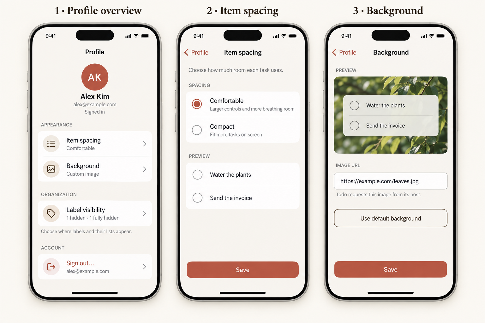
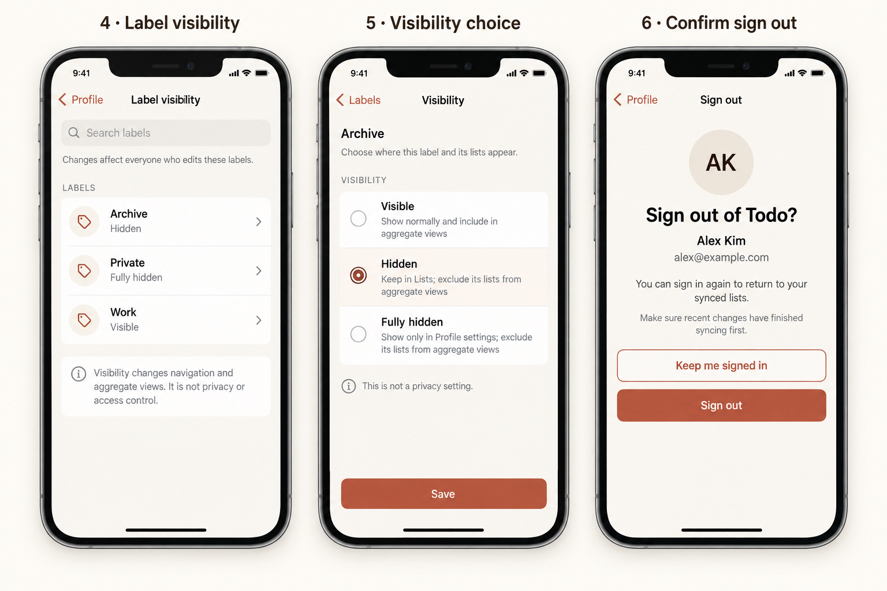
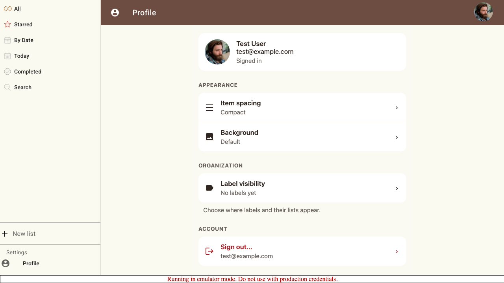

# Profile: a phone-first settings redesign

**Status: implemented for review.** This follows the full-height editing language established by [Task details](TODO_DETAILS_UX.md) and [List details](LIST_DETAILS_UX.md): warm neutral surfaces, grouped settings rows, readable summaries, dedicated child screens, and explicit save boundaries.

Replace the current stack of unrelated cards with a Profile overview. Keep identity read-only, group the existing appearance and label-visibility capabilities, and move each editable setting to a focused screen. Sign out becomes a clearly named account action with confirmation rather than a loose button at the bottom of a card.

## Review mock-ups

These are AI-generated design concepts, not screenshots of implemented UI. The written behavior below is authoritative where generated typography or geometry differs. Sample identities and URLs are fictional.



1. **Profile overview:** identity is readable but not editable. Appearance, organization, and account actions are grouped as navigation rows with saved-value summaries. There is no root Save.
2. **Item spacing:** replace implementation-oriented High/Low Density wording with Comfortable/Compact outcomes, show a truthful preview, and save only this setting.
3. **Background:** keep the existing custom-image capability, but draft and preview the URL before Save. Removing the URL is an explicit “Use default background” choice.



4. **Label visibility:** searchable overview of every label, including fully hidden labels. Rows show the saved visibility and open one label at a time; the overview has no Save.
5. **Visibility choice:** spell out the three existing states, their aggregate-view effect, and the fact that this is not privacy. Save persists only this label.
6. **Sign out:** identify the account, explain the result, and make staying signed in the first action. Successful sign-out returns to Login; a failure stays actionable here.

Active Save buttons in the boards represent changed, valid drafts. They are disabled on first entry, while submitting, or when invalid. Phone frames and photography are illustrative; implementation uses the actual safe area, viewport, avatar, background preview, and app icons.

## Evidence from the current profile

Reviewed the current [Profile route](<src/routes/(app)/profile/+page.svelte>), [appearance controls](src/lib/components/UiSettings.svelte), [UI settings reducer](src/lib/components/UiSettings.ts), [hidden-label settings](src/lib/components/HiddenListSettings.svelte), [authentication controls](src/lib/components/Login.svelte), [label visibility design](ARCHIVE_LABEL_DESIGN.md), and the existing [auth-flow profile capture](tests/e2e/002-auth-flow/screenshots/003-profile-page.png).



This capture is existing desktop emulator evidence, not a newly generated phone state.

The current screen exposes the right small set of capabilities, but not as a coherent settings experience:

- Appearance, hidden-label recovery, identity, and sign-out are separate cards with inconsistent spacing and little hierarchy.
- “High Density” and “Low Density” describe an internal setting rather than what the user will see. The low-density value actually produces larger icons and more spacing.
- Density dispatches from a reactive statement and the background URL dispatches on every input event. Merely opening the page or typing an incomplete URL can write settings; there is no draft, validation boundary, or clear removal action.
- A potentially large background preview sits inline with a raw URL field. Loading failure, long URLs, third-party requests, and the default-background state are unexplained.
- “Configure Hidden Lists” is a button for label visibility. It hides a phone-hostile grid/select dialog, uses “lists” and “labels” interchangeably, saves every select immediately, has no search, and makes the feature's shared and non-privacy semantics easy to miss.
- The account card renders a large image, email, name, and Sign Out without a clear identity hierarchy. Sign-out has no confirmation context or visible failure state.
- Desktop card widths and margins do not define a phone layout, keyboard behavior, focus restoration, or large-text behavior.

## Information architecture

Profile is a route-level settings overview, not one large draft. It remains under the normal application app bar and drawer. Child editors use the same full-height phone surface and navigation conventions as Task details and List details; on tablet/desktop they become bounded centered panels.

```text
Profile
├── signed-in identity (read-only)
├── Appearance
│   ├── Item spacing → independent draft and Save
│   └── Background → independent draft and Save
├── Organization
│   └── Label visibility
│       └── one label → independent draft and Save
└── Account
    └── Sign out… → confirmation and result
```

There is no Profile-level Save, dirty state, or rollback. A successful child Save is durable immediately and updates that row's summary. Closing or navigating away from Profile never submits, cancels, or reverts settings already saved.

## Profile overview

Use a single scrollable column, 16px phone side padding, modest section gaps, and opaque-enough groups to remain legible over a custom background. Avoid a decorative dashboard or oversized account banner.

### Identity

Show the current avatar, display name, and email in a compact read-only identity block. Use initials when the image is absent or fails. Long names and emails wrap. “Signed in” is neutral copy that works for the production Google account and test/emulator providers.

Do not add edit-avatar, edit-name, password, provider-linking, subscription, storage, or account-deletion controls. The current app does not own those capabilities. The app-bar avatar may remain; the Profile identity block provides the full readable identity.

### Appearance

- **Item spacing** summary is **Comfortable** for persisted `density: 'low'` and **Compact** for `density: 'high'`.
- **Background** summary is **Default** when `backgroundUrl` is empty and **Custom image** otherwise. Never put the complete URL in the overview row.

The whole row is one semantic button with an icon, label, saved summary, and chevron. A summary reflects confirmed state, not a draft left in a child screen.

### Organization

Rename “Configure Hidden Lists” to **Label visibility**. Its summary is:

- **No labels yet** when there are none;
- **All labels visible** when every label is visible;
- a readable count such as **1 hidden · 1 fully hidden** otherwise.

Helper copy: “Choose where labels and their lists appear.” Visibility is persisted label state and may affect collaborators; it is not a private per-profile preference. The overview wording must not imply otherwise.

### Account

Put **Sign out…** in an Account section as a regular grouped navigation row, using restrained warning color and the signed-in email as secondary text. It opens confirmation; it does not sign out on the first tap. Do not style it as account deletion or describe sign-out as deleting cloud data.

## Item spacing

Use one two-choice radio group and a non-interactive task preview:

| User-facing choice | Existing stored value | Meaning                                      |
| ------------------ | --------------------- | -------------------------------------------- |
| Comfortable        | `low`                 | Larger task controls and more breathing room |
| Compact            | `high`                | More tasks visible at once                   |

Keep the existing values so this design requires no data migration. Do not expose “density” in UI copy.

Entering the screen initializes a local draft from confirmed UI settings. Tapping a choice updates only the preview. Save is disabled until the draft changes, then dispatches one `set_density` action and waits for the existing settings persistence boundary before returning to Profile. Back with changes offers **Keep editing** and **Discard changes**; Back when clean returns directly. A save error retains the choice and offers Retry.

The preview should reuse representative task-row geometry without being editable and without exposing real private task names. It must visibly differentiate both options at all supported text sizes. Selection is expressed by radio semantics, text, and preview—not color alone.

## Background

The Background screen owns a local string draft and preview. It does not change the application background while the user types.

- Show the saved custom URL in a labeled **Image URL** field, or an empty field for the default background.
- Accept a trimmed absolute `https:` or `http:` URL for compatibility with existing values. Reject `javascript:`, `data:`, local-file, relative, whitespace-only custom values, and malformed URLs.
- Update a bounded preview after a short debounce or an explicit preview action; never create a network request for every keystroke.
- Preserve the input and show “Couldn't load this image. Check the URL.” when loading fails. A syntactically valid URL may still be retained for Retry; never erase the previous saved setting because preview failed.
- Explain: “Todo requests this image from its host.” A remote host can observe ordinary request metadata. Continue using a no-referrer policy where the platform supports it.
- **Use default background** stages an empty URL and updates the preview. It does not save immediately.
- Save is the only persistence action. It dispatches one `set_background_url` action, including the empty value for default, then returns after durable local confirmation.

Limit the preview's height and use `object-fit: cover`; extreme aspect ratios must not expand the page. Provide a neutral placeholder while loading and readable failure state. The settings surface itself stays legible if the saved image is very bright, dark, busy, transparent, or unavailable.

Image uploads, cropping, an image library, theme/color selection, per-device backgrounds, and Firebase Storage hosting are outside this proposal.

## Label visibility overview

This screen replaces the current dialog, while preserving all three persisted visibility values and the recovery path for fully hidden labels.

- Header: Back to Profile, **Label visibility**, no Save.
- Search labels by name and owner/share context. Search changes no state and does not hide the Back action.
- Include visible, hidden, and fully hidden labels. A fully hidden label must remain recoverable here even though it is absent from normal navigation.
- Each row shows name, saved visibility, optional owner/share context needed to distinguish duplicates, and a chevron. It opens that label's Visibility screen.
- Preserve the existing internal label order. Filtering never changes order or state.
- Empty state: “No labels yet. Create a label from a list, then return here.” Search miss: “No matching labels.” Do not add label creation to Profile.
- Always show: “Visibility changes navigation and aggregate views. It is not privacy or access control.”
- Also say that changes affect everyone who edits the label. Visibility belongs to the label document, not the signed-in user's profile.

If two labels have the same name, include owner email or another already-known identity detail. Do not expose raw document IDs by default. If the current user can view but not edit a label, the row remains readable and the child screen explains that editing is unavailable.

## One label's visibility

Selecting a label opens a dedicated single-setting screen. Show its full name/context, then the current three-choice radio list:

| Choice       | Required explanation                                                                                                                           |
| ------------ | ---------------------------------------------------------------------------------------------------------------------------------------------- |
| Visible      | Show normally and include its concrete lists in aggregate views.                                                                               |
| Hidden       | Keep the label in Lists; exclude its concrete lists from Search, All, Today, Starred, By Date, Completed, and ordinary saved aggregate labels. |
| Fully hidden | Apply the same aggregate exclusion and show the label only in Profile → Label visibility.                                                      |

The screen must include “This is not a privacy setting.” Direct concrete-list access and Firestore permissions are unchanged. For a hidden label, direct label browsing remains available as documented in `ARCHIVE_LABEL_DESIGN.md`; fully hidden labels must be restored here before direct label browsing.

Selection updates a local draft. Save is disabled until changed, persists one `set_label_visibility` action to that label's action stream, and returns only after the action reaches the documented confirmation/replay boundary. Back follows the normal dirty-draft confirmation. A failure keeps the draft and offers Retry without double-writing. A remote change to the same label while dirty requires **Reload latest** or **Keep my choice** before Save; deletion or lost edit access disables Save without discarding the readable draft.

Saving one label updates the overview summary immediately. The overview itself never owns a multi-label draft, so leaving it cannot accidentally discard or submit other labels.

## Sign out confirmation

Show avatar/initials, name, and email so the user can verify which account is leaving. Copy should say that the user can sign in again to return to synced lists. Do not promise that unknown pending writes are already synchronized.

Place **Keep me signed in** first and focus it by default. Put the explicit **Sign out** action below in warning color. Back and Keep me signed in return to Profile without changing auth state. Enter from page load must not trigger Sign out.

On Sign out:

1. Disable duplicate submission and show progress on the button.
2. Invoke the existing Firebase sign-out operation.
3. On success, clear account-scoped in-memory state according to the existing auth flow and navigate to Login.
4. On failure, remain on confirmation with the account identity visible and offer Retry/Keep me signed in.

If the application can prove that writes are pending, show **Waiting for changes to sync** and defer sign-out or require an explicit reviewed policy. If it cannot prove queue state, use neutral advisory copy rather than a false “Everything is synced” status. Account switching, remote session revocation, account deletion, and offline-auth redesign are separate work.

## Save, navigation, and synchronization

Profile follows the List details model: overview rows show saved state, and each child owns one independent draft.

- There is no root Save and no cross-screen draft.
- A child Save persists only its named setting. Saving spacing, then discarding a Background draft, keeps the spacing change.
- System Back, browser Back, Escape, and visible Back must follow the same clean/dirty rules. Background taps or swipe gestures cannot bypass them.
- Restore focus to the invoking overview row after returning, and to the Profile navigation control after sign-out cancellation.
- While a UI setting child is clean, confirmed external/cache updates refresh its draft. While dirty, do not overwrite local edits; explain the conflict and require Reload latest or Keep my choice.
- Disable duplicate submissions. Preserve the complete draft on error. Do not announce success based on a timeout.
- The root summaries update only from confirmed state and are announced politely after child Save.

Item spacing and Background are current-user UI settings. Label visibility is shared label state. Keep those persistence scopes distinct in code and copy.

## Phone, desktop, and accessibility requirements

- Baseline 390 × 844 CSS pixels; review at 320 × 568, 360 × 800, landscape, safe-area insets, 200% text, and with the Background keyboard visible.
- Use about 17px body text, 16px phone side padding, an 8px rhythm, and at least 48 × 48px interactive targets. Long names, emails, URLs, and label names wrap without horizontal page scrolling.
- Keep the page/child header reachable and let only the body scroll. Save stays above the visible keyboard. Scroll the focused URL and its error into view rather than shrinking the layout.
- Use semantic headings, buttons, radio groups, labels, status messages, and live announcements. Do not communicate saved state, selection, warning, or failure only with color or icons.
- On entry, focus/announce the screen heading rather than automatically opening the keyboard. The Background field receives focus only when the user taps it.
- The identity avatar has meaningful alternative text or is decorative when adjacent identity text is equivalent. Broken images fall back to initials.
- Trap focus in full-height child panels when implemented as dialogs, keep underlying app content inert, and restore focus on close.
- Match light and dark app themes, verify contrast over every custom background, honor reduced motion, and avoid required transition animation.
- On wider screens, center the same hierarchy in a bounded column/panel; do not resurrect the old scattered-card desktop layout.

## Implementation shape

Reuse the proven shell, focus, dirty-draft, and save-status patterns from `TaskDetailsEditor` and `ListDetailsEditor`; do not create a separate visual system for Profile. A likely boundary is:

```text
ProfileSettingsOverview
├── ProfileIdentity
├── ItemSpacingEditor
├── BackgroundEditor
├── LabelVisibilityOverview
│   └── LabelVisibilityEditor
└── SignOutConfirmation
```

The implementation should remove the route's direct composition of `UiSettings`, `HiddenListSettings`, and signed-in `Login` controls. Authentication helpers can remain shared with Login, but signed-in identity/sign-out presentation belongs to the Profile settings flow.

Keep the current action/data model unless review uncovers a persistence defect:

- `set_density('low' | 'high')`, with user-facing mapping only;
- `set_background_url(string)`, dispatched once on Save;
- `set_label_visibility({ label_id, visibility })`, dispatched once per label Save;
- Firebase `signOut`, with observable success/failure.

Do not bundle a settings schema migration, profile editing, theme system, notification-preference backend, background upload service, or account-management project into this work.

## Review decisions

Approve these choices before implementation:

- Profile is an overview with no root Save.
- Existing density values become Comfortable/Compact without migration.
- Background changes are drafted and explicitly saved instead of persisted while typing.
- Label visibility is named accurately, searchable, and edited one shared label at a time.
- Sign out opens a named confirmation screen and stays recoverable on failure.
- No new account, notification, theme, or upload capability is implied by the redesign.

## Implementation acceptance stories

1. Open Profile on a small phone: identity, all sections, saved summaries, and Sign out are readable with no horizontal scrolling and no root Save.
2. Choose Compact, inspect the changed preview, Back and discard, then Save it. Reopen/reload and see Compact with stored `high`; repeat for Comfortable/`low`.
3. Type an incomplete and malformed background URL without changing the app background. Save a valid custom URL, reload and see its summary/preview; return to Default and save. Exercise load failure, long URL, offline Retry, and a busy image behind Profile.
4. Search visible, hidden, fully hidden, duplicate-name, shared, missing-owner, and very long labels. Search/filtering changes no visibility.
5. Change one label from Visible to Hidden, Save, and verify aggregate exclusion plus direct hidden-label browsing. Change it to Fully hidden, verify it appears only in Profile settings, restore it, and verify collaborators observe the shared change.
6. Back/discard and save failure preserve the right independent drafts. A remote settings/visibility change never silently overwrites dirty input; lost label edit access disables Save.
7. Open Sign out, verify the named account, cancel via Back and Keep me signed in, simulate failure, then successfully sign out and reach Login without stale account content.
8. Repeat key screens at 320 × 568, landscape, 200% text, keyboard open, keyboard-only navigation, screen reader, dark mode, reduced motion, missing avatar, and failed background image.

Deterministic emulator E2E stories now cover the overview, independent saves, background validation, label visibility, sign-out confirmation, and the 320px/200%-text layout. Review the [desktop story](tests/e2e/019-profile-settings/stories/Desktop-Chrome/README.md) and [phone story](tests/e2e/019-profile-settings/stories/Pixel-5/README.md). Real-device keyboard, native Back, push/auth state, and assistive-technology checks remain manual acceptance evidence.

## Generated assets and provenance

The two concepts were generated with the built-in image generation tool. Exact final prompts are saved in [generation-prompts.md](docs/profile-ux/generation-prompts.md), and the PNGs are committed so the proposal does not depend on a personal image cache:

- [Profile and appearance board](docs/profile-ux/01-profile-appearance.png)
- [Label visibility and sign-out board](docs/profile-ux/02-labels-signout.png)
