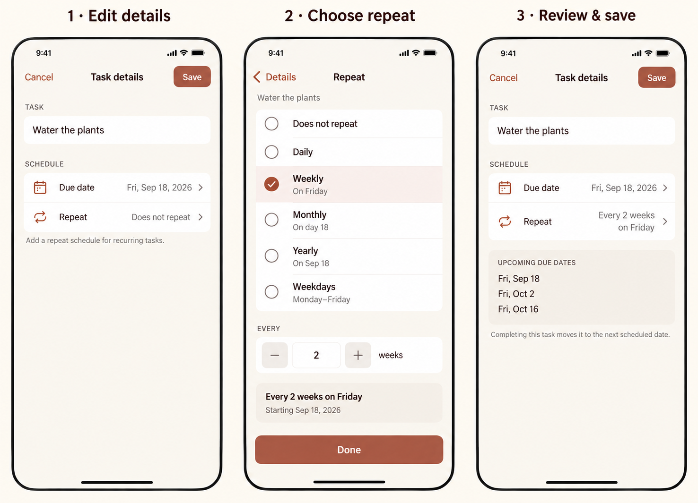
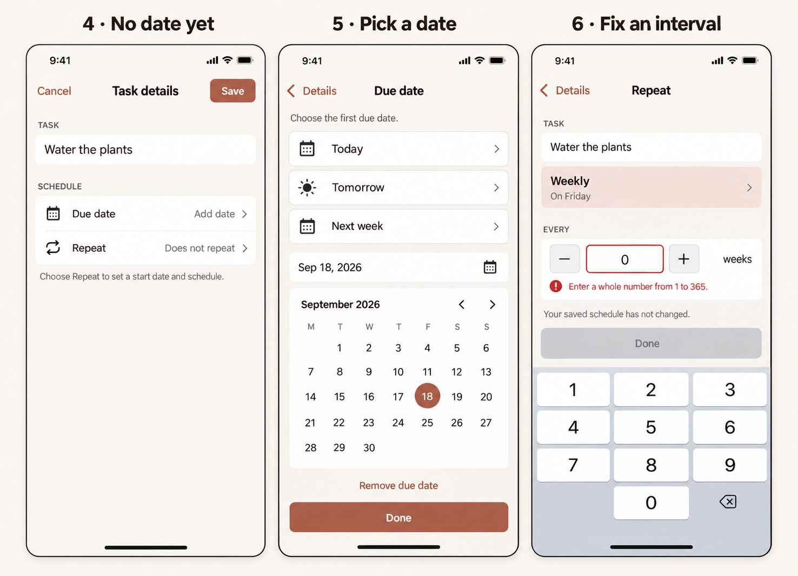
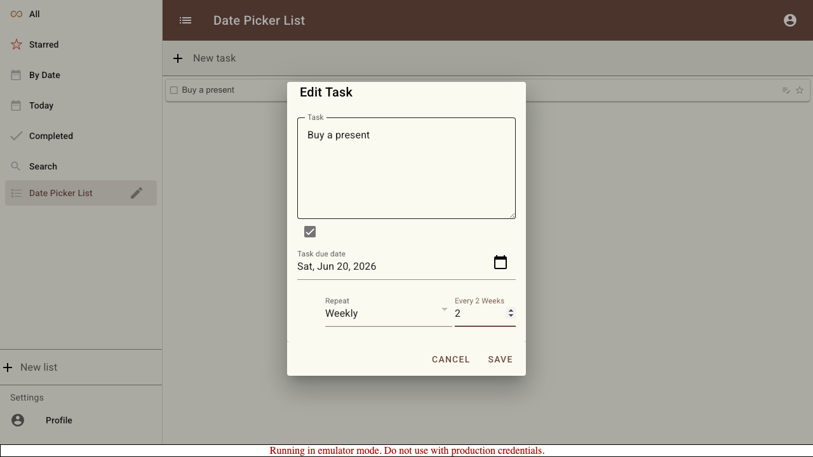

# Todo details: a phone-first redesign

**Status:** design proposal for review, September 16, 2026. No application behavior changed.

Replace the cramped Edit Task modal with a full-height phone editor. Make the task, due date, and repeat rule readable at a glance. Put schedule choices on dedicated screens, then return to a single explicit Save action.

## Review mock-ups

These are freshly AI-generated design concepts, not screenshots of implemented UI. The written behavior below is authoritative where generated typography or geometry differs. Examples use Friday, September 18, 2026.

### Main journey: details → repeat → review

1. **Details:** a compact, growing task field; two large scheduling rows; visible Cancel and Save. No keyboard until the user taps an editable field.
2. **Repeat:** all six supported choices appear as labeled rows. Selecting Weekly reveals “Every [2] weeks” and a complete sentence describing the schedule.
3. **Review:** returning with Done updates the draft. The details screen shows “Every 2 weeks on Friday” and upcoming due dates. Save commits the task.

### Supporting states: no date, date selection, invalid input

4. **No date:** show “Add date” and “Does not repeat.” Both rows are actionable. Avoid a disabled form whose prerequisite is an unexplained checkbox.
5. **Date:** a dedicated screen with shortcuts, an editable date, a calendar, and Done. The illustration shows the existing-date variant, where Remove due date is available.
6. **Invalid interval:** keep the user's input visible, explain the error beside it, and disable Done. Never silently replace an invalid number with 1.

The boards establish hierarchy and interaction, rather than pixel-exact implementation. Screen 6 compresses the repeat choices to illustrate keyboard editing; implementation keeps the same scrollable radio list as screen 2, with the focused interval scrolled into view. Save is illustrated in its active state; unchanged drafts use the disabled state specified below. At short heights, content scrolls; it must never shrink to fit the illustration.

## What is wrong with the current dialog

Reviewed the [current dialog markup and save handlers](<src/routes/(app)/+layout.svelte>), [date picker](src/lib/components/MaterialDatePicker.svelte), [dialog wrapper](src/lib/components/SgDialog.svelte), [repeat reducer](src/lib/components/items.ts), and [existing date-picker scenario](tests/e2e/006-date-picker/README.md).

This existing capture is desktop evidence, not a fresh phone test. The source also reveals the following structural problems:

- A large textarea dominates three small scheduling controls. The schedule has little visual hierarchy.
- An unlabeled checkbox gates both the date and repeat controls. A user must discover the dependency before making progress.
- Repeat type and interval are separate narrow fields, indented away from the date. The changing interval label repeats information rather than explaining the result.
- There is no complete schedule sentence or preview of upcoming dates.
- Invalid intervals are normalized to 1. The UI permits a weekdays interval even though completion logic ignores it.
- Updates to the underlying item can repopulate editor fields while editing. A draft should not be silently overwritten by synchronization.

## Screen and interaction specification

### Details

Use a full-height modal surface on phones, including landscape phones. Retain the warm neutral palette and terracotta accent; simplify the form rather than introducing a new brand. On wider tablet/desktop layouts, use the same editor in a centered panel with bounded height and scrolling content.

- Fixed top bar: Cancel, Task details, Save. Save is the only action that persists edits. Disable it while unchanged or invalid; expose the disabled reason when validation fails.
- Task field: persistent “Task” label, initially about two lines, growing with content. Require non-whitespace text. Long titles wrap without pushing Save off-screen.
- Due date row: calendar icon, “Due date,” formatted date or “Add date,” chevron. The whole row is tappable.
- Repeat row: repeat icon, “Repeat,” a sentence or “Does not repeat,” chevron. Values may wrap; do not truncate the rule.
- A repeating task shows up to three upcoming scheduled due dates, including the current due date. Include years when needed to disambiguate. An overdue current date is labeled overdue rather than omitted.
- Explanation: “Completing this task moves it to the next scheduled date.” For overdue tasks add “Missed dates are skipped when you complete it.” These are scheduled dates, not promises that the app creates multiple tasks.

### Due date

Open a screen within the editor, not a small popover over another dialog. Show Today, Tomorrow, and Next week (defined as seven days from today), plus a calendar and an editable localized date field. Shortcuts show their actual target dates as secondary text in implementation. Use locale-specific week starts and date formatting; the concept calendar uses Monday first.

Choosing a date updates this screen's local draft. Done applies it to the details draft. Back abandons this screen's changes. Calendar selection is the first due date and the recurrence anchor; there is no independent start-date concept in the current model.

If Repeat is tapped while no date exists, route first to this screen with “Choose a first due date to repeat this task.” Suggest today visually, but require Done to accept it. Then open Repeat. Back from Repeat returns to that date screen; leaving this setup flow without Done on Repeat restores the previously undated draft. Do not invent a persisted date merely because Repeat was opened.

Changing the date on a repeating task also changes its weekly weekday, monthly day, or yearly anniversary. Show the updated schedule sentence before Done.

Remove due date is present only when a date exists. If a repeat rule exists, ask within this screen: “Remove due date and repeat?” with Keep schedule and Remove both. Acceptance removes both from the draft and returns to Details. Save is still required. For a non-repeating task, remove the date directly into the draft.

### Repeat

Use a single-select radio list, with a checkmark and accessible selected state. No dropdown or horizontally scrolling chips.

| Choice | Detail and interval | Summary example |
| --- | --- | --- |
| Does not repeat | No interval | Does not repeat |
| Daily | Every N days | Every 3 days |
| Weekly | Every N weeks; weekday from due date | Every 2 weeks on Friday |
| Monthly | Every N months; day from due date | Every month on day 18 |
| Yearly | Every N years; month/day from due date | Every year on Sep 18 |
| Weekdays | Monday–Friday; no interval control | Every weekday (Mon–Fri) |

For daily, weekly, monthly, and yearly choices, show a labeled numeric input with minus/plus buttons and a written unit. Allow direct input so “90 days” does not require 89 taps. Valid values are whole numbers from 1 through 365. Disable stepping beyond the limits. Use singular/plural copy correctly. Switching units preserves a valid N in the local draft; switching to None or Weekdays hides N and serializes `every: 1` when saving that choice.

Update a summary card immediately for valid input. Empty, fractional, zero, negative, and out-of-range values remain editable and show “Enter a whole number from 1 to 365.” Hide any stale valid preview and disable Done until fixed. A numeric keyboard is helpful, but validation must also cover pasted input and hardware keyboards.

Done accepts the repeat subdraft and returns to Details; it does not persist to the store. Back discards this subdraft. “Does not repeat” removes recurrence while preserving the due date. Arbitrary weekday combinations, end dates, occurrence counts, reminders, and “repeat after completion” are outside this proposal's first version.

## Save, cancel, and synchronization

Maintain one details draft initialized on open, with nested date/repeat subdrafts. Do not dispatch persistence actions while navigating or previewing. Save validates the complete draft, dispatches the existing task/date actions, and returns focus to the originating item. This is one user-visible save boundary; the existing separate actions are not a new transactional storage guarantee.

Cancel or system Back at Details closes immediately when unchanged. With changes, offer Discard changes and Keep editing. Back within a sub-screen discards that subdraft as specified above. Avoid swipe-to-dismiss on this full-height editor; any platform dismissal or Escape must follow the same dirty-draft rule.

Keep local edits when synchronization arrives. If an edited field changed remotely, show an inline notice and require a choice to reload the latest task or explicitly keep the local edits before saving; untouched fields use latest values. If the task is removed remotely, disable Save and explain that the task is no longer available. Preserve a draft on a reported save failure and show Retry. Offline handling follows the application's existing local queue: say “Saved on this device. Waiting to sync.” only if queue status is known; do not imply server acknowledgment.

## Recurrence semantics requiring care

The current model is `DueDate { year, month, day, repeats?: { type, every } }`. Weekly, monthly, and yearly anchors come from the due date itself. Preserve those constraints in this redesign.

Completion currently keeps a repeating task active and advances from its scheduled date until the next due date is after completion time (or after the current due date when completed early). It skips missed occurrences. It does not calculate N days from completion. Preview and helper copy must reflect that distinction.

Two cases need explicit review before implementation:

| Case | Existing behavior | Recommendation |
| --- | --- | --- |
| Monthly on the 29th–31st; yearly on Feb 29 | JavaScript date overflow can move the occurrence into the next month and shift later dates. | Keep this UX phase compatible and calculate previews with the same recurrence function. Flag these schedules with concrete upcoming dates. Treat “last valid day” plus an enduring original anchor as a separate recurrence change, with migration and tests. |
| Weekdays with a weekend first date | Initial date may be a weekend; later occurrences advance to weekdays. `every` is ignored. | Hide the interval; if the first date is a weekend, explain “First due Saturday; then Monday–Friday.” Offer changing the first date, without silently moving it. |

Do not ship a preview that promises clamping to month end while the reducer still overflows. Extract a shared pure date-advancement helper for both completion and preview as part of implementation. Preserve date-only values without converting through UTC timestamps.

## Phone layout and accessibility

- Design baseline: 390 × 844 CSS pixels. Review at 320 × 568, 360 × 800, and landscape, with safe-area insets and the keyboard visible.
- Use 16px side padding, an 8px spacing rhythm, roughly 17px body text, and at least 48 × 48px interactive targets. Calendar days remain at least 44px; reduce outer padding at 320px so seven columns fit.
- Keep navigation visible. Only the body scrolls. Pin sub-screen Done above the keyboard using the actual visible viewport; allow scrolling the active field and its error into view.
- Support text enlargement to 200% without horizontal scrolling or clipped controls. Stack field labels and values when necessary. At large sizes, the entire choice list may scroll rather than fitting above the fold.
- Use semantic buttons, input labels, radio-group semantics, selected calendar-date announcements, and polite live announcements for validation and schedule summaries. Never communicate selection or errors only through color.
- Trap focus within the editor. Announce each sub-screen heading, then restore focus to its triggering row on return. Keep the background list inert and restore the item's edit control on close.
- Match the app's theme in light and dark mode; verify actual text/control contrast during implementation. Honor reduced motion; transitions must not be required to understand navigation.

## Implementation and review checklist

Suggested component boundary: `TaskDetailsEditor` owns the draft and save; `DueDateEditor` and `RepeatEditor` own local subdrafts; a shared recurrence helper supplies truthful previews. Reuse store actions and the existing calendar where suitable, but remove the checkbox and desktop popover dependency from the phone flow.

Review these decisions first:

- Full-height phone editor and separate Date/Repeat screens.
- One Save boundary, with Done applying only to the parent draft.
- Repeat without a date leading through an explicit first-date step.
- Existing recurrence behavior retained and exposed honestly, with month-end corrections scoped separately.

Implementation acceptance scenarios:

1. Open an undated task, choose Repeat, select a date and every 2 weeks, then Save. Reopen and see the same date and sentence.
2. Cancel from Details after editing task/date/repeat: persisted state is unchanged. Back from each sub-screen restores its previous values.
3. Remove repeat and preserve date; remove date with repeat and confirm both; cancel removal and preserve both.
4. Validate empty, 0, -1, 1.5, 366, and pasted text without silently replacing input. Verify 1 and 365 work.
5. Verify all six repeat types, weekend starts, early and late completion, month-end overflow, leap years, daylight-saving boundaries, and year-crossing preview labels against completion behavior.
6. Edit a long task and large interval on a small phone with the keyboard open; all controls remain reachable. Repeat with enlarged text, screen reader, keyboard navigation, and reduced motion.
7. Receive a remote edit/removal while a local draft is dirty; do not silently overwrite the user's work. Exercise offline save and a reported failure.

No application tests were run for this documentation-only proposal. Mock-ups were visually reviewed; repository image links and example calendar dates were checked. Phone usability and accessibility still require implementation testing.

## Generated assets and provenance

Generated with the built-in image generation tool for this review. Final prompt text is saved in [generation-prompts.md](docs/todo-details-ux/generation-prompts.md). Both boards are stored in this worktree so the proposal does not depend on a personal image cache:

- [Main journey PNG](docs/todo-details-ux/01-details-repeat-review.png)
- [Date and validation PNG](docs/todo-details-ux/02-date-and-validation.png)
