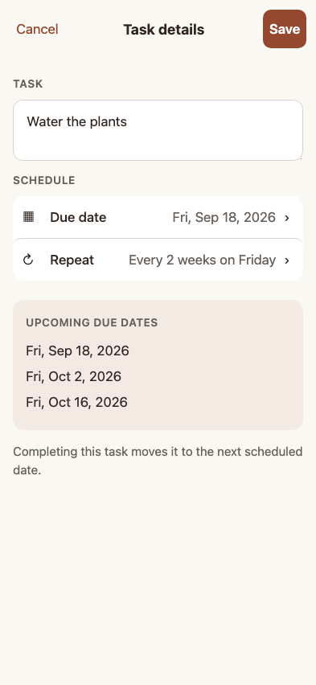

# Task details implementation review

The phone editor replaces the Edit Task modal with a task field, large Due date and Repeat rows, and dedicated date/repeat screens. Done updates a draft; Save writes the edit. All six existing repeat rules are supported, with readable summaries and upcoming dates calculated by the same helper as completion.

## Walk through the actual app

These stories are generated by Playwright after their assertions pass. Each includes screenshots of the running application. The design mock-ups remain in [the proposal](../../TODO_DETAILS_UX.md).

| Story | Phone | Desktop |
| --- | --- | --- |
| First repeating task: choose date, repeat, preview, save, reload | [Phone story](../../tests/e2e/006-date-picker/stories/Pixel-5/README.md) | [Desktop story](../../tests/e2e/006-date-picker/stories/Desktop-Chrome/README.md) |
| Every repeat rule, month-end/leap-year behavior, completion, stop repeating | [Phone story](../../tests/e2e/012-repeat-rules/stories/Pixel-5/README.md) | [Desktop story](../../tests/e2e/012-repeat-rules/stories/Desktop-Chrome/README.md) |
| Validation, cancel/back, removal, enlarged text, short viewport | [Phone story](../../tests/e2e/013-details-drafts/stories/Pixel-5/README.md) | [Desktop story](../../tests/e2e/013-details-drafts/stories/Desktop-Chrome/README.md) |
| Remote edits/removal, offline save, rejected write, retry | [Phone story](../../tests/e2e/014-details-sync/stories/Pixel-5/README.md) | [Desktop story](../../tests/e2e/014-details-sync/stories/Desktop-Chrome/README.md) |



## Implementation decisions

- A native modal dialog makes the background inert. Explicit Tab cycling, focus restoration, Escape, and a modal history entry support keyboard and system Back. Small screens use the whole visible viewport; the footer follows viewport changes.
- Date and repeat screens maintain local drafts. Removing a repeating date explicitly removes both date and rule. Invalid intervals remain visible rather than silently becoming 1. Weekdays has no interval field.
- The editor detects remote changes to edited fields, offers Reload latest task or Keep my edits, and merges untouched fields. A task whose list was removed cannot be saved.
- Existing description/date actions are written together in a Firestore batch. Rejected local actions are rolled back so Retry writes the preserved draft. Save waits for the action listener to confirm the write and flushes the confirmed cache before closing.
- Offline saves stay in the editor with a queued/waiting status until connection returns. This deliberately keeps the draft and any eventual failure visible; the editor does not report a server save before acknowledgment.
- Recurrence retains the existing month-end overflow and leap-year behavior. The preview makes it visible. There is no new month-end clamping, arbitrary weekday selection, reminder, or end-date feature.
- A reload bug found by the stories required tracking action IDs at each list's cached timestamp boundary. Multiple edits in one second now survive replay. Cache schema 6 rebuilds older local caches once from the existing action history; it does not migrate or delete server data.
- Isolated tests now resolve the actual Firestore rules and stop emulators gracefully. The retry story temporarily installs rejecting rules in its isolated emulator and restores them in a `finally` block.

## Reproduce

From the worktree, install dependencies with `npm ci`. Then run:

```sh
npm run test
nix develop -c npm run playwright:isolated -- \
  tests/e2e/006-date-picker tests/e2e/012-repeat-rules \
  tests/e2e/013-details-drafts tests/e2e/014-details-sync --workers=1
```

The committed visual baselines were generated with Chromium on macOS. On that platform, enable exact comparisons:

```sh
E2E_COMPARE_SCREENSHOTS=1 nix develop -c npm run playwright:isolated -- \
  tests/e2e/006-date-picker tests/e2e/012-repeat-rules \
  tests/e2e/013-details-drafts tests/e2e/014-details-sync --workers=1
```

Comparisons use `maxDiffPixels: 0`. Intentional baseline updates require the explicit `--update-snapshots` flag and visual review. Other platforms run the same functional assertions and generate story screenshots; their font rendering needs its own reviewed visual baselines before enabling comparisons. The helper hides the unrelated background task list and masks the changing build label for deterministic dialog screenshots.

The small-height story simulates a keyboard-reduced viewport; it is not a screenshot of a real operating-system keyboard. Real-device screen-reader and software-keyboard acceptance remain manual checks. Native iOS/Android packaging was not changed.
