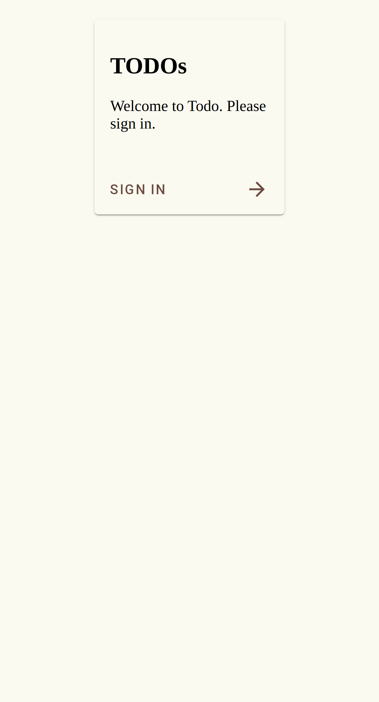

# Scenario: Login Page Verification

Verify the initial state of the login page.

## Steps

### Step 001: navigate_to_login

User navigates to the home page and is redirected to the login page.

**Verifications:**
- [x] URL is /login

### Step 002: verify_login_content

Verify the presence of essential elements on the login page.

**Verifications:**
- [x] Title is Todo
- [x] Heading contains TODOs
- [x] Welcome message is present

### Step 003: verify_login_button

Ensure the login button is visible and ready for interaction.

**Verifications:**
- [x] Login button is visible

