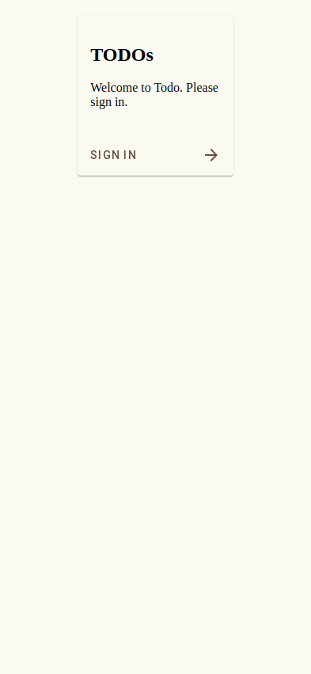

# Scenario: Login Page Verification

Verify the initial state of the login page.

## Steps

### Step 001: login_page

User navigates to the home page and is redirected to the login page, where content and button are verified.

**Verifications:**

- [x] URL is /login
- [x] Title is Todo
- [x] Heading contains TODOs
- [x] Welcome message is present
- [x] Login button is visible

