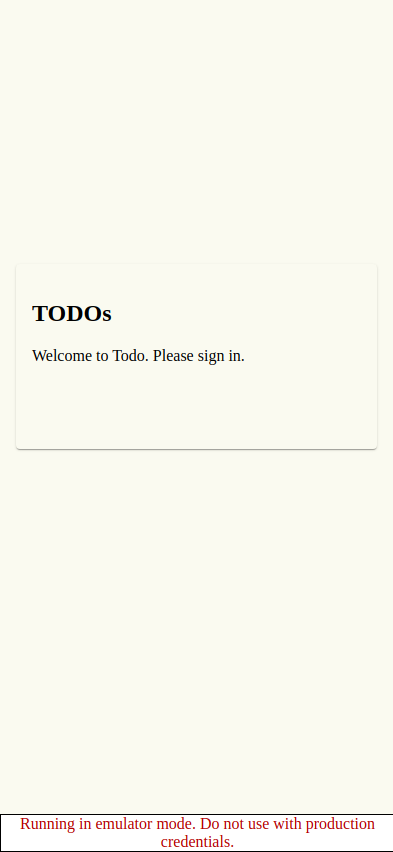
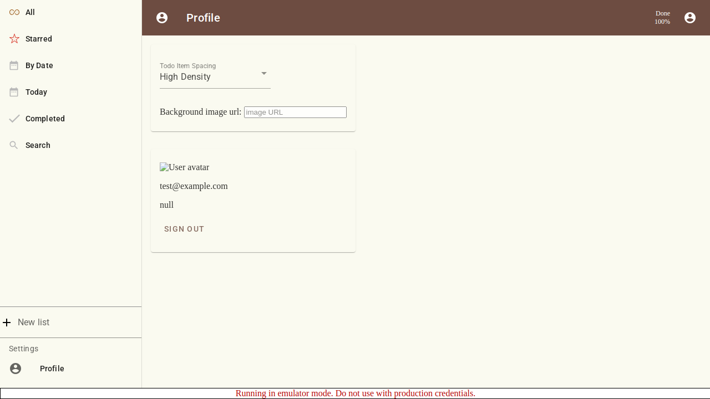
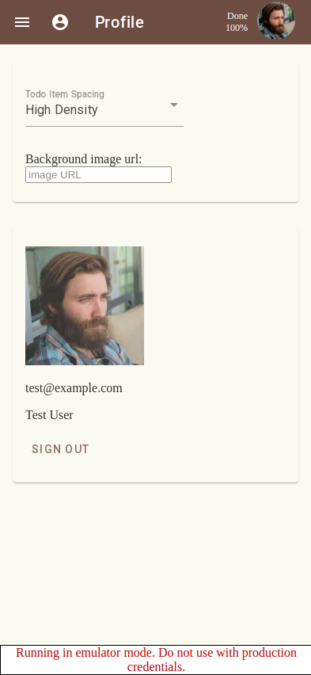
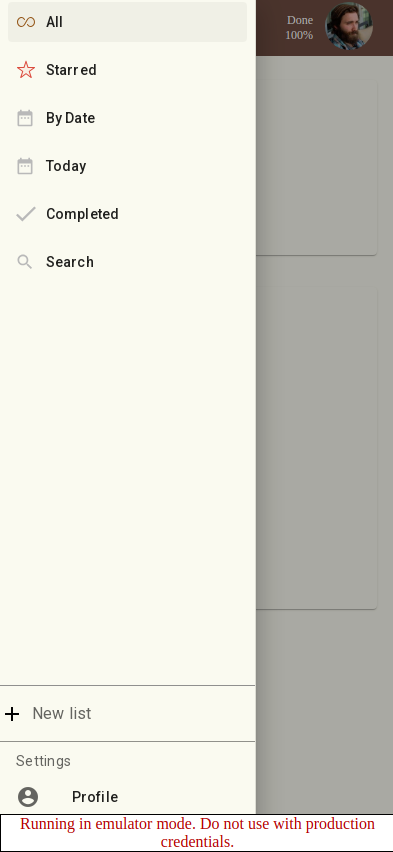
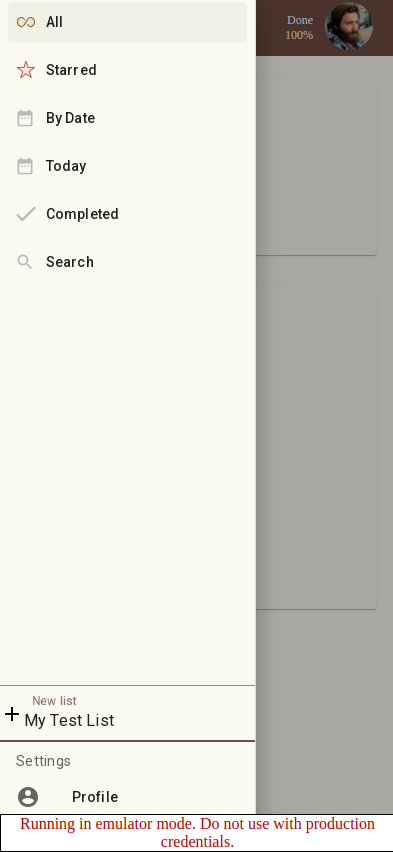
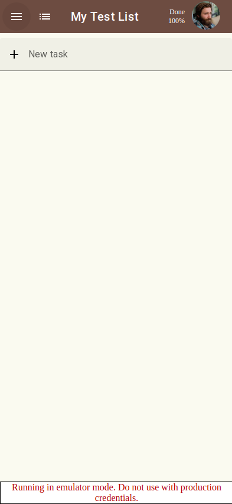
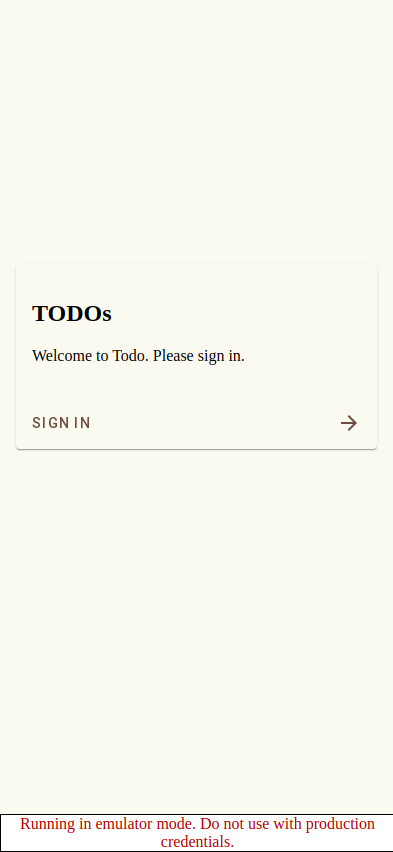

# Scenario: Successful Login Flow

Verify that a user can sign in using the test button and view their profile.

## Steps

### Step 001: login_page

User is on the login page.

**Verifications:**
- [x] Login button is visible

### Step 002: after_login

User clicked test sign in and should be redirected to profile page (via home page).

**Verifications:**
- [x] Redirected to profile page

### Step 003: profile_page

User is on the profile page.

**Verifications:**
- [x] URL is /profile
- [x] Email is visible
- [x] Name is visible

### Step 004: create_list_step

User creates a new todo list.

**Verifications:**
- [x] New list input is visible

### Step 005: entering_list_name

User has entered the new list name but has not yet submitted.

**Verifications:**
- [x] Input contains the list name

### Step 006: list_created

User created a new list and is redirected to it.

**Verifications:**
- [x] URL contains the new list ID
- [x] List title matches

### Step 007: after_signout

User clicked sign out and should be redirected to login page.

**Verifications:**
- [x] Redirected to login page

