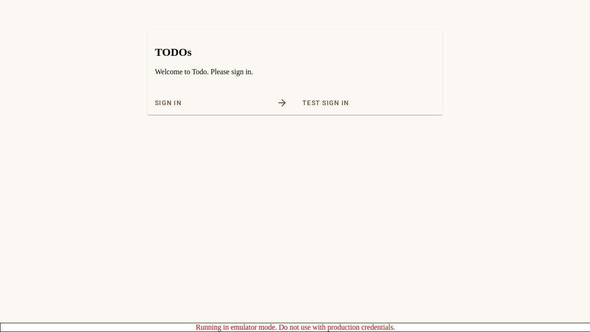

# Scenario: Successful Login Flow

Verify that a user can sign in using the test button and view their profile.

## Steps

### Step 001: login_page

User is on the login page.

**Verifications:**
- [x] Login button is visible

### Step 002: after_login

User clicked test sign in and should be redirected to profile page (via home page).

**Verifications:**
- [x] Redirected to profile page

### Step 003: profile_page

User is on the profile page.

**Verifications:**
- [x] URL is /profile
- [x] Email is visible
- [x] Name is visible

### Step 004: after_signout

User clicked sign out and should be redirected to login page.

**Verifications:**
- [x] Redirected to login page

