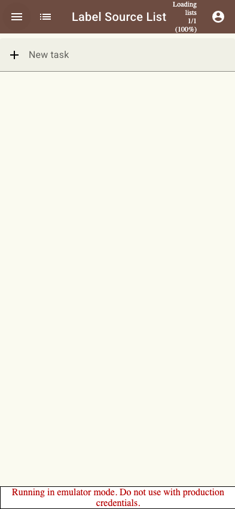
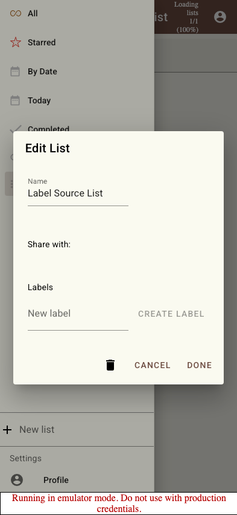
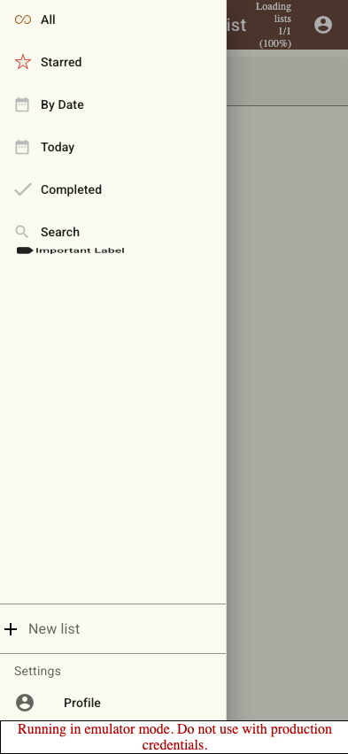
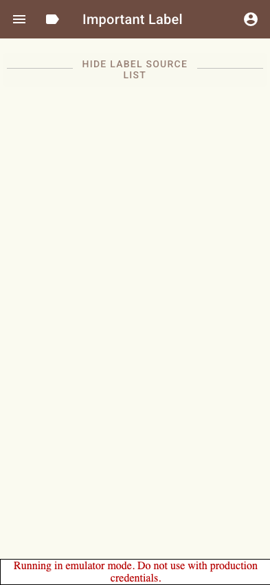
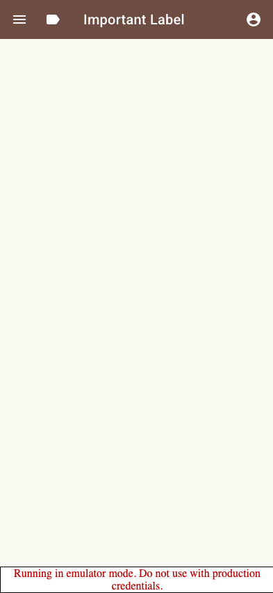

# Scenario: Labels

Verify that a user can create a label from the list edit dialog and see list tasks through that label.

## Steps

### Step 001: source_list_created

User has created a source list.

**Verifications:**
- [x] Source list is visible

### Step 002: label_creation_ui_available

User can create a label from the list edit dialog.

**Verifications:**
- [x] Labels section is visible
- [x] New label field is visible
- [x] Create label button is disabled until a name is entered

### Step 003: label_created

User created a label containing the current list.

**Verifications:**
- [x] Label appears in the sidebar

### Step 004: label_opened

User opened the label and sees the source list as a contained group.

**Verifications:**
- [x] URL is the label route
- [x] Source list group name is visible

### Step 005: label_sidebar_folder_opened

The active label opens like a folder in the sidebar.

**Verifications:**
- [x] Source list appears nested under the active label
- [x] Source list is hidden from the top-level sidebar

### Step 006: label_removal_draft_cancelled

User can draft removing the current list from the label and cancel it.

**Verifications:**
- [x] Label checkbox stays unchecked while the dialog is open

### Step 007: label_unchanged_after_cancel

User cancelled the draft removal and the label still contains the source list.

**Verifications:**
- [x] URL is the label route
- [x] Source list group is still visible

### Step 008: label_removed_from_list

User removed the current list from the label.

**Verifications:**
- [x] Label checkbox stays unchecked

### Step 009: label_empty_after_removal

User opened the label and no longer sees the removed list.

**Verifications:**
- [x] URL is the label route
- [x] Removed source list group is absent

