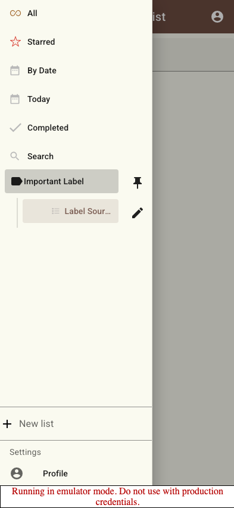
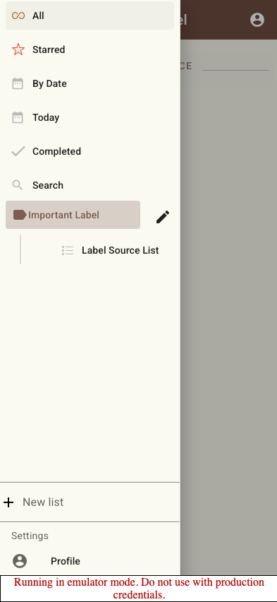
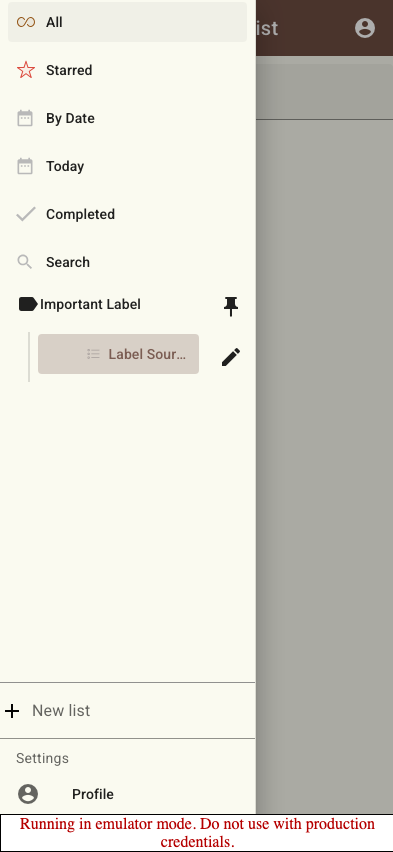
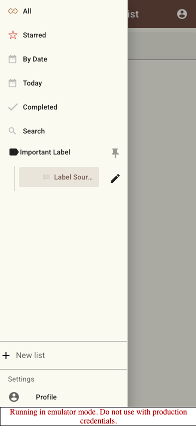
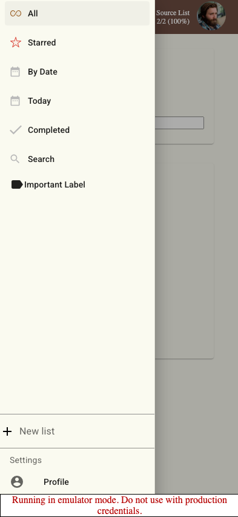
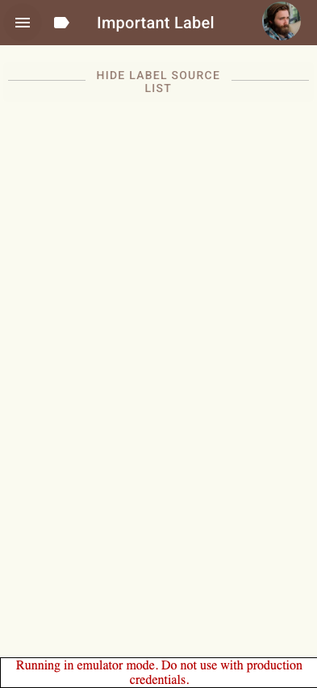
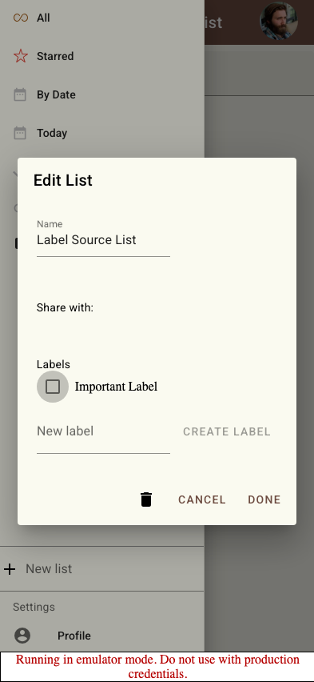
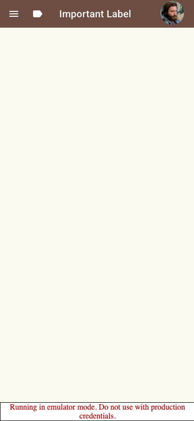

# Scenario: Labels

Verify that a user can create a label from the list edit dialog and see list tasks through that label.

## Steps

### Step 001: source_list_created

User has created a source list.

**Verifications:**
- [x] Source list is visible

### Step 002: label_creation_ui_available

User can create a label from the list edit dialog.

**Verifications:**
- [x] Labels section is visible
- [x] New label field is visible
- [x] Create label button is disabled until a name is entered

### Step 003: label_created

User created a label containing the current list.

**Verifications:**
- [x] Label appears in the sidebar

### Step 004: label_pinned_and_expanded

User tapped a collapsed label and it expanded as a pinned folder.

**Verifications:**
- [x] User remains on the source list
- [x] Drawer remains open so the user can choose a nested list
- [x] Source list appears nested under the pinned label
- [x] Pinned label can be unpinned

### Step 005: expanded_label_tap_selects_label

User tapped an already-expanded label to select the label view.

**Verifications:**
- [x] URL is the label route
- [x] Mobile drawer is dismissed after selecting the label
- [x] Source list group name is visible

### Step 006: label_sidebar_folder_opened

The active label opens like a folder in the sidebar.

**Verifications:**
- [x] Source list appears nested under the active label
- [x] Source list is hidden from the top-level sidebar

### Step 007: active_unpinned_label_collapsed

The selected label collapses when it is not pinned and no current child list keeps it open.

**Verifications:**
- [x] Nested source list is hidden

### Step 008: pinned_label_stays_open_after_nested_navigation

The pinned label stays expanded after navigating to a list inside it.

**Verifications:**
- [x] Nested source list remains visible

### Step 009: unpinned_label_collapses_after_navigation_away

An unpinned label collapses after the user navigates away from its nested list.

**Verifications:**
- [x] Unpinned label is still expanded while viewing its nested list

### Step 010: unpinned_label_collapsed_after_navigation_away

The unpinned label collapsed after the user navigated away from its nested list.

**Verifications:**
- [x] Nested source list is no longer shown in the drawer

### Step 011: label_removal_draft_cancelled

User can draft removing the current list from the label and cancel it.

**Verifications:**
- [x] Label checkbox stays unchecked while the dialog is open

### Step 012: label_unchanged_after_cancel

User cancelled the draft removal and the label still contains the source list.

**Verifications:**
- [x] URL is the label route
- [x] Source list group is still visible

### Step 013: label_removed_from_list

User removed the current list from the label.

**Verifications:**
- [x] Label checkbox stays unchecked

### Step 014: label_empty_after_removal

User opened the label and no longer sees the removed list.

**Verifications:**
- [x] URL is the label route
- [x] Removed source list group is absent

