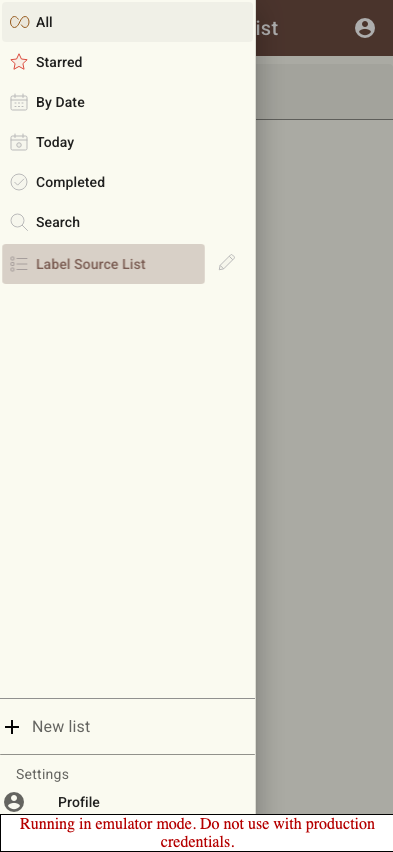
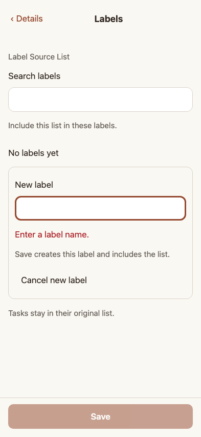
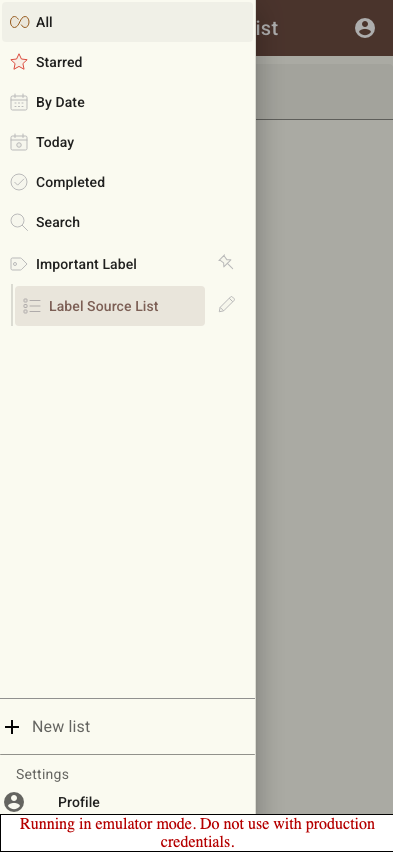
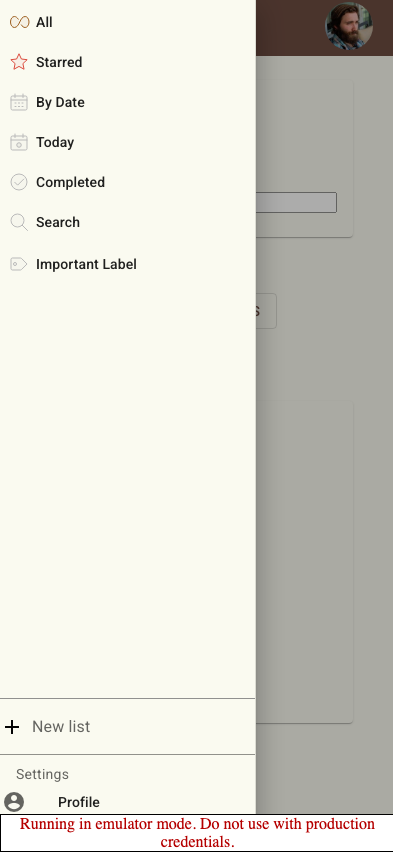
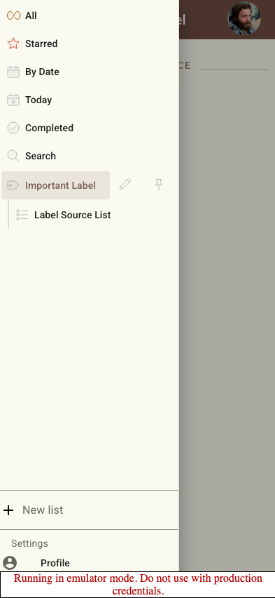
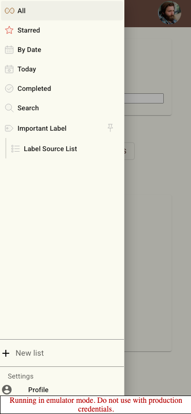
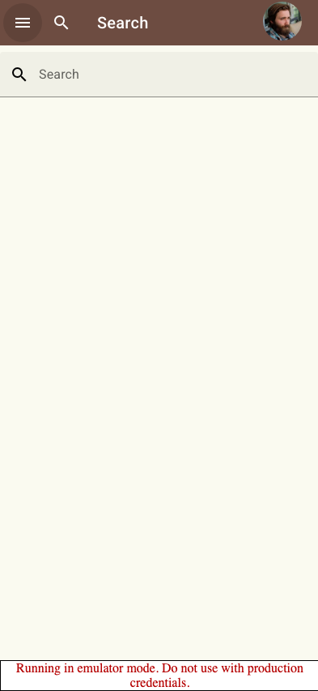
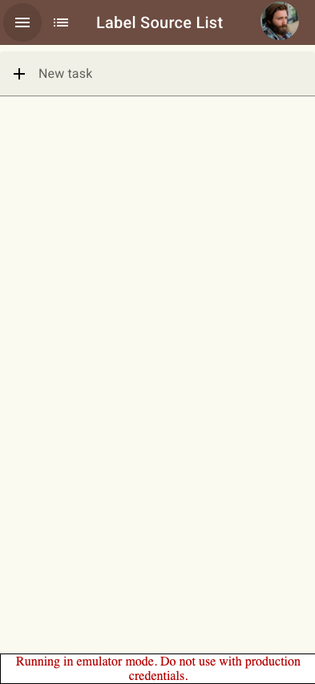
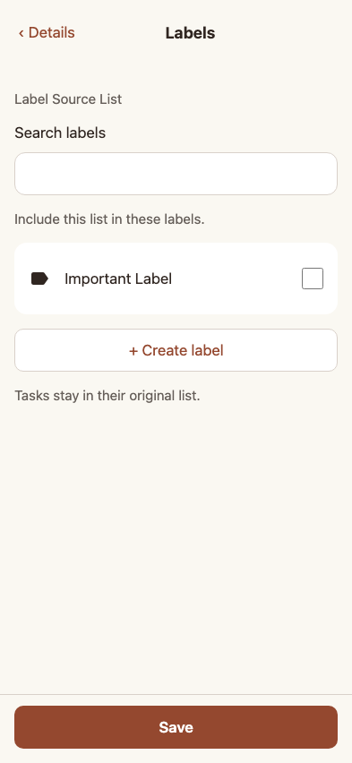

# Scenario: Labels

Verify that a user can create a label from the list edit dialog and see list tasks through that label.

## Steps

### Step 001: source_list_created

User has created a source list.

**Verifications:**
- [x] Source list is visible

### Step 002: label_creation_ui_available

User can create a label from the list edit dialog.

**Verifications:**
- [x] Labels section is visible
- [x] New label field is visible
- [x] Create label button is disabled until a name is entered

### Step 003: label_created

User created a label containing the current list.

**Verifications:**
- [x] Label appears in the sidebar

### Step 004: closed_label_has_no_pin_control

An unpinned label is closed away from its label or child-list route.

**Verifications:**
- [x] Nested source list is hidden
- [x] Closed label has no pin control

### Step 005: label_click_selects_and_expands

One label-row click selects the label view and expands its sidebar folder.

**Verifications:**
- [x] URL is the label route
- [x] Mobile drawer is dismissed after selecting the label
- [x] Source list group name is visible

### Step 006: selected_label_is_open_but_unpinned

The selected label is expanded without being pinned.

**Verifications:**
- [x] Source list appears nested under the selected label
- [x] Nested list uses the new assets without excessive indentation
- [x] Open label offers a separate Pin action
- [x] Edit appears to the left without moving the Pin action

### Step 007: label_pinned_explicitly

The user explicitly pins the already-open label without navigating.

**Verifications:**
- [x] Label route is unchanged
- [x] Pin control changes to Unpin

### Step 008: pinned_label_persists

The explicit pin survives reload and unrelated navigation.

**Verifications:**
- [x] Pinned label remains expanded on Profile
- [x] Persisted label remains pinned
- [x] Pin position is stable when the Edit action disappears

### Step 009: unpin_collapses_pinned_only_label

Unpinning on an unrelated route collapses a label that was open only because it was pinned.

**Verifications:**
- [x] Current route is unchanged
- [x] Nested source list is no longer shown
- [x] Collapsed label has no pin control

### Step 010: unpinned_label_stays_closed_after_navigation

Subsequent navigation continues to derive the unpinned label as closed.

**Verifications:**
- [x] Nested source list is no longer shown
- [x] Closed label again has no pin control

### Step 011: nested_navigation_records_via

Opening a nested list records the parent label explicitly in the URL.

**Verifications:**
- [x] List URL includes the parent label as via

### Step 012: label_removal_draft_cancelled

User can draft removing the current list from the label and cancel it.

**Verifications:**
- [x] Label checkbox stays unchecked while the dialog is open

### Step 013: label_unchanged_after_cancel

User cancelled the draft removal and the label still contains the source list.

**Verifications:**
- [x] URL is the label route
- [x] Source list group is still visible

### Step 014: label_removed_from_list

User removed the current list from the label.

**Verifications:**
- [x] Label checkbox stays unchecked

### Step 015: label_empty_after_removal

User opened the label and no longer sees the removed list.

**Verifications:**
- [x] URL is the label route
- [x] Removed source list group is absent

