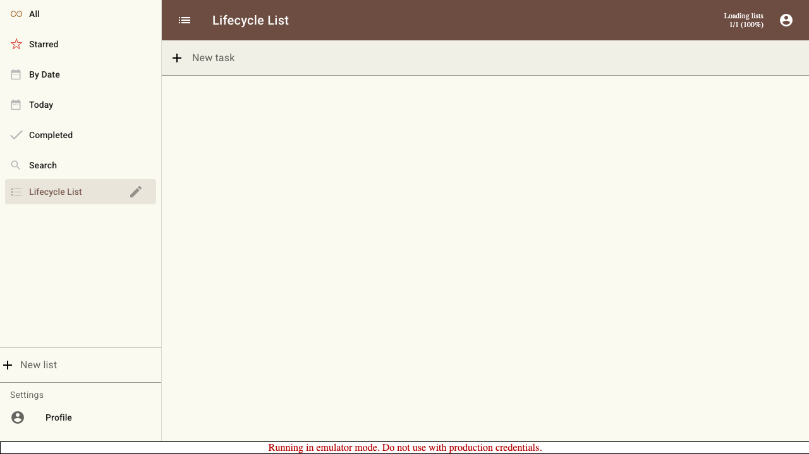
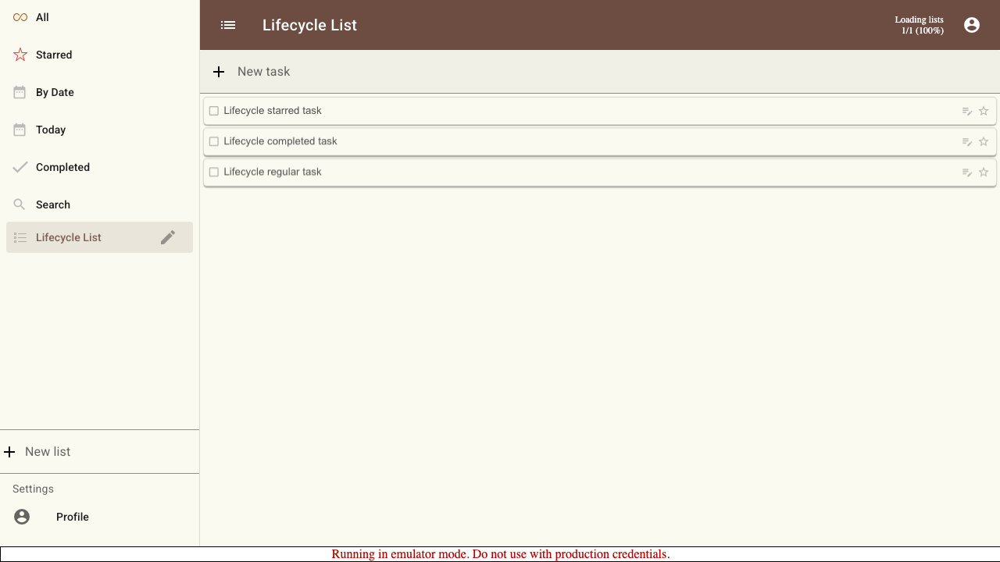
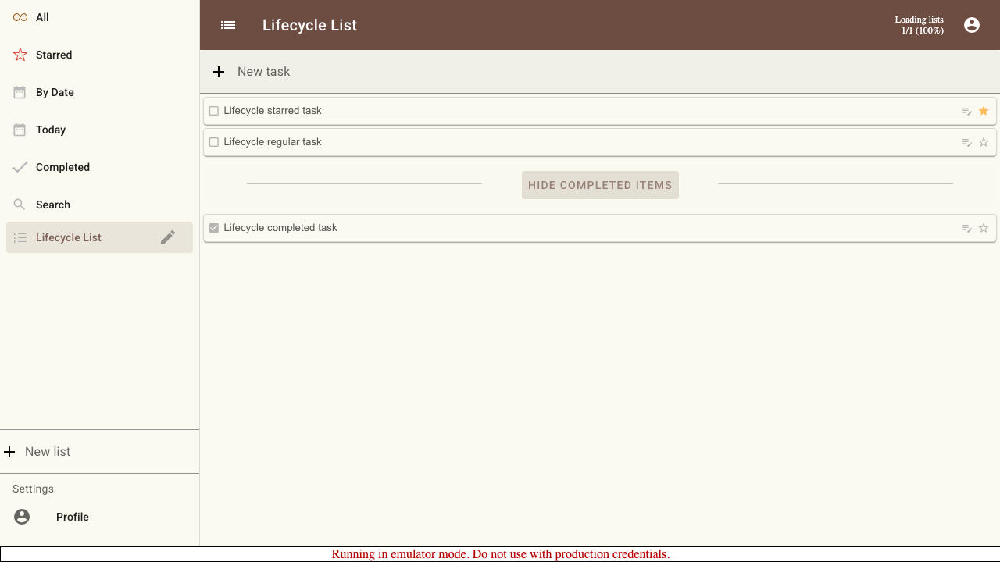
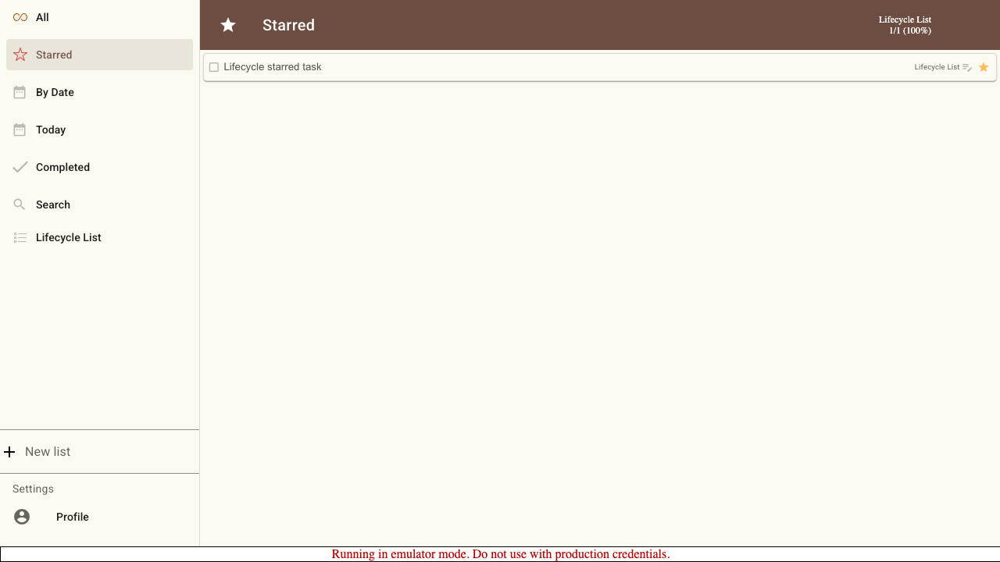
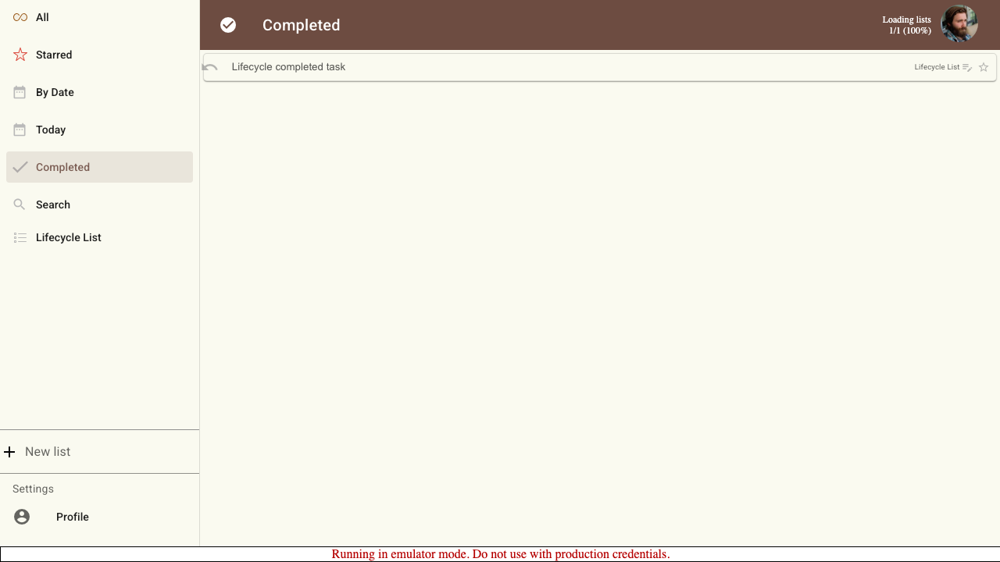
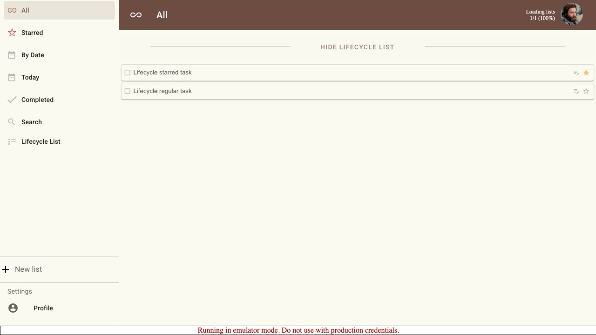

# Scenario: Task Lifecycle Across Views

Verify that created, starred, completed, and revealed tasks appear in the expected task views.

## Steps

### Step 001: signed_in

User signs in and the application shell is visible.

**Verifications:**
- [x] Application shell is visible

### Step 002: list_created

User creates a dedicated list for the lifecycle scenario.

**Verifications:**
- [x] List route is active
- [x] List title is visible
- [x] New task input is visible

### Step 003: tasks_created

User adds regular, completed, and starred candidate tasks to the list.

**Verifications:**
- [x] Regular task is visible
- [x] Completed candidate task is visible
- [x] Starred candidate task is visible

### Step 004: task_states_changed

User stars one task and completes another task.

**Verifications:**
- [x] Starred task remains visible on the list
- [x] Completed task is hidden from the active list
- [x] Regular task remains visible on the list
- [x] Completed-items toggle is available

### Step 005: completed_revealed_in_list

User reveals completed items inside the source list.

**Verifications:**
- [x] Completed task is visible in the source list
- [x] Completed-items toggle changes to hide

### Step 006: starred_view

User opens the Starred view.

**Verifications:**
- [x] Starred title is visible
- [x] Starred task is visible
- [x] Completed task is not visible
- [x] Regular task is not visible

### Step 007: completed_view

User opens the Completed view.

**Verifications:**
- [x] Completed title is visible
- [x] Completed task is visible
- [x] Source list name is shown for the completed task
- [x] Starred task is not visible

### Step 008: all_view

User opens All and verifies active tasks remain visible while the completed task is hidden.

**Verifications:**
- [x] All title is visible
- [x] Starred task is visible as active
- [x] Regular task is visible as active
- [x] Completed task is hidden from active All view

