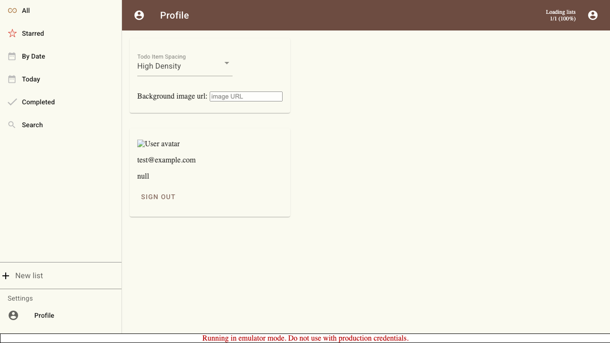
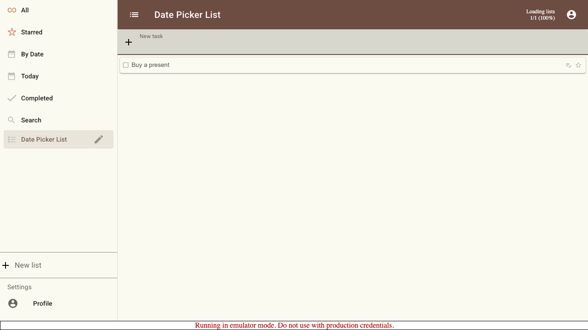
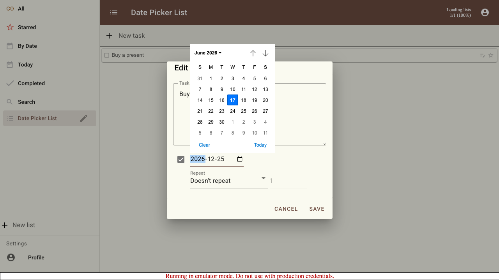
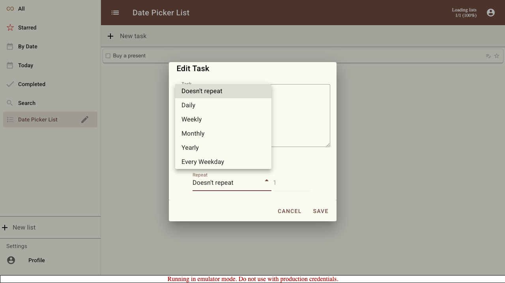
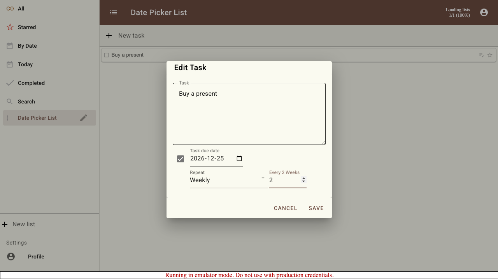
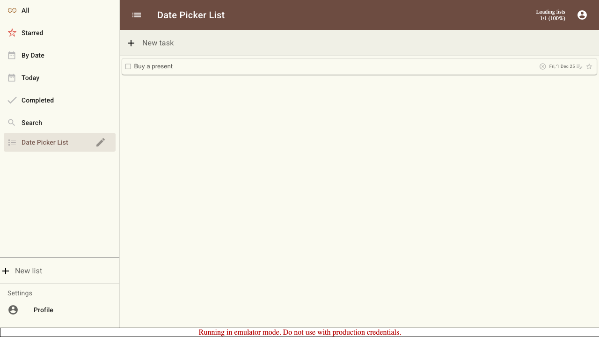
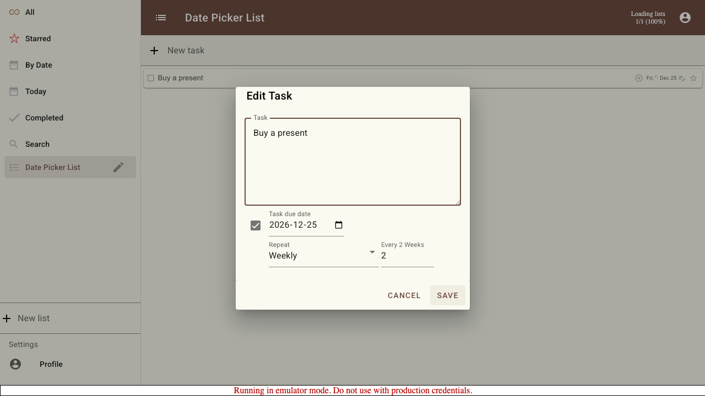

# Scenario: Date Picker Dialog (Baseline)

Documents the current "Edit Task" dialog used to set a due date and repeat schedule on a task. Captured before redesigning the date picker so the new design can be compared against this baseline.

## Steps

### Step 001: list_setup

Reveal the "New list" field (opening the drawer on mobile layouts).

**Verifications:**
- [x] New list input is visible

### Step 002: task_added

A task has been added to the list and is ready to be edited.

**Verifications:**
- [x] Task description input is present

### Step 003: date_picker_opened

The "Edit Task" dialog is open. The due date is initially disabled: the checkbox is unchecked and the date field is greyed out.

**Verifications:**
- [x] Dialog title "Edit Task" is visible
- [x] Due date checkbox is unchecked
- [x] Date field is disabled

### Step 004: due_date_enabled

Checking the box enables the due date controls.

**Verifications:**
- [x] Due date checkbox is checked
- [x] Date field is now enabled

### Step 005: due_date_selected

A specific due date has been entered via the native date input.

**Verifications:**
- [x] Date field holds the selected date

### Step 006: repeat_options_open

The repeat selector (a Material `Select`) is open, showing the available repeat schedules: Doesn't repeat, Daily, Weekly, Monthly, Yearly, and Every Weekday.

**Verifications:**
- [x] Weekly option is available

### Step 007: repeat_configured

A "Weekly" repeat is selected and configured to recur every 2 weeks.

**Verifications:**
- [x] Repeat interval is set to 2

### Step 008: due_date_saved

After saving, the task shows its due date chip. The repeating task also gains the "complete forever" (highlight_off) control.

**Verifications:**
- [x] A due date chip is shown on the task

### Step 009: date_picker_reopened

Reopening the dialog shows the previously saved values: the due date is enabled, the date is preserved, and the repeat interval is retained.

**Verifications:**
- [x] Due date checkbox is checked
- [x] Saved due date is preserved
- [x] Saved repeat interval is preserved

