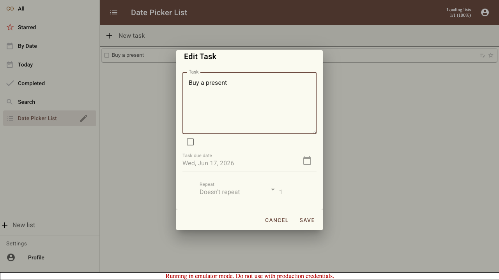
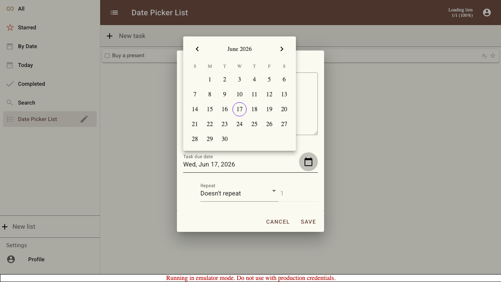

# Scenario: Date Picker Dialog

Documents the "Edit Task" dialog used to set a due date and repeat schedule on a task. The due date is chosen with a Material-styled calendar that matches the rest of the app.

## Steps

### Step 001: task_added

A task has been added to the list and is ready to be edited.

**Verifications:**
- [x] Task is visible in the list

### Step 002: dialog_opened

The "Edit Task" dialog is open. The due date is initially disabled: the checkbox is unchecked and the Material date field is greyed out.

**Verifications:**
- [x] Dialog title "Edit Task" is visible
- [x] Due date checkbox is unchecked
- [x] Material date field is disabled

### Step 003: due_date_enabled

Checking the box enables the due date controls.

**Verifications:**
- [x] Due date checkbox is checked
- [x] Material date field is now enabled

### Step 004: calendar_opened

The Material-styled calendar popover opens, matching the app theme (month navigation, weekday headers, and a grid of selectable days).

**Verifications:**
- [x] Calendar is visible
- [x] Days are selectable

### Step 005: due_date_selected

Choosing a day closes the calendar and shows the formatted due date in the field.

**Verifications:**
- [x] Date field shows the selected date

### Step 006: repeat_options_open

The repeat selector is open, showing the available schedules: Doesn't repeat, Daily, Weekly, Monthly, Yearly, and Every Weekday.

**Verifications:**
- [x] Weekly option is available

### Step 007: repeat_configured

A "Weekly" repeat is selected and configured to recur every 2 weeks.

**Verifications:**
- [x] Repeat interval is set to 2

### Step 008: saved

After saving, the task shows its due date chip.

**Verifications:**
- [x] A due date chip is shown on the task

### Step 009: reopened

Reopening the dialog shows the saved values: the due date is enabled and preserved, and the repeat interval is retained.

**Verifications:**
- [x] Due date checkbox is checked
- [x] Saved due date is preserved
- [x] Saved repeat interval is preserved

