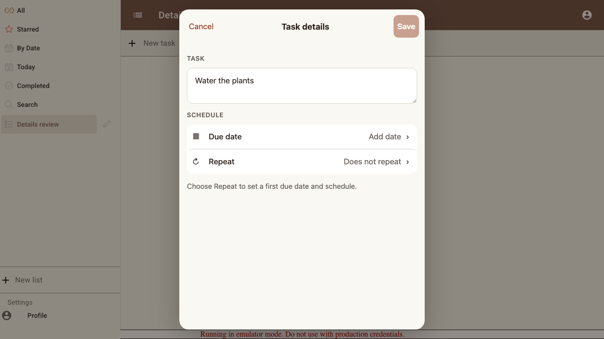
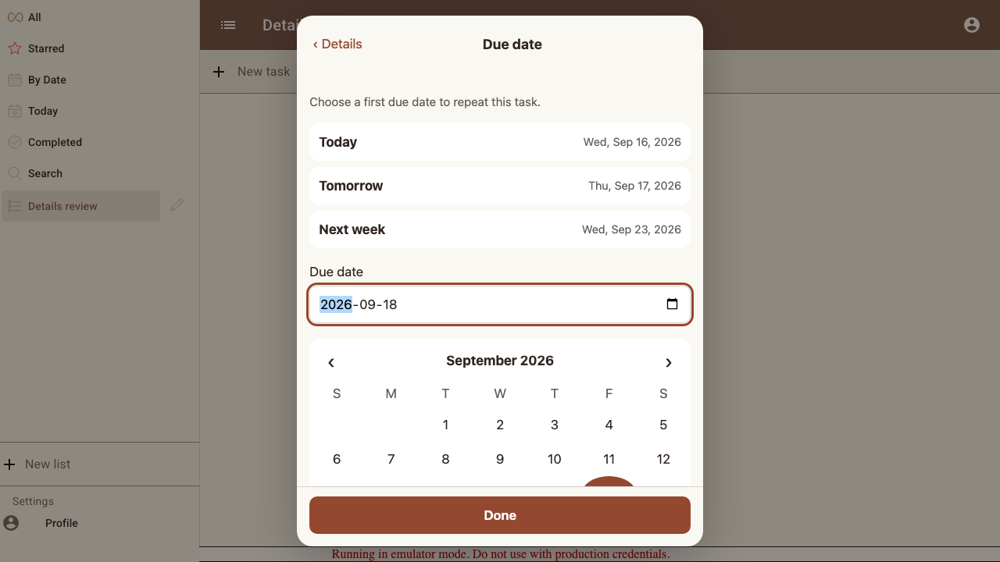
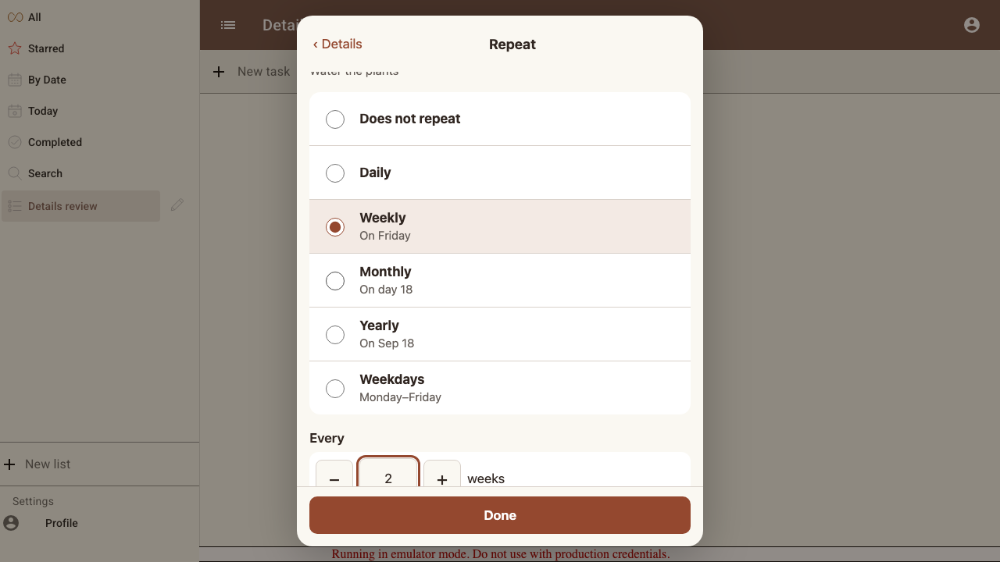
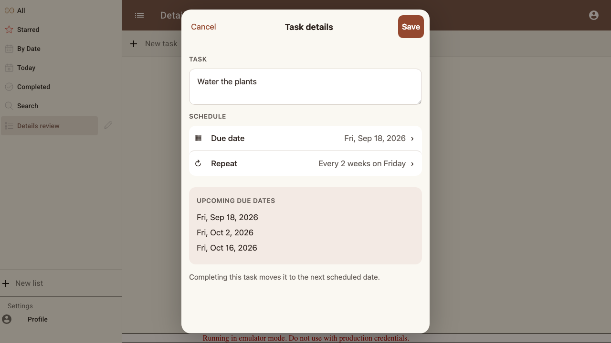
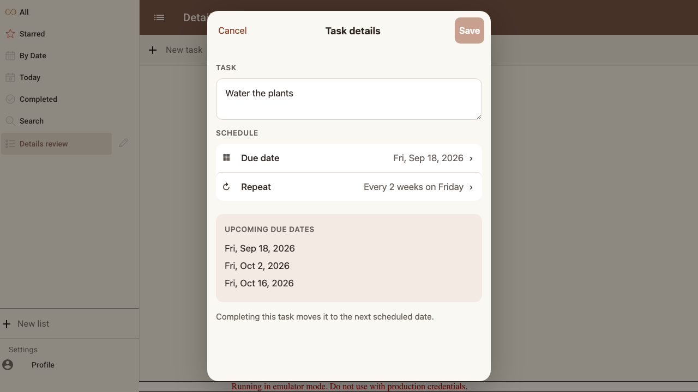

# Scenario: Task details: first repeating task

Choose a first date, configure a schedule, preview it, save, and reopen. Real app screens, generated by the verified story.

## Steps

### Step 001: undated_task

Repeat is available without finding an unlabeled checkbox.

**Verifications:**
- [x] The repeat row is enabled and the unchanged draft cannot be saved

### Step 002: choose_first_date

**Verifications:**
- [x] The calendar highlights the entered first date

### Step 003: weekly_schedule

**Verifications:**
- [x] All six rules are available and the full schedule is readable

### Step 004: review_before_save

**Verifications:**
- [x] Upcoming dates include Sep 18, Oct 2 and Oct 16

### Step 005: saved_and_reloaded

**Verifications:**
- [x] The date and repeat rule survive a full reload

