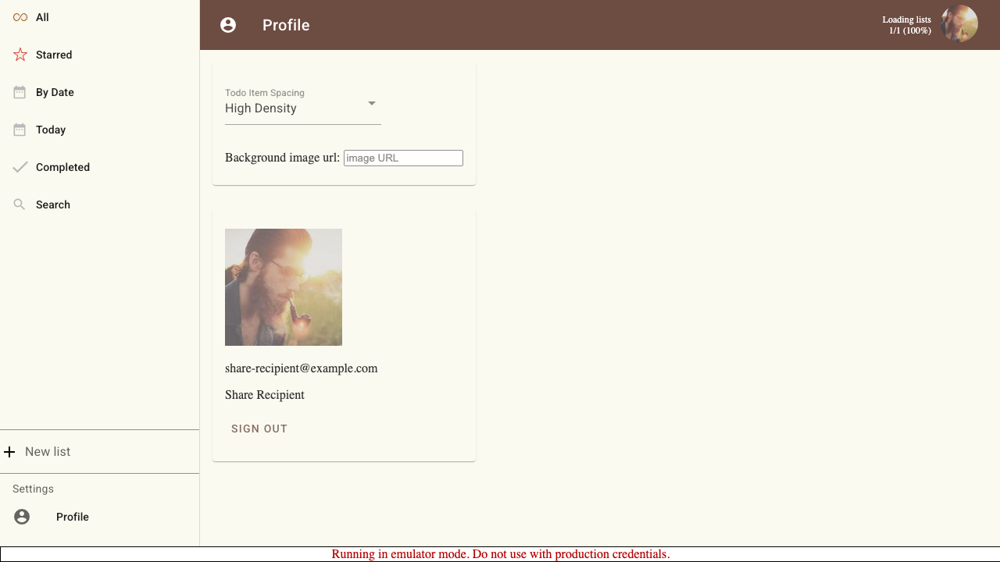
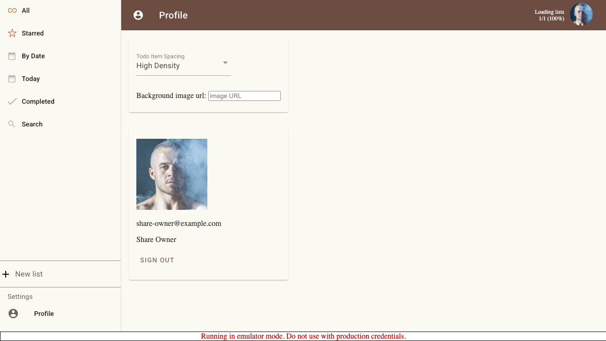
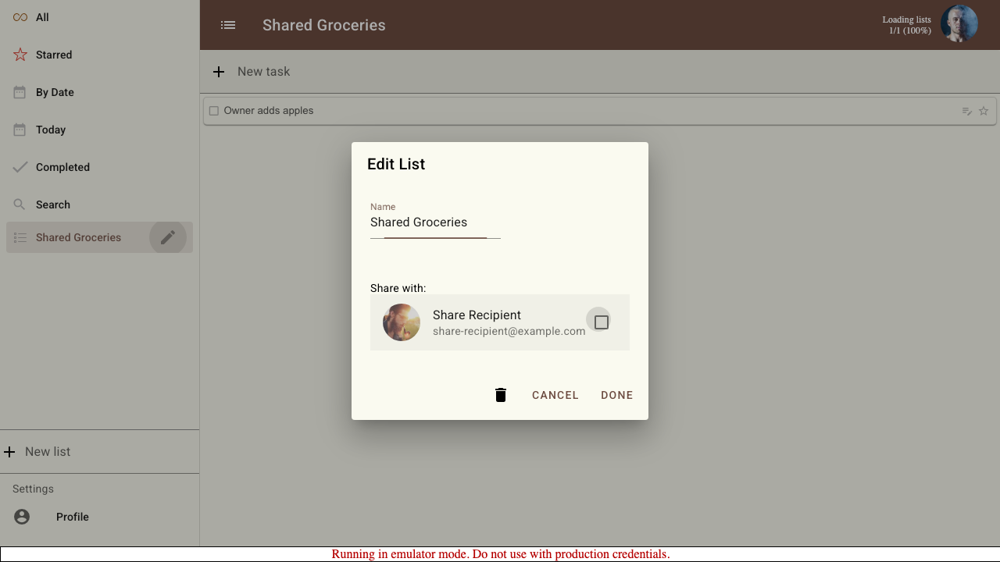
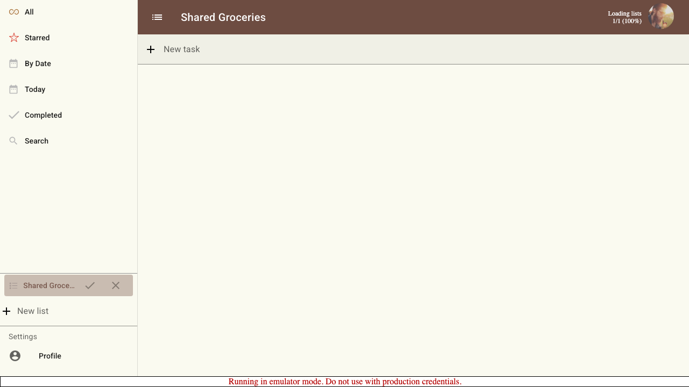
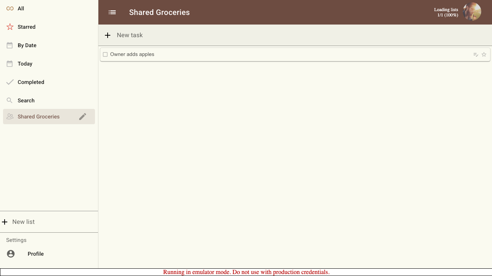
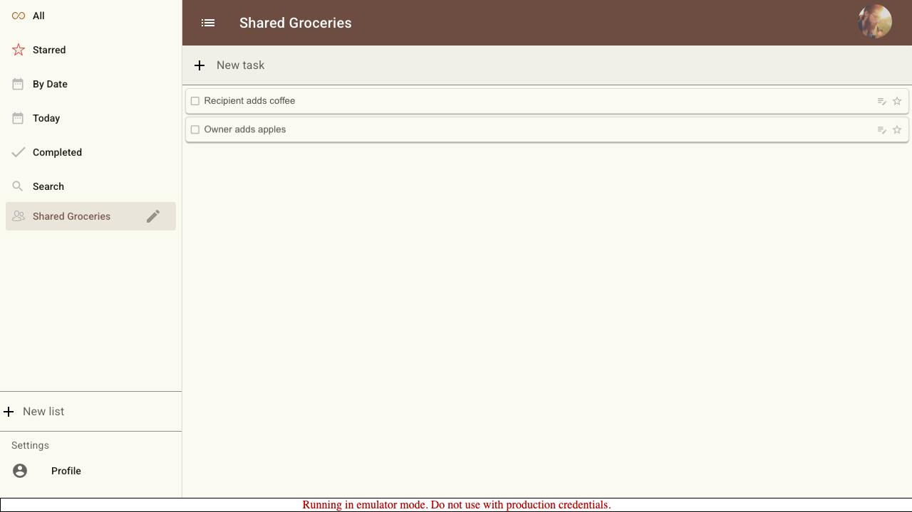
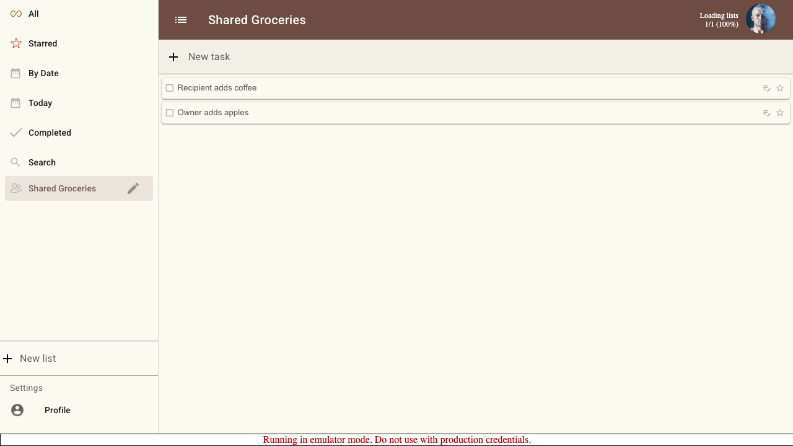

# Scenario: Share List Between Users

Verify that one user can share a list, a second user can accept it, and both users see shared task updates.

## Steps

### Step 001: recipient_registered

Recipient signs in once so they are discoverable as a share target.

**Verifications:**
- [x] Recipient profile is visible

### Step 002: owner_signed_in

Owner signs in and sees the application shell.

**Verifications:**
- [x] Owner profile is visible

### Step 003: owner_list_created

Owner creates a list and adds the first shared task.

**Verifications:**
- [x] Owner list title is visible
- [x] Owner task is visible

### Step 004: recipient_selected_for_share

Owner selects the recipient in the list sharing dialog.

**Verifications:**
- [x] Recipient is listed in share dialog
- [x] Recipient share checkbox is checked

### Step 005: recipient_share_pending

Recipient receives the pending shared list with accept and reject controls.

**Verifications:**
- [x] Pending shared list is visible
- [x] Accept share control is visible
- [x] Reject share control is visible

### Step 006: recipient_accepted_share

Recipient accepts the share and can view the owner task.

**Verifications:**
- [x] Shared list title is visible to recipient
- [x] Owner task is visible to recipient

### Step 007: recipient_added_task

Recipient adds a task to the accepted shared list.

**Verifications:**
- [x] Owner task remains visible to recipient
- [x] Recipient task is visible to recipient

### Step 008: owner_sees_recipient_update

Owner sees the task added by the recipient on the shared list.

**Verifications:**
- [x] Owner task remains visible to owner
- [x] Recipient task is visible to owner

