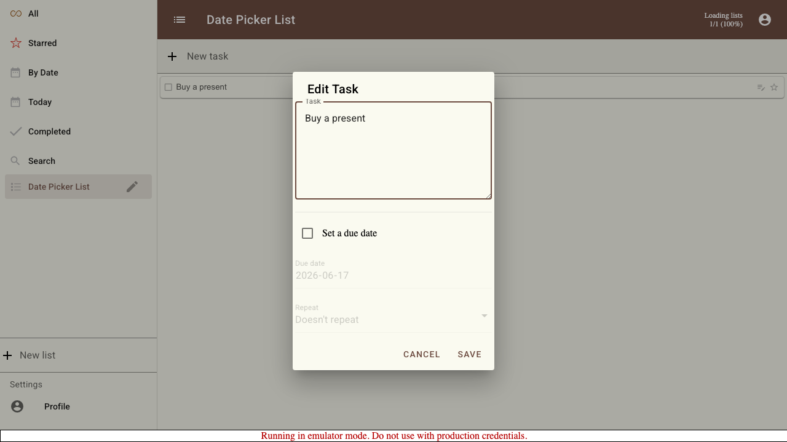
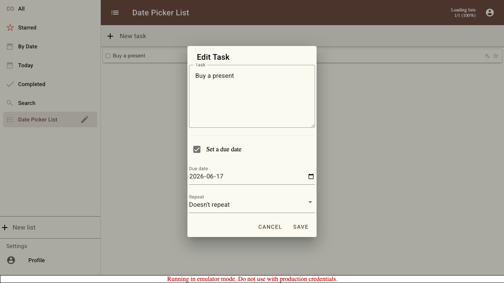
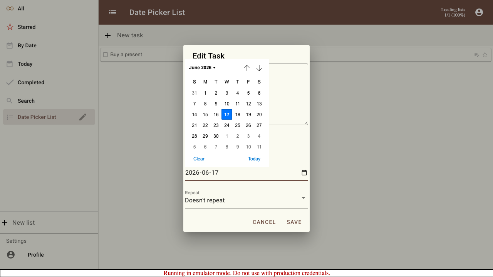
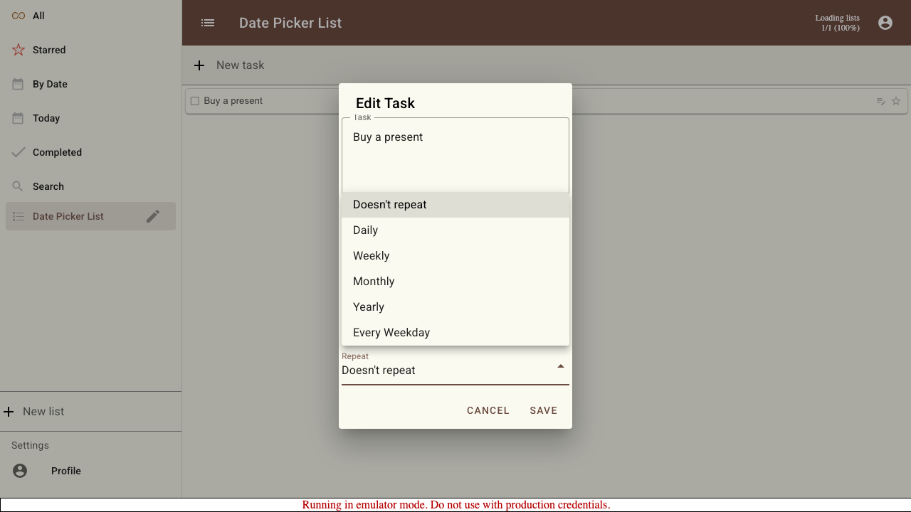
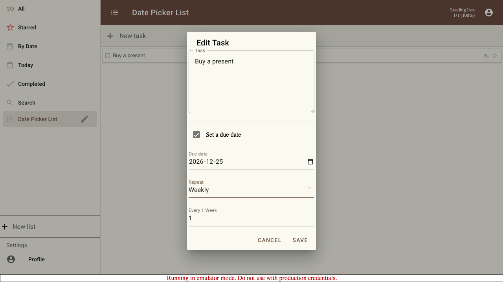

# Scenario: Date Picker Dialog (Redesigned)

Documents the redesigned "Edit Task" dialog used to set a due date and repeat schedule on a task. Compare against 006-date-picker, which captures the previous design.

## Steps

### Step 001: dialog_opened

The redesigned "Edit Task" dialog is open. The due date section is grouped under a clearly labelled "Set a due date" toggle, which starts off so the date controls are inactive.

**Verifications:**
- [x] Dialog title "Edit Task" is visible
- [x] "Set a due date" toggle is visible
- [x] Due date checkbox is unchecked
- [x] Date field is disabled

### Step 002: due_date_enabled

Activating the "Set a due date" toggle enables the grouped Due date and Repeat controls.

**Verifications:**
- [x] Due date checkbox is checked
- [x] Date field is now enabled

### Step 003: calendar_opened

Clicking the calendar icon opens the browser-native date picker GUI.

### Step 004: due_date_selected

A specific due date has been chosen.

**Verifications:**
- [x] Date field holds the selected date

### Step 005: repeat_options_open

The repeat selector is open, showing the available schedules: Doesn't repeat, Daily, Weekly, Monthly, Yearly, and Every Weekday.

**Verifications:**
- [x] Weekly option is available

### Step 006: repeat_interval_revealed

Choosing a repeating schedule reveals the interval field, which is hidden while the task does not repeat.

**Verifications:**
- [x] Repeat interval field is now shown

### Step 007: repeat_configured

The repeat is configured to recur every 2 weeks.

**Verifications:**
- [x] Repeat interval is set to 2

### Step 008: saved

After saving, the task shows its due date chip.

**Verifications:**
- [x] A due date chip is shown on the task

### Step 009: reopened

Reopening the dialog shows the saved values: the due date is enabled, the date is preserved, the repeat schedule is Weekly, and the interval field is shown with its saved value.

**Verifications:**
- [x] Due date checkbox is checked
- [x] Saved due date is preserved
- [x] Saved repeat interval is preserved

