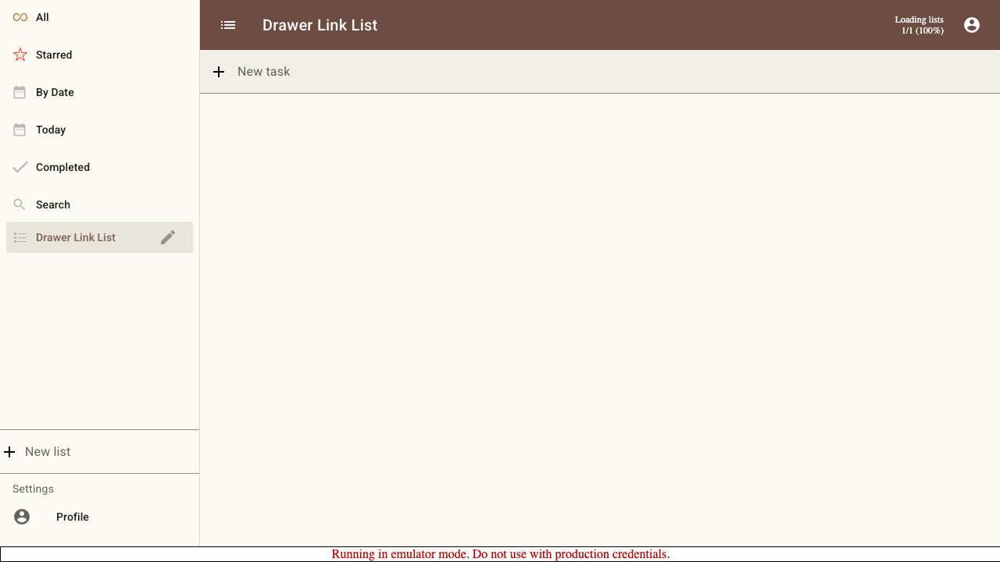
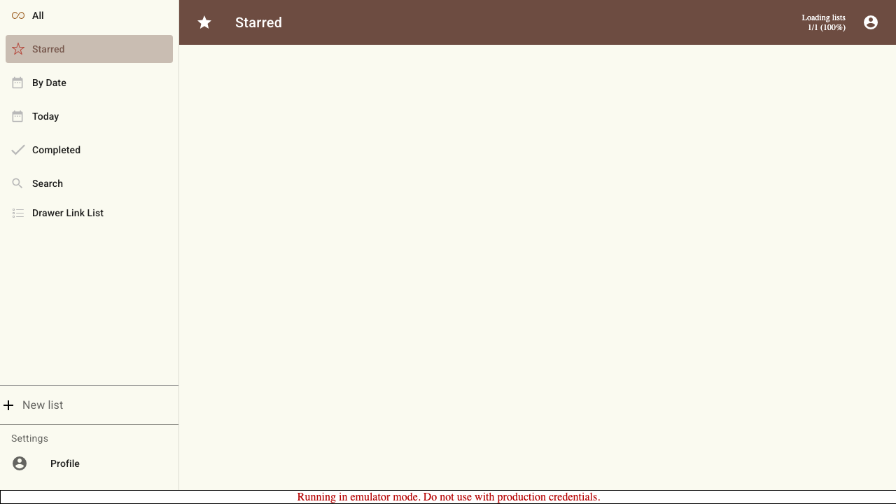

# Scenario: Drawer Navigation Links

Verify the drawer (filters, lists, and Profile) contains no "javascript:" href links while staying interactive.

## Steps

### Step 001: drawer_rendered

The drawer shows filter shortcuts, the created list, and the Profile link — none of which are "javascript:" anchors.

**Verifications:**
- [x] Drawer is visible
- [x] Created list is shown in the drawer
- [x] Profile link is shown
- [x] No "javascript:" links exist anywhere on the page

### Step 002: filter_navigates

Clicking a drawer filter still navigates, confirming the items remain interactive.

**Verifications:**
- [x] Starred view is active
- [x] Still no "javascript:" links exist

