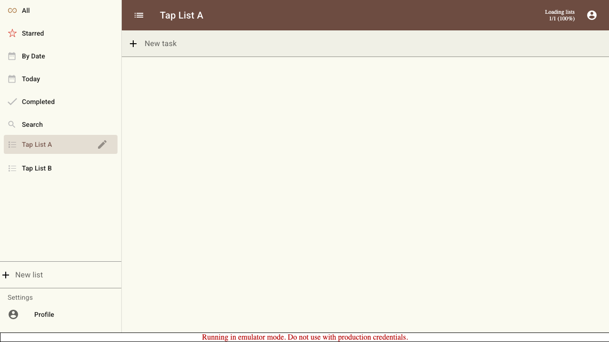
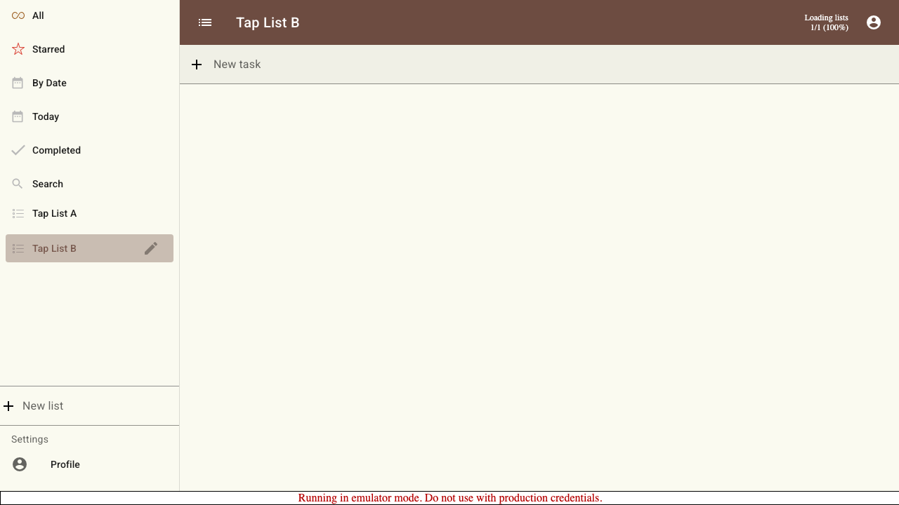

# Scenario: List Tap Is Not A Drag

A press-and-hold on a list in the drawer, released without moving, navigates to that list rather than picking it up for a drag.

## Steps

### Step 001: held_tap_navigates

Pressing and holding List A, then releasing in place, navigates to List A — it is treated as a tap, not a drag.

**Verifications:**
- [x] Navigated to the held list
- [x] No list is left stuck in a dragged state

### Step 002: quick_tap_navigates

A quick tap on List B navigates to it, confirming normal taps still work.

**Verifications:**
- [x] Navigated to the tapped list

