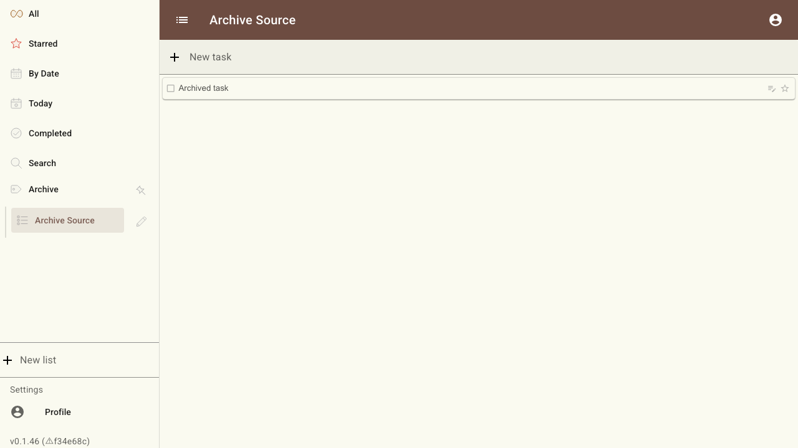
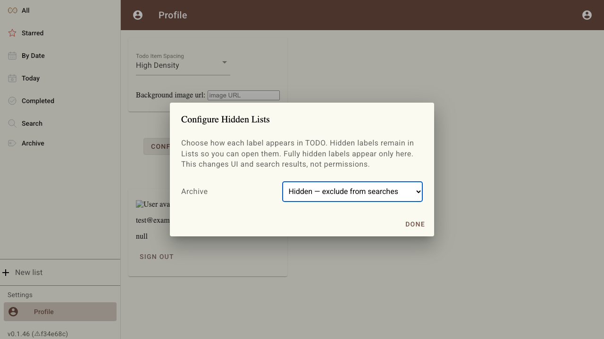
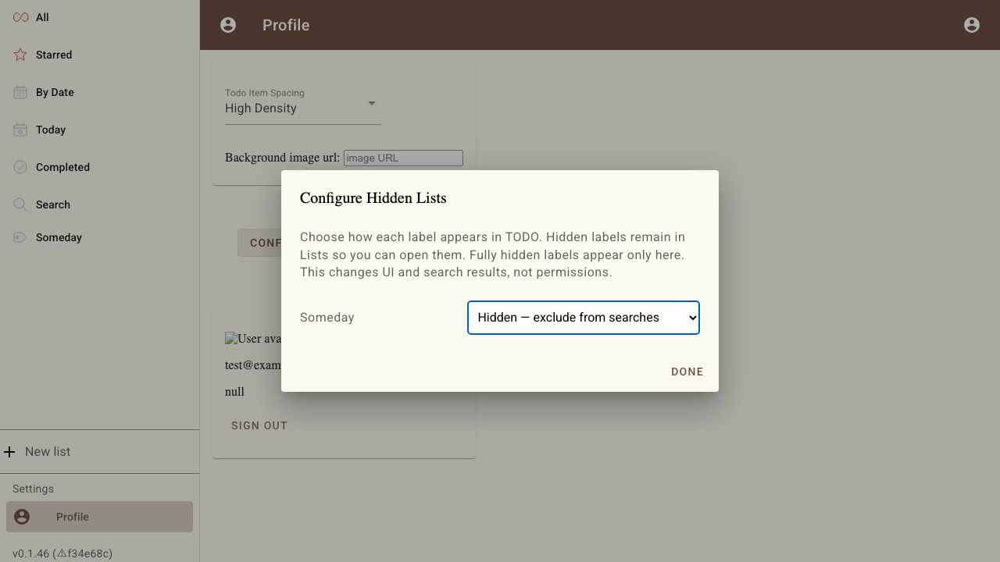
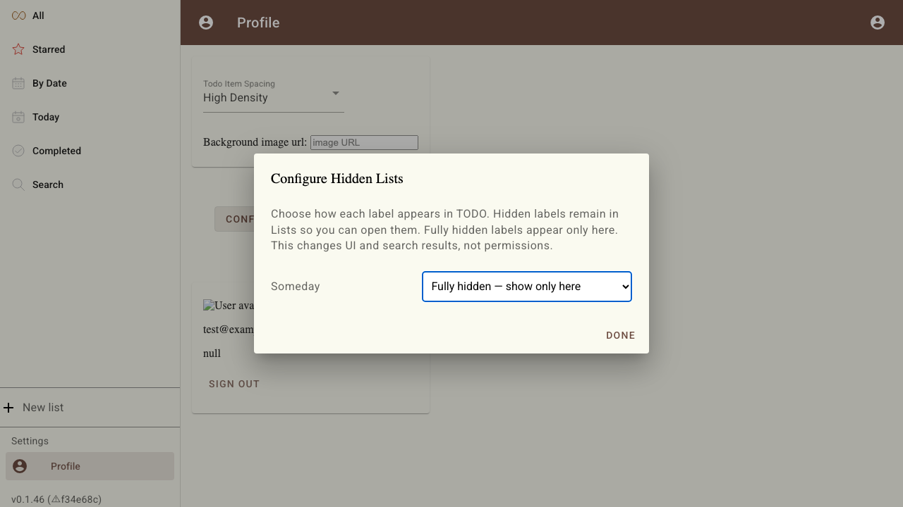
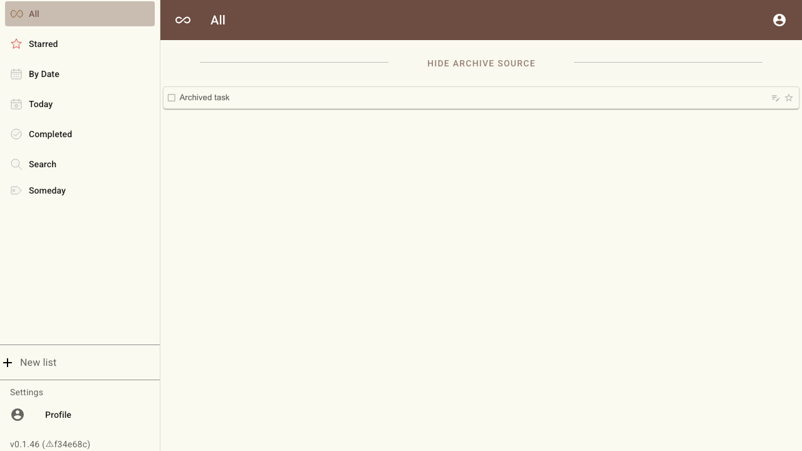

# Scenario: Hidden label visibility

Verify that hiddenness belongs to a label id, survives rename, filters aggregate views, and can be fully hidden and restored.

## Steps

### Step 001: archive-label-created

Archive starts as an ordinary visible label containing the source list.

**Verifications:**
- [x] Archive is present in the list-of-lists
- [x] The archived task exists in its concrete list

### Step 002: archive-hidden-setting-applied

Archive is configured as Hidden in the label settings.

**Verifications:**
- [x] Archive is Hidden

### Step 003: hidden-label-is-filtered-but-directly-browsable

Aggregate All excludes the source, while opening Archive directly shows it.

**Verifications:**
- [x] The direct Archive view shows the task

### Step 004: hidden-status-survives-rename

Renaming Archive to Someday does not break the id-based visibility property.

**Verifications:**
- [x] Someday remains Hidden

### Step 005: fully-hidden-label-is-recoverable-only-in-settings

Someday disappears from navigation and its direct route, but remains configurable.

**Verifications:**
- [x] The fully-hidden label is absent from the sidebar
- [x] The fully-hidden label remains in Configure Hidden Lists

### Step 006: visible-label-restores-results-and-navigation

Returning the same label to Visible restores its task and sidebar position.

**Verifications:**
- [x] The task is visible in All again
- [x] The renamed label is back in the sidebar

