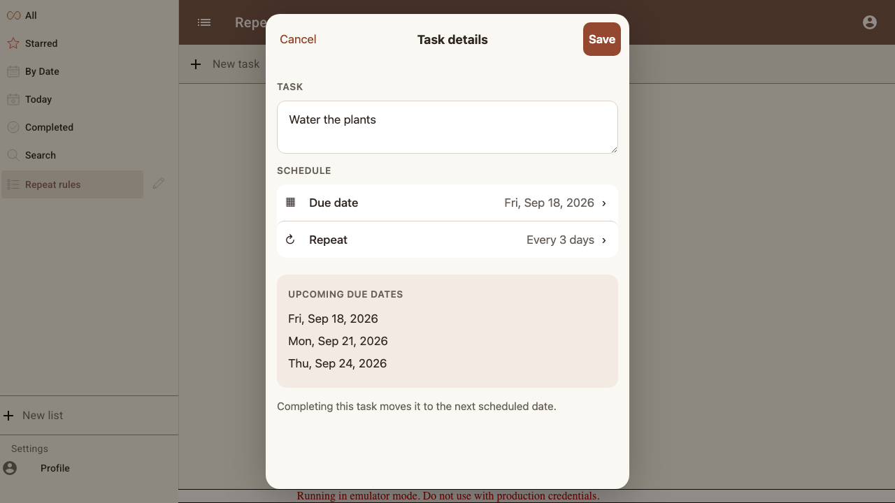
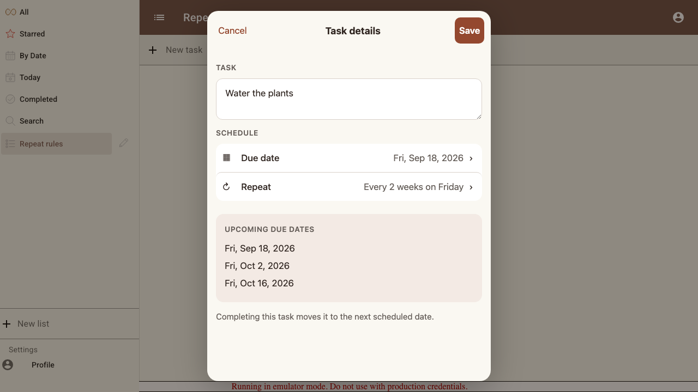
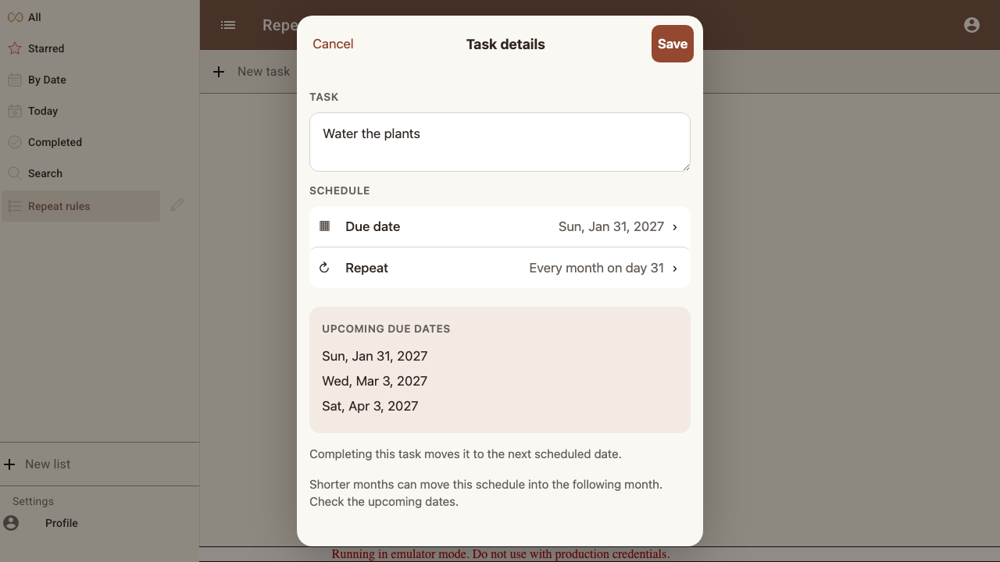
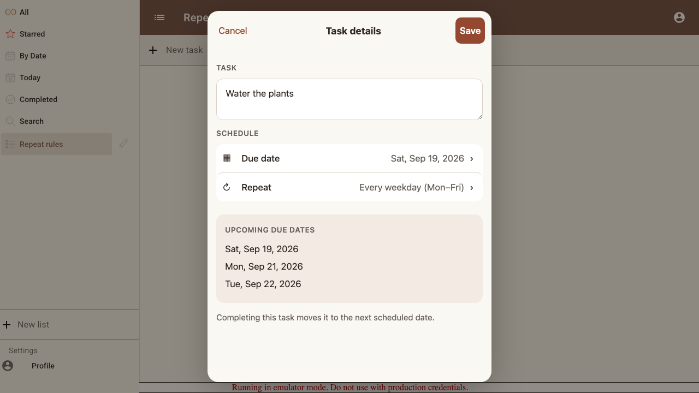
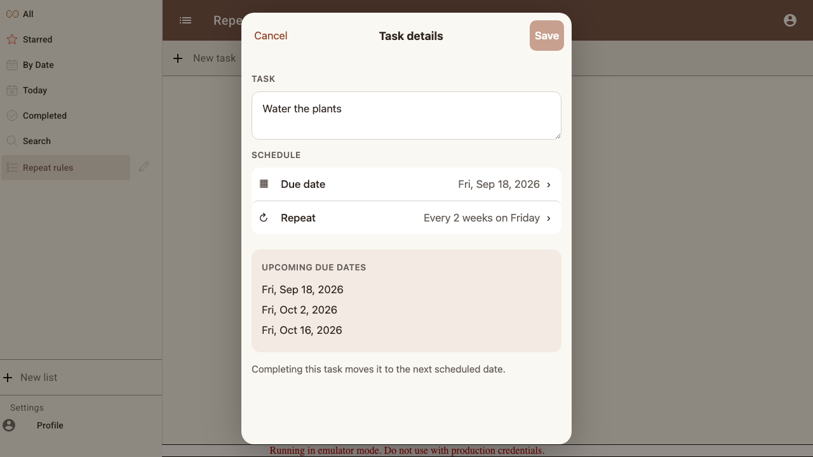
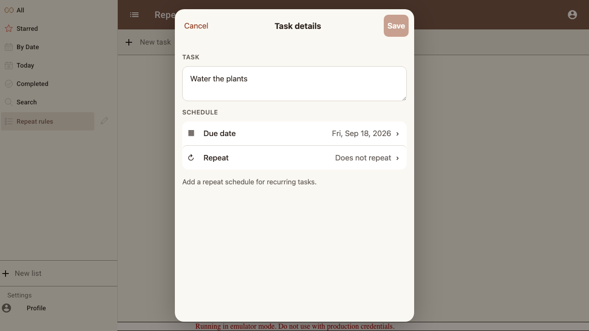

# Scenario: Repeat rules and completion

All supported rules, month-end and leap-year overflow, weekdays, and early/late completion use the same schedule.

## Steps

### Step 001: daily

Every 3 days

**Verifications:**
- [x] The preview and persisted completion agree on the next date

### Step 002: weekly

Every 2 weeks on Friday

**Verifications:**
- [x] The preview and persisted completion agree on the next date

### Step 003: monthly

Every month on day 31

**Verifications:**
- [x] The preview and persisted completion agree on the next date

### Step 004: yearly

Every year on Feb 29

**Verifications:**
- [x] The preview and persisted completion agree on the next date

### Step 005: weekdays

Every weekday (Mon–Fri)

**Verifications:**
- [x] The preview and persisted completion agree on the next date

### Step 006: late_completion

**Verifications:**
- [x] Late completion skips missed dates and keeps the Friday anchor

### Step 007: stop_repeating

**Verifications:**
- [x] Removing repeat preserves the due date and hides upcoming occurrences

