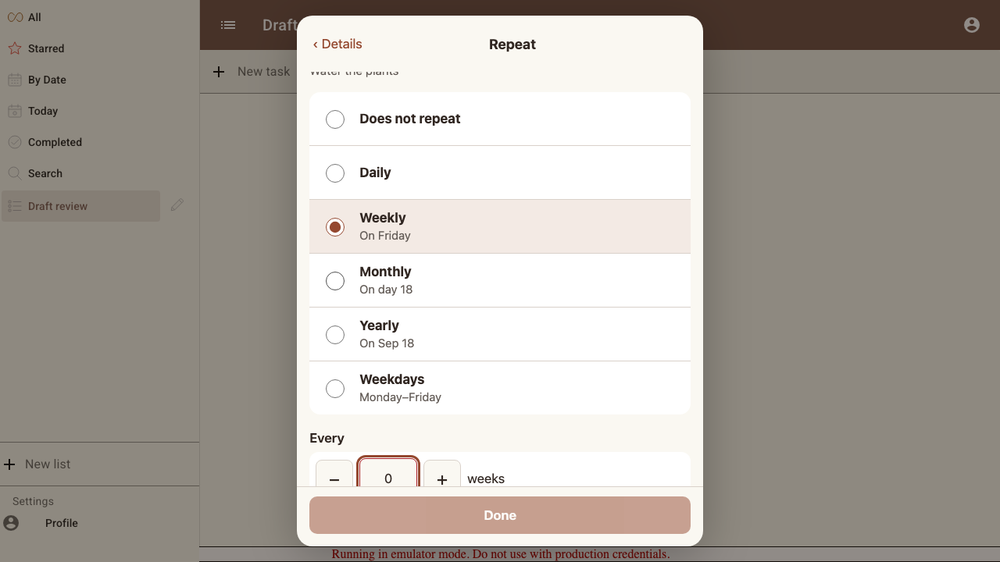
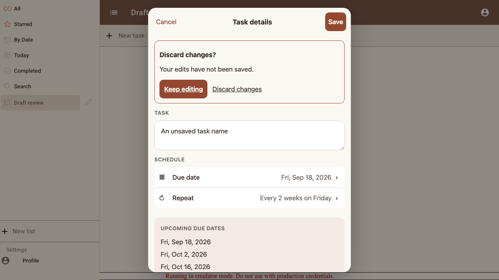
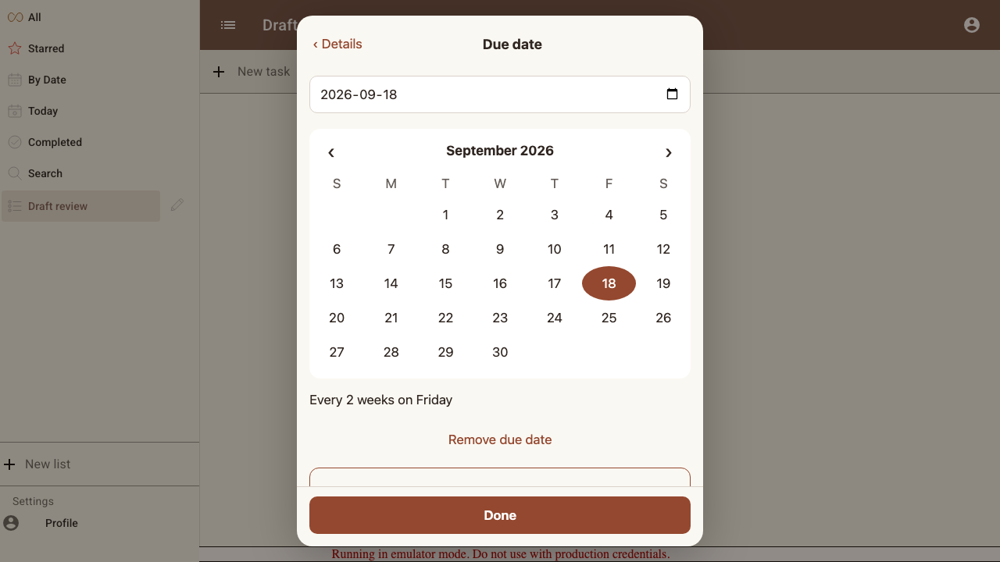
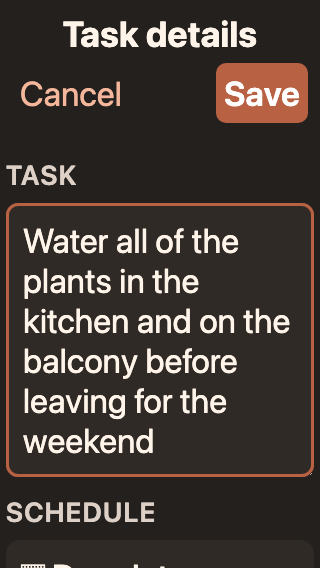
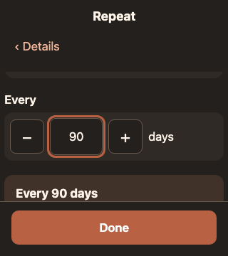

# Scenario: Safe editing on a small phone

Back and cancel preserve saved data, errors remain editable, removal is explicit, and controls remain usable with a short viewport and enlarged text.

## Steps

### Step 001: invalid_interval

**Verifications:**
- [x] Invalid input stays visible with an explicit error and no stale summary

### Step 002: discard_confirmation

**Verifications:**
- [x] Cancel asks before discarding a changed draft

### Step 003: remove_confirmation

**Verifications:**
- [x] Removing a repeating date explicitly includes the repeat rule

### Step 004: small_phone_large_text

**Verifications:**
- [x] Large text wraps without horizontal overflow and Save stays visible

### Step 005: short_viewport

A reduced visual viewport exercises the layout used while a software keyboard is open; browser automation does not render an OS keyboard.

**Verifications:**
- [x] Focused interval and Done are reachable in a short viewport

