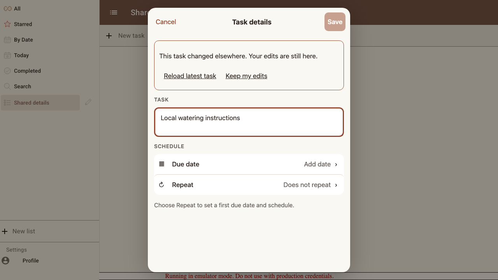
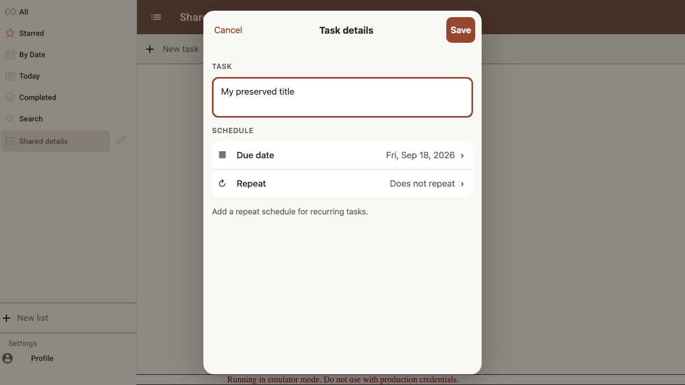
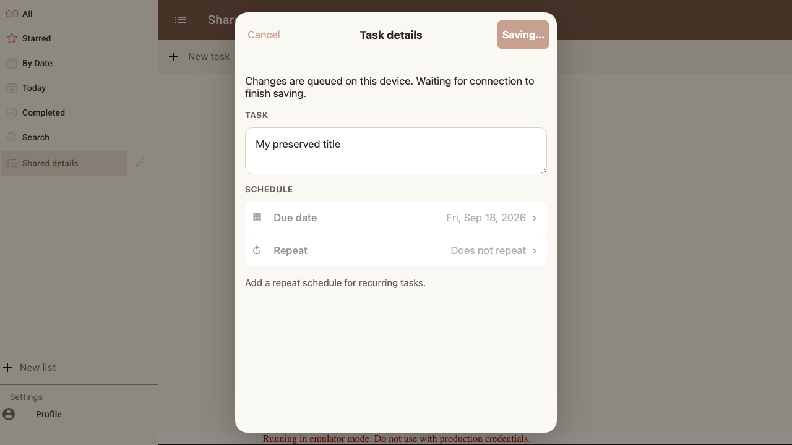
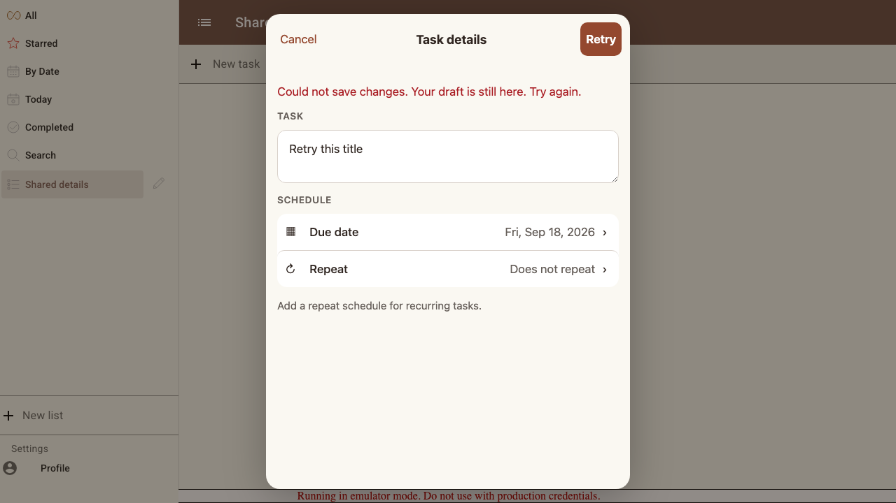
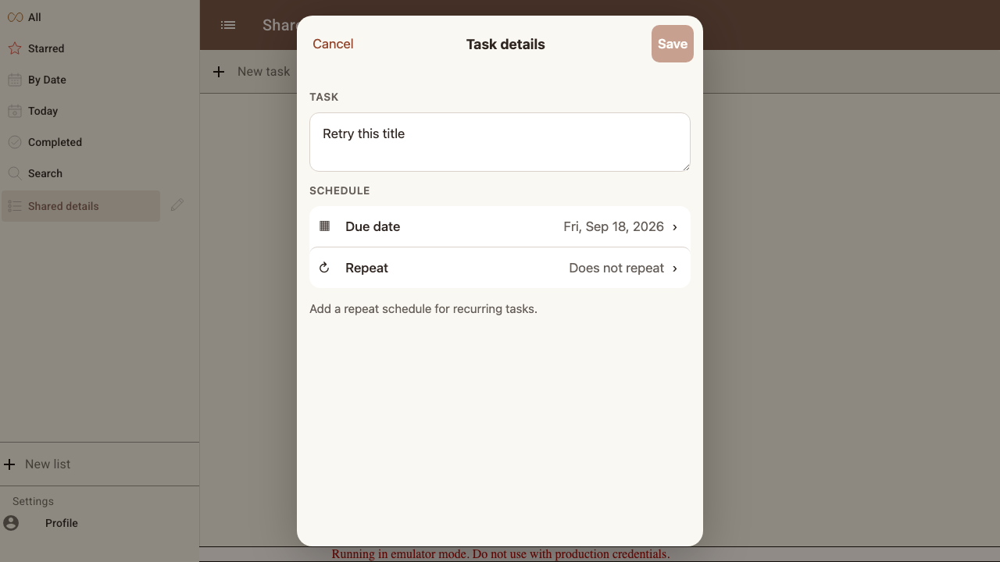
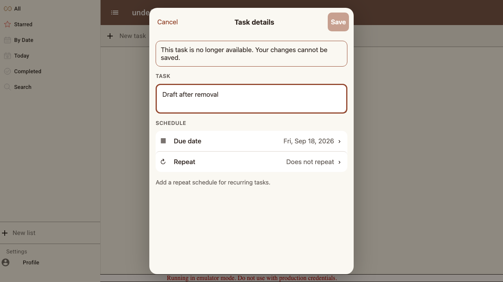

# Scenario: Synchronization and saving

Two browser tabs edit the same task. Local drafts survive conflicts, offline writes finish on reconnection, and a rejected write can be retried.

## Steps

### Step 001: remote_conflict

**Verifications:**
- [x] A remote edit does not overwrite local text and Save waits for a decision

### Step 002: untouched_fields_merge

**Verifications:**
- [x] An untouched due date updates without clobbering the edited title

### Step 003: offline_queue

**Verifications:**
- [x] Offline save keeps the draft and reports that synchronization is pending

### Step 004: save_failure

**Verifications:**
- [x] A rejected write preserves the draft and offers Retry

### Step 005: retry_persisted

**Verifications:**
- [x] Retry writes the preserved draft and survives reload

### Step 006: removed_remotely

**Verifications:**
- [x] Removing the list elsewhere disables Save without deleting the open draft

