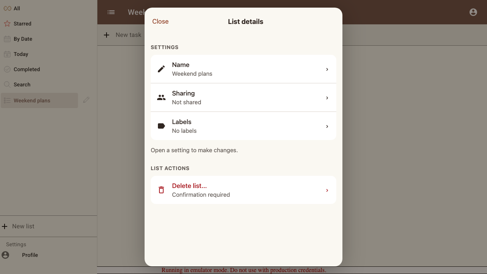
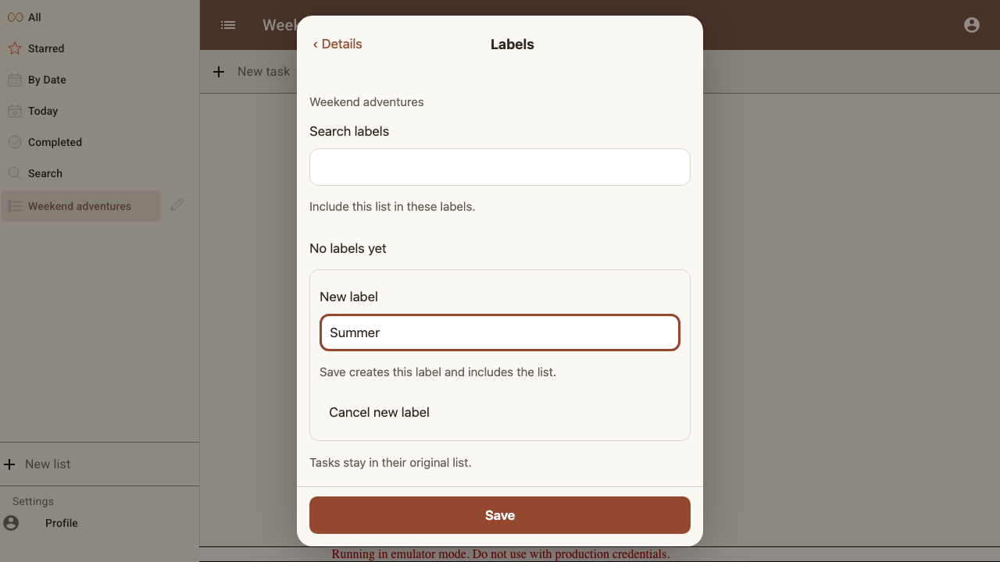
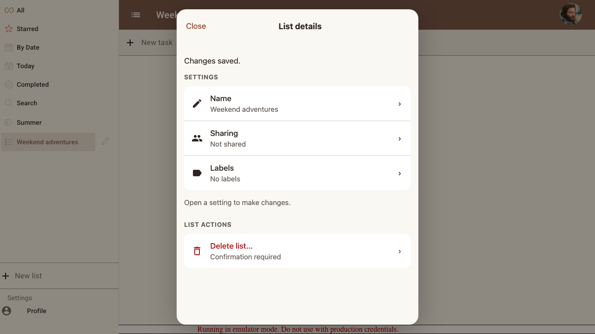
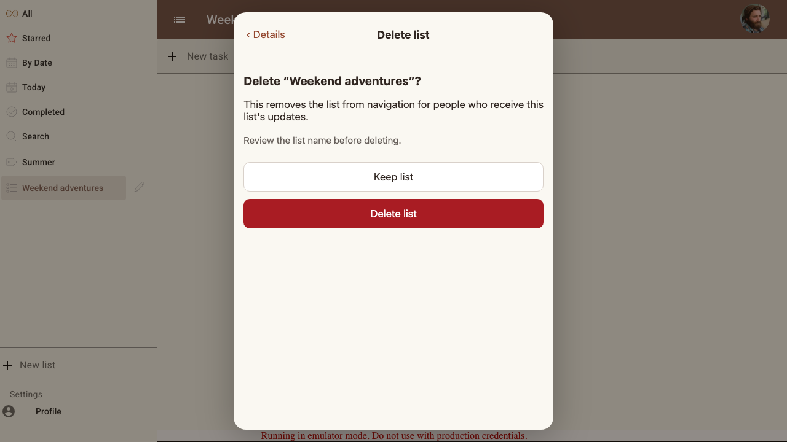

# Scenario: List settings

Name and labels save independently; discarding a later setting preserves earlier saves. Deletion requires its own confirmation.

## Steps

### Step 001: settings_overview

**Verifications:**
- [x] Overview has Close, no Save, and a regular delete settings row

### Step 002: independent_save

**Verifications:**
- [x] Discarding Labels preserves the already saved name and creates no label

### Step 003: inline_label

**Verifications:**
- [x] Label creation uses the Labels Save button and retains entered text

### Step 004: membership_removed

**Verifications:**
- [x] Removing membership saves independently and updates the overview

### Step 005: delete_confirmation

**Verifications:**
- [x] Delete opens a separate confirmation with Keep list focused

