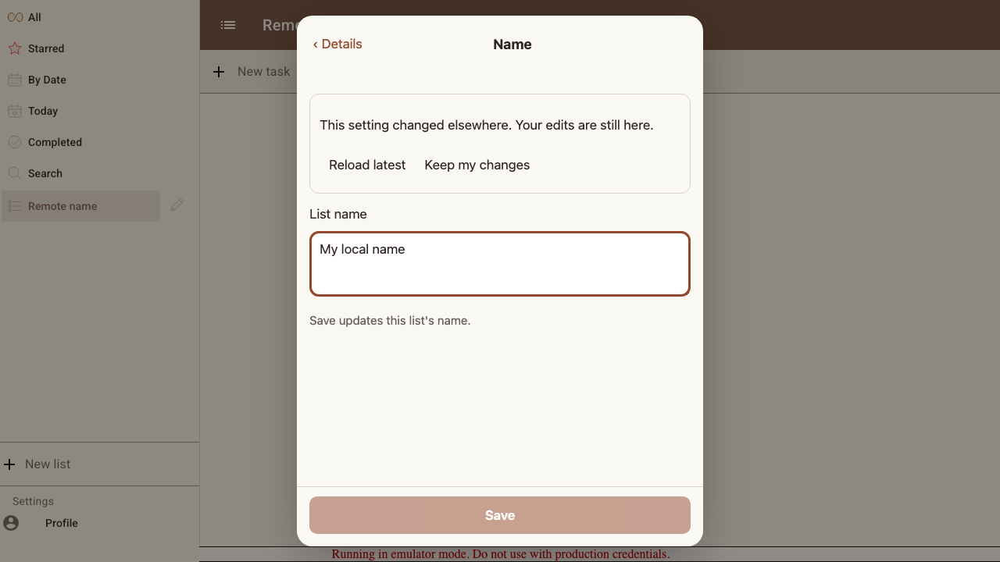
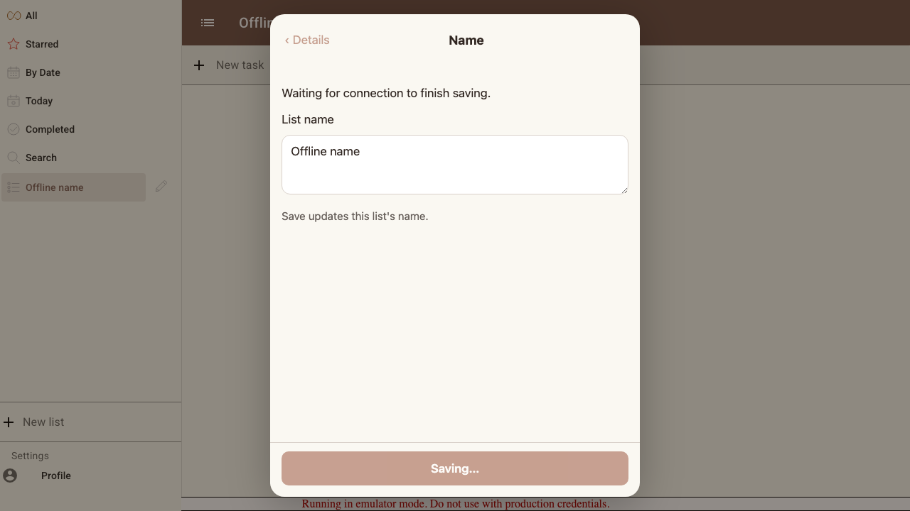
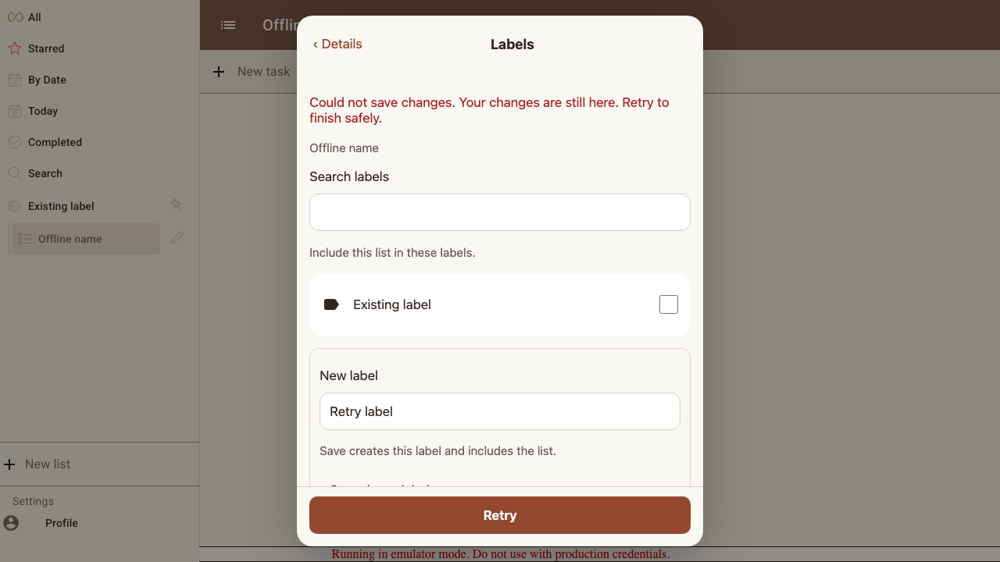
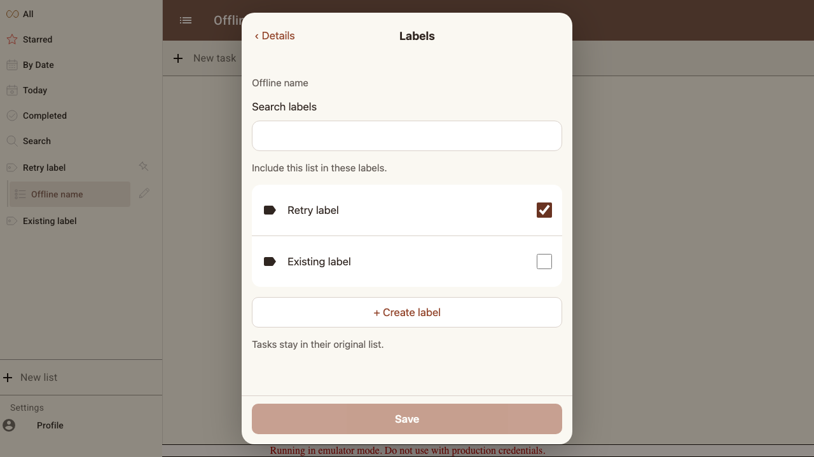
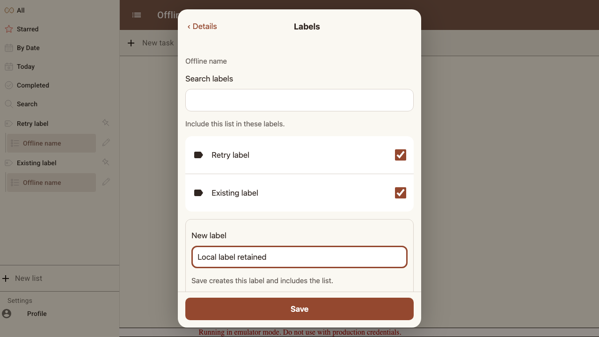
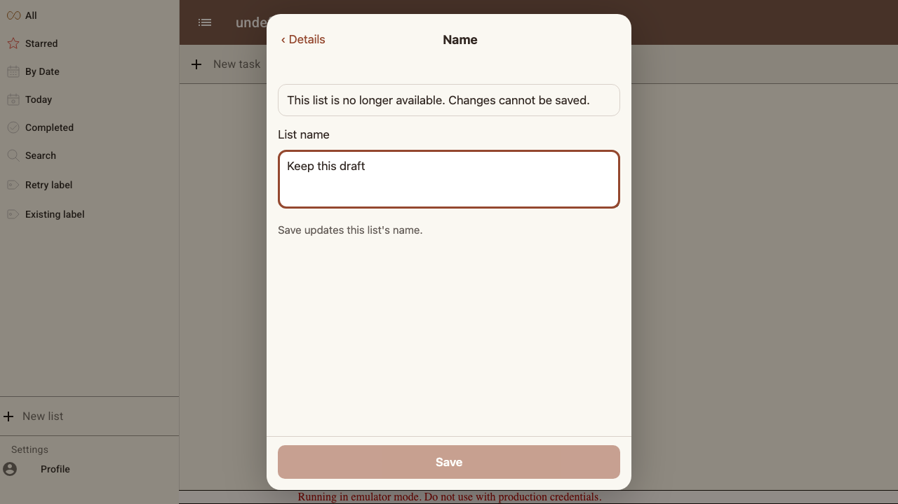

# Scenario: List settings synchronization

Remote edits preserve drafts, offline saves wait for acknowledgment, and rejected label writes retry without duplicates.

## Steps

### Step 001: name_conflict

**Verifications:**
- [x] Remote rename preserves local text and requires a conflict choice

### Step 002: offline_save

**Verifications:**
- [x] Offline save retains the setting until the connection returns

### Step 003: atomic_failure

**Verifications:**
- [x] Rejected batch retains both membership edits and the new-label input

### Step 004: retry_persisted

**Verifications:**
- [x] Retry creates exactly one new label and applies the membership removal

### Step 005: label_update_preserves_input

**Verifications:**
- [x] Remote membership updates merge without replacing a new-label draft

### Step 006: remote_deletion

**Verifications:**
- [x] Deleted list leaves the draft readable and disables Save

