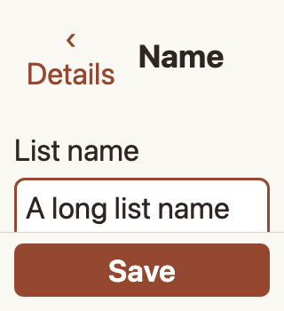
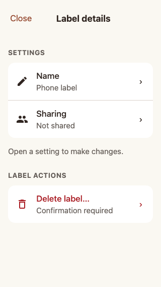
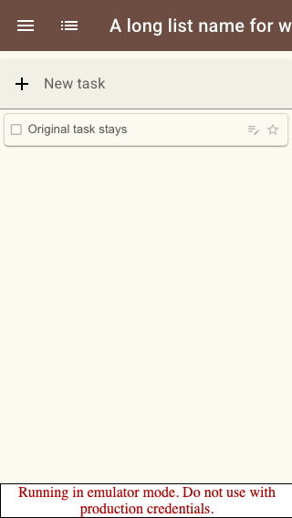
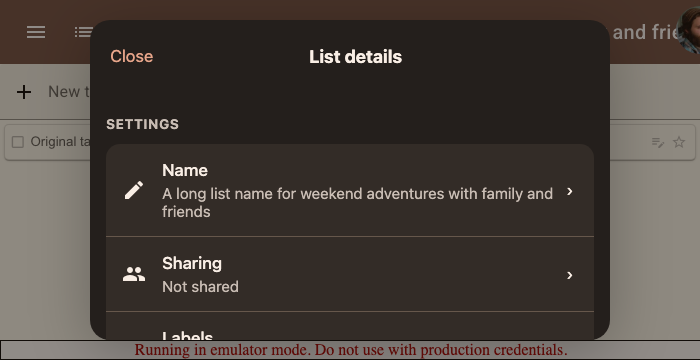

# Scenario: Phone list settings

Small viewport, enlarged text, keyboard focus, system Back and label deletion that preserves source tasks. Software keyboard appearance still needs device review.

## Steps

### Step 001: large_text_short_viewport

**Verifications:**
- [x] Save stays reachable with 200% text in a short viewport and no horizontal overflow

### Step 002: label_settings

**Verifications:**
- [x] Label editor identifies its type and omits recursive membership controls

### Step 003: source_tasks_preserved

**Verifications:**
- [x] Deleting a label preserves its source list and task after reload

### Step 004: dark_landscape

**Verifications:**
- [x] Dark landscape retains Close and scrollable settings with no root Save

