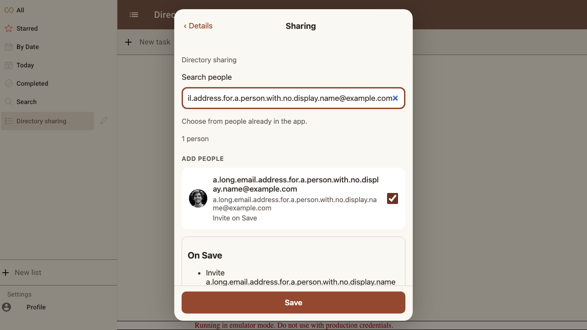
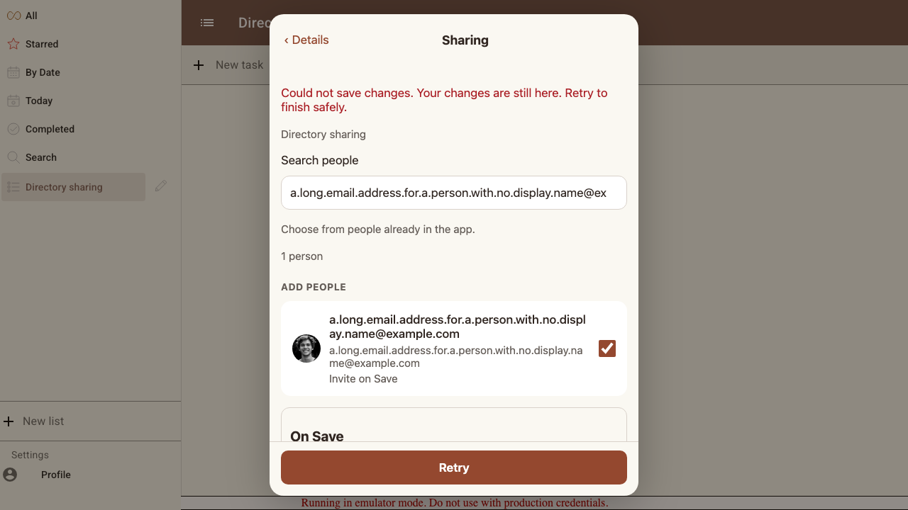
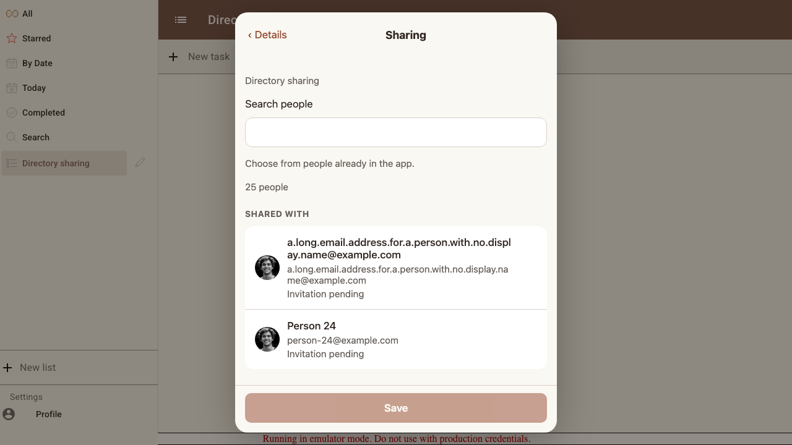
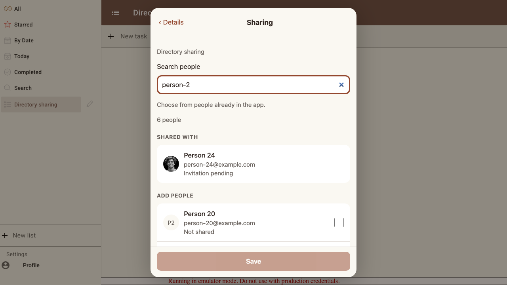

# Scenario: Sharing search and atomic retry

Profile photos and separate Shared with/Add people groups survive searching and sharing updates. Missing or broken photos fall back safely. A denied recipient prevents the whole save; retry creates exactly one request per selected person.

## Steps

### Step 001: search_keeps_selection

**Verifications:**
- [x] Filtering preserves both selections and missing names fall back to wrapped email

### Step 002: sharing_batch_rejected

**Verifications:**
- [x] One denied target sends neither invitation and leaves both selections available for retry

### Step 003: retry_sends_once

**Verifications:**
- [x] Retry sends exactly one invitation to each recipient and pending rows cannot be selected again

### Step 004: shared_and_available_groups

**Verifications:**
- [x] Pending recipients have photos in Shared with; uninvited matches have their own Add people group

