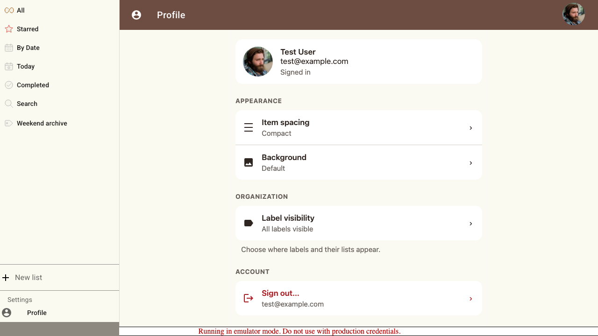
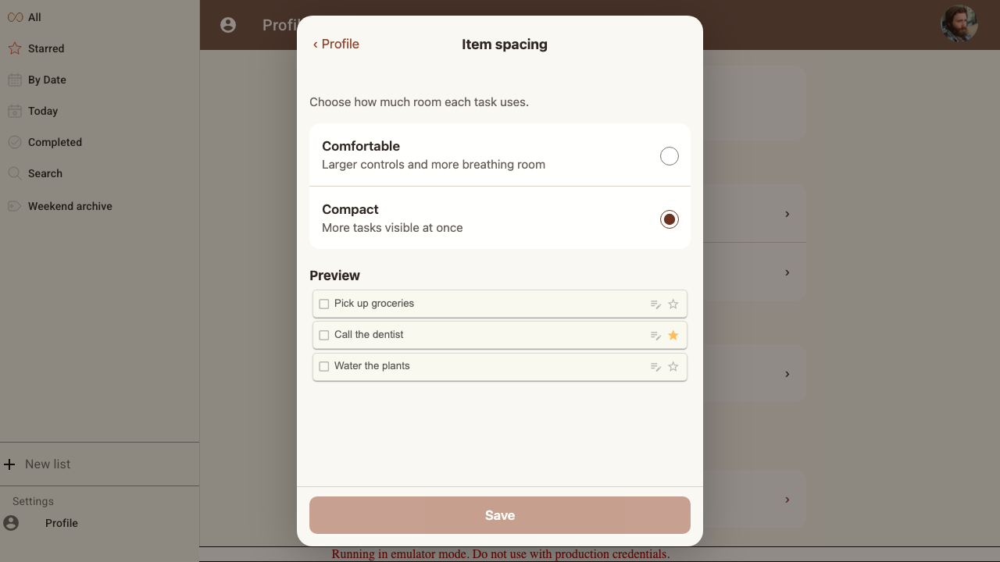
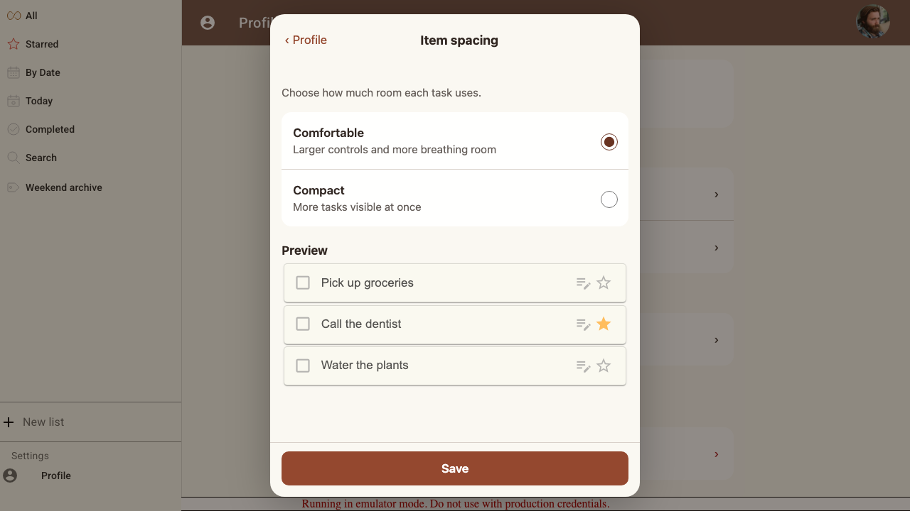
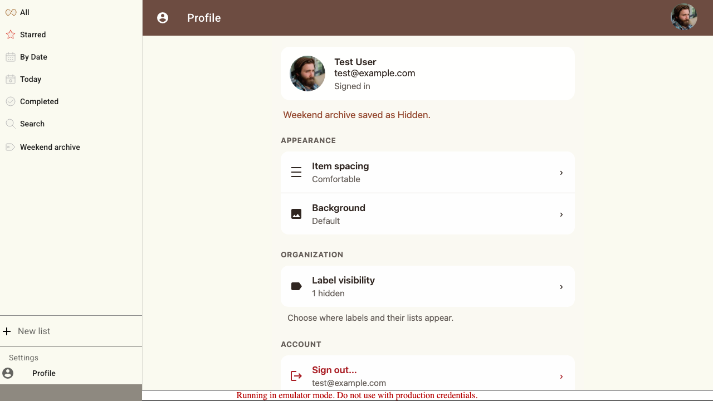
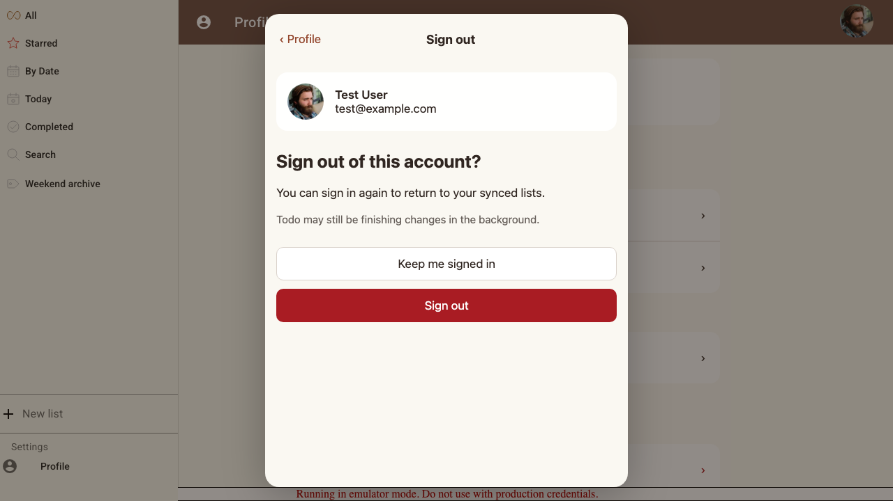

# Scenario: Profile settings

Profile uses focused setting screens, independent confirmed saves, searchable shared-label visibility, and sign-out confirmation.

## Steps

### Step 001: profile_overview

**Verifications:**

- [x] Identity and saved summaries are grouped without a root Save

### Step 002: compact_spacing_preview

**Verifications:**

- [x] Compact preview renders three real, non-interactive task rows

### Step 003: comfortable_spacing_preview

**Verifications:**

- [x] Comfortable applies the production low-density class to all preview rows

### Step 004: spacing_saved

**Verifications:**

- [x] Discard leaves Compact intact; Save persists Comfortable through reload

### Step 005: background_and_labels

**Verifications:**

- [x] Invalid background input never applies, Default saves explicitly, and one searched label saves as Hidden

### Step 006: signout_confirmation

**Verifications:**

- [x] Sign out is cancellable and identifies the account before the explicit action

