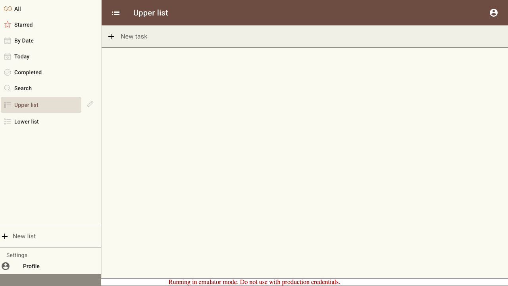

# Scenario: Mobile screen transitions

Portrait navigation uses a full-screen drawer track, landscape list selection follows drawer order vertically, focused setting screens move left and right, and desktop remains still.

## Steps

### Step 001: desktop_navigation_stays_still

**Verifications:**

- [x] Desktop route content opts out of screen transitions

