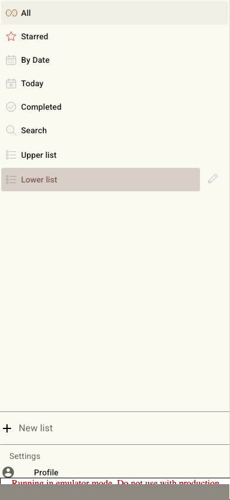
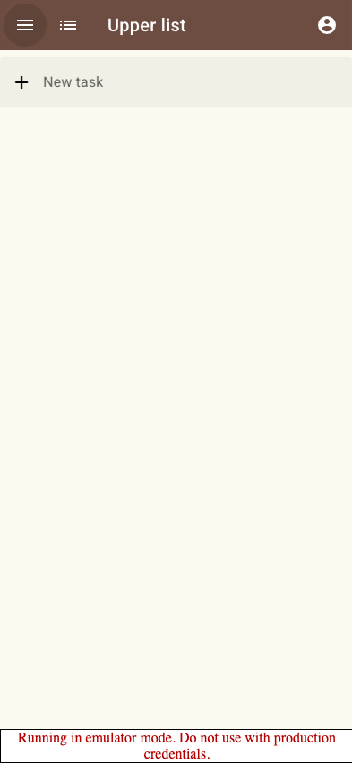
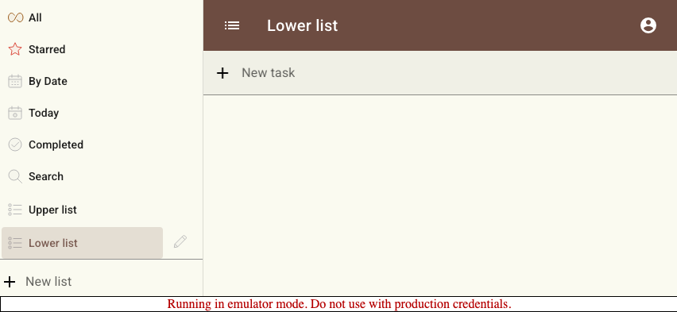
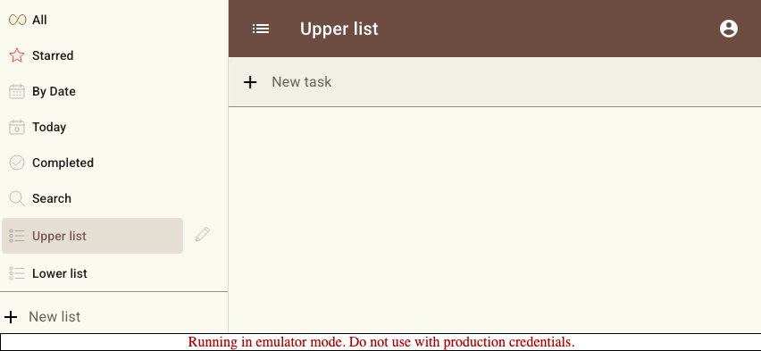
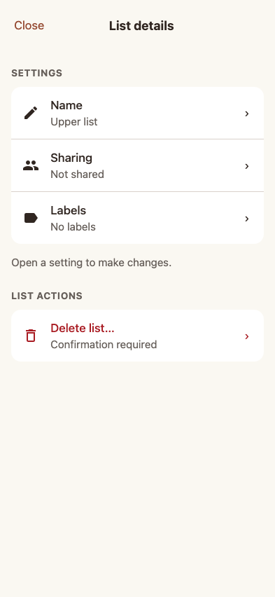

# Scenario: Mobile screen transitions

Portrait navigation uses a full-screen drawer track, landscape list selection follows drawer order vertically, focused setting screens move left and right, and desktop remains still.

## Steps

### Step 001: portrait_drawer_covers_screen

**Verifications:**

- [x] Portrait drawer covers the viewport while the current screen is pushed right

### Step 002: portrait_destination_returns_from_right

**Verifications:**

- [x] Closing the drawer reveals the selected list with no competing inner transition

### Step 003: landscape_lower_list_slides_up

**Verifications:**

- [x] Selecting a lower drawer row moves the right pane upward

### Step 004: landscape_upper_list_slides_down

**Verifications:**

- [x] Selecting a higher drawer row moves the right pane downward

### Step 005: focused_settings_slide_back

**Verifications:**

- [x] Focused settings use forward and backward horizontal screen movement

### Step 006: reduced_motion_stays_still

**Verifications:**

- [x] Reduced-motion preference disables route transitions

